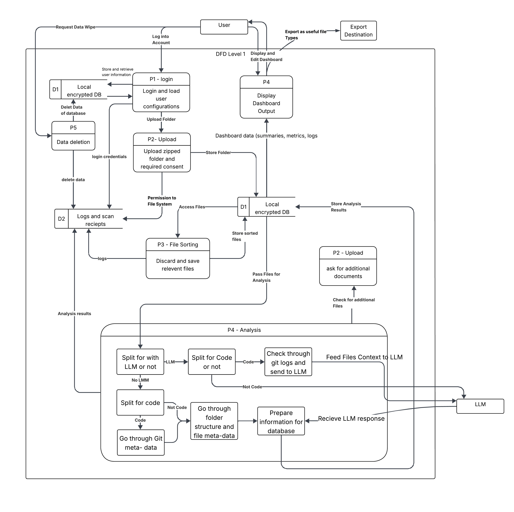

# Team Contract
Team Contract can be found at [here](docs/Capstone Team 6 Contract.pdf). 
Google Docs link to the team contract: https://docs.google.com/document/d/1QnISyjm78uy_NUFr6qpKbF3jwdyAV0nqgGjOC47GHT8/edit?usp=sharing

# Project Work Breakdown Structure 

## Level-1 Overview
- **Project Management**
- **Milestone 1 — Core Parsing & Text Outputs (Oct–Dec 07)**
- **Milestone 2 — Service/API + Human-in-the-Loop (Jan–Mar 01)** *(Subject to change)*
- **Milestone 3 — Front-End (Mar–Apr 05)** *(Subject to change)*
- **Cross-Cutting Quality:** Testing, Security & Privacy, Documentation  
- **Project Closure**

---

## 1. Project Management
### 1.1 Initiation & Scope Control
- Define success metrics.

### 1.2 Planning
- Timeline and task assignments.

### 1.3 Stakeholder & Ethics Review
- Define data-use boundaries and privacy considerations.

### 1.4 Standups & Reviews
- Weekly meetings and milestone demos.

### 1.5 Tracking & Reporting
- Maintain weekly logs.

---

## 2. Milestone 1 — Core Parsing & Text Outputs (Oct–Dec 07)

**Goal:**  
Build the Python core that takes as input a zipped folder, parses artifacts, derives projects/skills/metrics, and produces TXT/CSV/JSON outputs.  
Store results in a local database, enable retrieval and secure deletion, and ensure user data privacy.

### 2.1 System Architecture & Foundations
- **2.1.1** Architecture design (Python backend, module boundaries, DFD)
- **2.1.2** Local DB schema (SQL): projects, artifacts, sessions, skills, summaries
- **2.1.3** Configuration management: user settings stored for reuse

### 2.2 Data Access, Consent & Modes
- **2.2.1** Consent flow: explicit permission before any access
- **2.2.2** Upload Mode: validate zipped folder; return error on wrong format
- **2.2.3** Laptop Scan list: folder allow/deny lists; OS checks (Windows/macOS)

### 2.3 Parsers & Extractors
- **2.3.1 Code Analysis**
  - Language/framework detection  
  - Lines of code  
  - Functions/classes  
  - Repository mining  
  - Individual contribution heuristics
- **2.3.2 Document Parsing**
  - PDF, DOC, DOCX, Text  
  - Metadata extraction
- **2.3.3 Media/Other Artifacts**
  - Basic metadata (created, modified, authorship)

### 2.4 Project & Skill Inference
- **2.4.1** Project grouping: distinguish individual vs. collaborative projects  
- **2.4.2** Contribution inference: commits for collaboration repos  
- **2.4.3** Metrics engine: duration and frequency of activity types (code/test/design/doc)  
- **2.4.4** Skill extraction: keywords and skills developed during project

### 2.5 External Services Policy & Fallbacks
- **2.5.1** Permission prompt for LLM/external calls + privacy implications  
- **2.5.2** Offline/alternative analyses if external use not permitted

### 2.6 Ranking, Summaries & Outputs
- **2.6.1** Project importance ranking (based on contributions/impact)  
- **2.6.2** Summaries for top-ranked projects  
- **2.6.3** Projects timeline and skills progression list  
- **2.6.4** Output generators: CSV/JSON/plain-text for all key info  
- **2.6.5** Store & retrieve:
  - Portfolio items from DB  
  - Résumé items from DB

### 2.7 Secure Data Deletion
- **2.7.1** Delete insights/data with verification

### 2.8 Performance & Resource Control
- **2.8.1** Processing-time: target ~5 minutes ideal time  
- **2.8.2** Memory/permission edge cases: resumable or partial scans

#### Milestone-1 Deliverables
- M1 architecture diagram & DB schema  
- DFD  
- WBS  
- Parsers (code/docs) + metrics/skills extraction  
- Ranking and summaries in chronological lists  
- Text/CSV/JSON outputs  
- Secure deletion function  
- Unit/integration tests for code  

---

## 3. Milestone 2 — Service/API + Human-in-the-Loop (Jan–Mar 01)

**Goal:**  
Run as a service (API). Add human-in-the-loop curation: incremental ingest, deduplication, selection, corrections, and customizable résumé/portfolio text.

### 3.1 Service Enablement
- **3.1.1** API design & contracts (OpenAPI)  
- **3.1.2** Orchestration & jobs: async processing for ingest/parse/analyze  
- **3.1.3** Auth/session model (local profile)

### 3.2 Incremental & Deduplicated Ingest
- **3.2.1** Add new zipped folders into existing portfolio  
- **3.2.2** Duplicate detection & single-instance storage  

### 3.3 Human-in-the-Loop Curation
- **3.3.1** User controls: choose info to represent (re-rank, chronology fixes, comparison attributes, highlight skills)  
- **3.3.2** Role attribution: specify user’s role per project  
- **3.3.3** Evidence linking: metrics/feedback/evaluations  
- **3.3.4** Project thumbnail association  
- **3.3.5** Save customizations: curated “showcase project” + résumé wording  
- **3.3.6** Display textual views: portfolio showcase & résumé item renderers (text)

#### Milestone-2 Deliverables
- Running local service with documented API  
- Incremental ingest + deduplication  
- Full HIL curation flows & saved states  
- Textual display endpoints for portfolio/résumé items  
- API/integration/UX validation tests  

---

## 4. Milestone 3 — Front-End (Mar–Apr 05)

**Goal:**  
Build the UI to consume the service. Generate one-page résumé and web-portfolio views with private/public modes.

### 4.1 Front-End Foundations
- **4.1.1** Tech selection (Electron+React or web stack)  
- **4.1.2** UI kit, routing, state, theming  

### 4.2 Résumé Generator (One-Pager)
- **4.2.1** Education/Awards section  
- **4.2.2** Skills by expertise level  
- **4.2.3** Projects highlighting contributions/impact  
- **4.2.4** Export (PDF/HTML)

### 4.3 Web Portfolio
- **4.3.1** Skills timeline (learning progression)  
- **4.3.2** Activity heatmap (productivity over time)  
- **4.3.3** Top-3 project showcases (process & evolution)  
- **4.3.4** Dashboard modes:  
  - Private (interactive customization)  
  - Public (search/filter only)

#### Milestone-3 Deliverables
- Front-end app integrated with API  
- One-page résumé generator  
- Portfolio with timeline, heatmap, showcases  
- Private/public dashboard modes  
- UI tests & demo  

---

## 5. Cross-Cutting Quality

### 5.1 Testing & QA
- **5.1.1** Unit tests (pytest)  
- **5.1.2** Integration & contract tests (API)  
- **5.1.3** Parser correctness suites (golden files)  
- **5.1.4** Performance tests (processing time)  
- **5.1.5** Security/privacy tests (consent, data at rest)

### 5.2 Security & Privacy
- **5.2.1** Local-only encrypted storage  
- **5.2.2** Permission gating & audit logs for deletion  
- **5.2.3** External-service consent & redaction paths  

### 5.3 Documentation & DevEx
- **5.3.1** Developer guide: setup, scripts, data contracts  
- **5.3.2** User guide: consent, modes, exports, deletion  
- **5.3.3** Architecture & ADRs  
- **5.3.4** Demo scripts & milestone readouts  

---

## 6. Project Closure
- **6.1** Final acceptance & rubric mapping  
- **6.2** Post-mortem & lessons learned  
- **6.3** Handover: code, docs, demo assets  

---

## Assumptions
- Milestone dates are hard boundaries for acceptance demos.  
- Python is mandated for M1 & M2 core; stack may expand in M3.  
- No cloud persistence required; local-first with encryption.  
- Linux desktop support is out of scope initially (per proposal).

 # Data Flow Diagram (DFD Level 1)

## Overview
This DFD shows how data flows between the user, system processes, local storage, and output in the **Mining Digital Work Artifacts** system.

## Entities
- **User** – logs in, uploads files, views dashboard, and can request data deletion or exports.  
- **Export Destination** – receives final exported outputs.

---

## Processes
- **P1 – Login**  
  Load user configurations and start session.

- **P2 – Upload**  
  Upload zipped folder and give consent; store data in local encrypted DB.

- **P3 – File Sorting**  
  Discard irrelevant files and pass relevant ones for analysis.

- **P4 – Analysis**  
  Analyze files (code or non-code), extract metadata, optionally use LLM, and prepare summaries for storage.

- **P5 – Data Deletion**  
  Handle user’s data wipe requests and remove logs and stored data.

- **P4 (continued) – Display Dashboard Output**  
  Present analyzed results, logs, and visualizations; allow export.

---

## Data Stores
- **D1 – Local Encrypted DB**  
  Stores user data, uploaded files, and analysis results.  

- **D2 – Logs and Scan Receipts**  
  Stores logs, receipts, and deletion confirmations.

