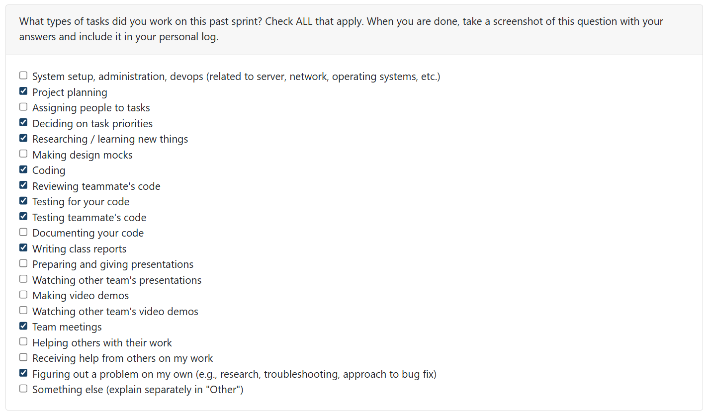
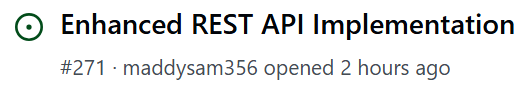
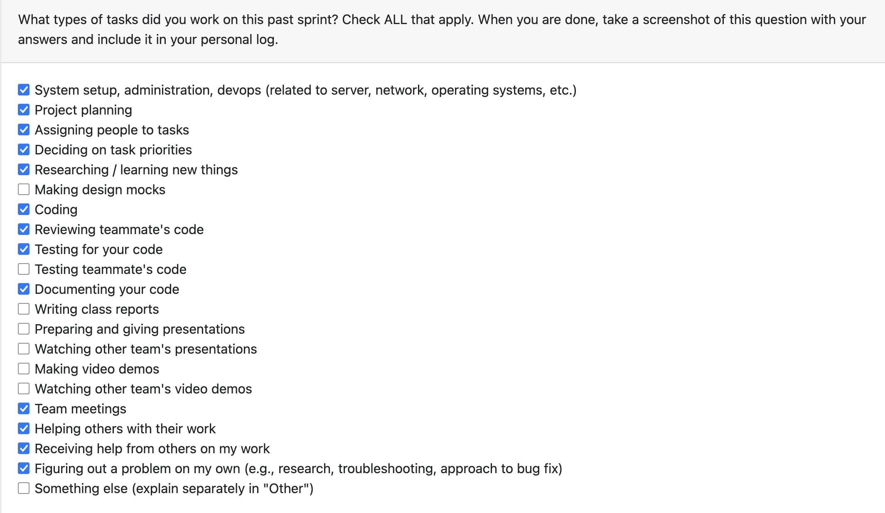
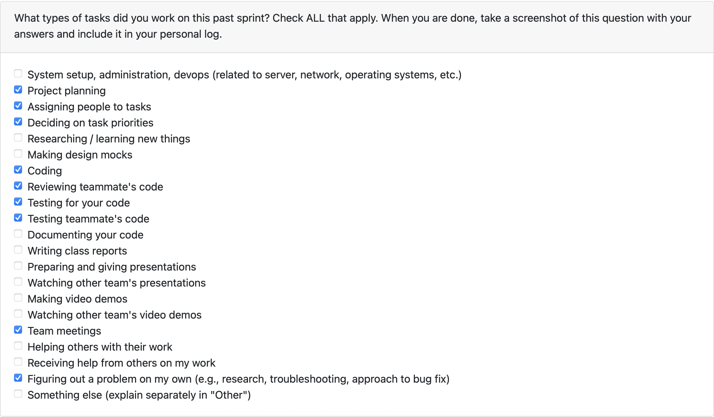
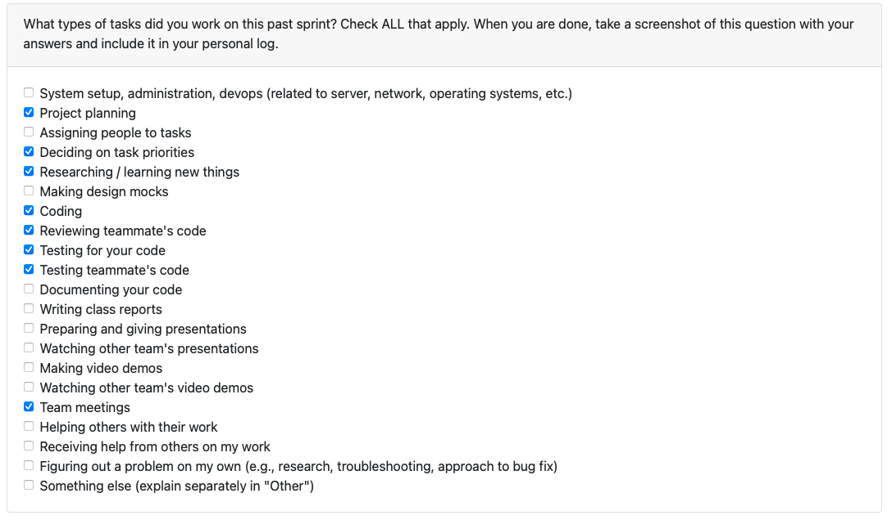

# Mandira Samarasekara

## Date Ranges

January 5 – January 11  

## Weekly recap goals

- Researched REST APIs, focusing on how API calls are made and how endpoints are structured  
- Attended all team meetings  
- Participated in weekly check-ins and explained/demonstrated features not explicitly covered in the Milestone 1 demo video  
- Met with Mithish to discuss API setup, design decisions, and task ownership  
- Reviewed all pending pull requests (8 total)  
- Wrote and finalized team weekly logs  

## What went well

I attended all scheduled team meetings and had a productive discussion with Mithish to align on the REST API architecture, responsibilities, and next steps. This early coordination helped clarify expectations and prevent overlapping work. Following this, I continued development from Mithish’s existing implementation and added missing and additional functionality in my own PR.

I also reviewed and completed all pending pull requests in a timely manner, helping ensure the codebase remained stable and up to date before progressing further into Milestone 2 development.

## What didn't go well

No major issues this week besides the majority of the team members being in different countries and time zones. However, this did not cause any significant problems, as we communicated proactively and planned around availability. As a result, we were able to maintain our usual workflow and collaboration despite working as a distributed team.

## PR's initiated

- **Enhanced REST API Implementation #272**  
  https://github.com/COSC-499-W2025/capstone-project-team-6/pull/272  

This PR implements a complete, production-ready REST API for Milestone 2, addressing all remaining gaps from the initial API and authentication work. It includes full FastAPI server integration with secure authentication, user-scoped portfolio management, background task processing, and persistent file handling.

Key contributions include background analysis with task status tracking, SHA256-based file deduplication with permanent storage, database extensions for secure user-specific operations, and improved error handling across all endpoints. I also added comprehensive automated tests and performed manual end-to-end testing to verify server startup, authentication flows, and API functionality.

This PR finalizes the backend foundation required for Milestone 2 and enables reliable, scalable portfolio analysis workflows.

## PR's reviewed

- **T2W1 Mohamed Logs #270**  
  https://github.com/COSC-499-W2025/capstone-project-team-6/pull/270  

- **Enhanced contribution ranking #268**  
  https://github.com/COSC-499-W2025/capstone-project-team-6/pull/268  

- **Add REST API Server structure with Authentication (Milestone 2) #265**  
  https://github.com/COSC-499-W2025/capstone-project-team-6/pull/265  

- **Unit testing for Java complexity #262**  
  https://github.com/COSC-499-W2025/capstone-project-team-6/pull/262  

- **Include detailed portfolio skills in chronological timeline #257**  
  https://github.com/COSC-499-W2025/capstone-project-team-6/pull/257  

- **Ranking Multiple Projects in a Folder Based on Contribution Scores #249**  
  https://github.com/COSC-499-W2025/capstone-project-team-6/pull/249  

- **Added project specific duration analysis features #241**  
  https://github.com/COSC-499-W2025/capstone-project-team-6/pull/241  

- **Git language breakdown #237**  
  https://github.com/COSC-499-W2025/capstone-project-team-6/pull/237  

## Distinct PR review

**PR Review Summary – #265**  
https://github.com/COSC-499-W2025/capstone-project-team-6/pull/265  

Reviewed Mithish’s PR implementing the foundational REST API and authentication system for Milestone 2. The implementation is well-structured and provides a strong, production-ready base for incremental portfolio uploads.

**Testing:**  
- Ran the full test suite — 19/19 tests passed  
- Manually verified that the API server starts correctly and that the health endpoint responds as expected  

Authentication, endpoint design, and validation are implemented cleanly, with clear error handling and proper REST conventions. Some expected follow-up work (database integration, background processing, and file management) remains but does not block this PR and is planned for subsequent work. Overall, this is a strong and well-executed foundation.

## Issue board

- **Issue #271**: 

## Plan for next week

- Attend weekly check-in  
- Discuss Milestone 2 requirements with the team  
- Complete Requirement 22 (recognize duplicate files and maintain only one instance in the system)  
- Complete Requirement 23 (allow users to choose which information is represented)  
- Address any feedback or required changes identified during PR reviews  

# Aakash Tirithdas

# Mithish Ravisankar Geetha

## Date Ranges

January 5-January 11

## Weekly recap goals

- Create API endpoints structure for milestone 2 requirements
- Attend the team meetings
- Meet with Mandira to discuss the API set up
- Review all pending PRs

Winter break activities:

- Added java complexity analysis and unit testing

## What went well

The basic API endpoint structure required for Milestone 2 was successfully designed and implemented, providing a clear and scalable foundation for upcoming features. The structure aligns well with the project’s existing architecture and will make future integrations smoother.

I attended all scheduled team meetings and had a focused discussion with Mandira to align on the API setup, responsibilities, and next steps. This helped clarify expectations early and avoid overlapping work.

Additionally, I reviewed and completed all pending pull requests, ensuring the codebase remained stable and up to date. Addressing these reviews promptly helped close open loops before moving forward into Milestone 2 development.

## What didn't go well

I was out of Kelowna during this period, so I was unable to attend class in person. I will also be unable to attend the Week 2 Monday class on January 12, which made real-time coordination slightly more challenging.

However, this was communicated to the team in advance, and we discussed expectations early on. Tasks were assigned accordingly to ensure progress was not blocked. Once everyone is back in Week 2, we plan to meet again to realign and continue coordination more smoothly.

## PR's initiated

Created during the winter break

- Java complexity analysis #245: https://github.com/COSC-499-W2025/capstone-project-team-6/pull/245
- Unit testing for java complexity #262: https://github.com/COSC-499-W2025/capstone-project-team-6/pull/262

Created during week 1:

- Add REST API Server structure with Authentication (Milestone 2) #265: https://github.com/COSC-499-W2025/capstone-project-team-6/pull/265

## PR's reviewed

- Git language breakdown #237 : https://github.com/COSC-499-W2025/capstone-project-team-6/pull/237
- Added project specific duration analysis features #241: https://github.com/COSC-499-W2025/capstone-project-team-6/pull/241
- Zero Project Contribution Detection #251 : https://github.com/COSC-499-W2025/capstone-project-team-6/pull/251
- Multi-Project Skill Chronological Listing #259 : https://github.com/COSC-499-W2025/capstone-project-team-6/pull/259
- Updated Analysis Database Projects Table to Reflect Skill Analysis Updates #261: https://github.com/COSC-499-W2025/capstone-project-team-6/pull/261

## Issue board

## Plan for next week

- Discuss milestone 2 requirements with the team
- Complete requirement 21 (Allow incremental information by adding another zipped folder of files for the same portfolio or résumé)
- Clean up API endpoints structure if anything is missing

# Ansh Rastogi

## Date Ranges

January 5-January 11

## Weekly recap goals

- Implement Enhanced Contribution Ranking algorithm for project scoring
- Add multi-factor ranking system with configurable weights
- Create comprehensive test suite for ranking functionality
- Review teammates' PRs and provide constructive feedback
- Attend team meetings and coordinate on Milestone 2 planning

## What went well

This week was highly productive in strengthening our project ranking system. I successfully implemented the Enhanced Contribution Ranking algorithm, which expands our basic composite scoring with five new contextual factors: individual contribution weight, recency bonus, project scale, collaboration diversity, and activity duration.

The implementation introduced a weighted algorithm that combines base technical scores (45%) with contribution and context factors (55%), providing more nuanced project rankings that better reflect individual contributions in collaborative environments. The system also includes a five-tier project categorization (Flagship/Major/Significant/Supporting/Minor) to help users quickly identify their most impactful work.

## What didn't go well

The implementation initially had a bug in the `calculate_contribution_score()` function where the user email lookup wasn't properly searching the contributors list. This caused three test failures on the first run, requiring a bug fix commit. The issue was identified quickly through the test suite, but it added an extra iteration to the development cycle.

Additionally, the enhanced ranking output format change (`"ENHANCED RANKING BREAKDOWN:"` instead of `"Score Breakdown"`) broke an existing test in `test_analyze.py`. This required a patch to update the test assertion to accept either format for backward compatibility, which was caught by the GitHub Actions CI/CD pipeline.

## PR's initiated

- Enhanced Contribution Ranking #267: https://github.com/COSC-499-W2025/capstone-project-team-6/pull/267

## PR's reviewed

- Updated Analysis DB for new git analysis features #239: https://github.com/COSC-499-W2025/capstone-project-team-6/pull/239
- Activity-type contribution frequency #243: https://github.com/COSC-499-W2025/capstone-project-team-6/pull/243
- Add User-Aware Contribution Ranking and Storage #247: https://github.com/COSC-499-W2025/capstone-project-team-6/pull/247
- Fixed DB Duplication Bug #253: https://github.com/COSC-499-W2025/capstone-project-team-6/pull/253
- Include detailed portfolio skills in chronological timeline #257: https://github.com/COSC-499-W2025/capstone-project-team-6/pull/257

## Plan for next week

- Discuss Milestone 2 requirements with the team
- Continue refining ranking algorithm based on user feedback
- Collaborate on Milestone 2 planning and task assignment

# Harjot Sahota

## Date Ranges

January 5-January 11

## Weekly Recap Goals
- Review current pull requests in the repository  
- Re-familiarize myself with the codebase  
- Learn and understand Milestone 2 requirements  

## What Went Well
I reviewed all current pull requests in the repository, which helped me re-learn the project structure, recent changes, and overall direction of the codebase. This was a good way to “jump-start” my understanding after the break and get mentally back into the project.

Going through the PRs in detail also gave me a clearer picture of how different components (analysis, ranking, database updates, CLI output) fit together, which will be useful moving into Milestone 2 development.

## What Didn’t Go Well
I was ill for most of the week, which limited how much new development work I could take on. As a result, I focused mainly on reviews and understanding existing work rather than implementing new features.

## PRs Initiated
- None this week

## PRs Reviewed
- **Java complexity analysis** https://github.com/COSC-499-W2025/capstone-project-team-6/pull/245)  
- **Updated Analysis Database Projects Table to Reflect Skill Analysis Updates** (https://github.com/COSC-499-W2025/capstone-project-team-6/pull/255)  
- **Add User-Aware Contribution Ranking and Storage** (https://github.com/COSC-499-W2025/capstone-project-team-6/pull/247)  
- **Fixed DB Duplication Bug** (https://github.com/COSC-499-W2025/capstone-project-team-6/pull/253)  
- **Updated Summary Output To Reflect On Analysis Updates** (https://github.com/COSC-499-W2025/capstone-project-team-6/pull/255)  
- **Enhanced Contribution Ranking** (https://github.com/COSC-499-W2025/capstone-project-team-6/pull/268)
- **Activity-type contribution frequency** https://github.com/COSC-499-W2025/capstone-project-team-6/pull/243
- **Improved Gaps in Git Analysis Extrapolation** https://github.com/COSC-499-W2025/capstone-project-team-6/pull/235

## Plan for Next Week
- Discuss Milestone 2 requirements with the team  
- Begin work on Milestone 2 implementation tasks  
- Transition from review-focused work to active development
  
# Mohamed Sakr
## Date Ranges
December 22 - January 11
 

## Weekly recap goals
- Attend the team meetings
- Review all pending PRs
- Wrap up and document Git Analysis & Metrics Features 1–12:
  - Insights/ranking: contributor insights (per-user language, trivial vs substantial, ownership), single-user hybrid ranking, multi-project ranking, zero-contribution transparency.
  - Data foundations: expanded language detection, project duration metrics, activity-type classification, schema expansions for ownership/semantic stats/language breakdowns and skills storage.
  - Reporting/skills: comprehensive summaries (semantic + activity mix), granular skill extraction (concepts), chronological skill progression, persisted `project_skills` for fast timelines.

Winter break activities:
- Enhanced Contributor Insights: per-user language usage, trivial vs. substantial commit split, total lines changed, surviving-line ownership (file-level dominance), aggregated blame summaries, and noreply-email filtering for accurate identity.
- Expanded Language Detection: broader extension map (TypeScript, Rust, Dockerfile, Swift, config formats, etc.) to shrink the “Other” bucket and improve repo language breakdowns.
- Database Schema Expansion: new tables to persist ownership, semantic stats, and language breakdowns so downstream tools query DB directly instead of parsing raw JSON.
- Project Duration Metrics: derive start/end dates and total active days from git history for portfolio timeline displays.
- Activity Type Classification: categorize contributions as Code, Test, Docs, or Design for contributor-level activity mix.
- Contribution-Aware Ranking (Single User): hybrid boost score for a target email using commit share, recency, and surviving lines to adjust project rank.
- Multi-Project Ranking: iterate top-level projects, apply user-contribution scoring, and produce an aggregated ranked list.
- Zero-Contribution Transparency: explicitly report when the target user has zero detected contributions in a project.
- Comprehensive Summary Outputs: CLI/portfolio summaries now surface semantic summaries, activity breakdowns, and fix the zero contributor/branch count bugs.
- Granular Skill Extraction: detect technical concepts (e.g., OOP, Singleton Pattern, CI/CD, TDD) beyond languages/frameworks.
- Chronological Skill Progression: flat, date-ordered skill list based on first-use timestamps across projects to show learning trajectory.
- Database Storage for Skills: persist extracted skills into a dedicated `project_skills` table during analysis to avoid regenerating timelines.

## What went well
- The expanded language detection and activity-type classification removed most “Other” and “unknown” buckets, producing clear contributor breakdowns and ownership signals.
- Database schema changes landed cleanly, enabling downstream tools to query ownership, semantic stats, and skills without re-parsing raw JSON.
- Ranking outputs now reflect real user impact; zero-contribution cases are explicit, reducing confusion in multi-project reports.
- Portfolio summaries now display the richer metrics (semantic summaries, branch/contributor counts, activity mix) without the prior zero-count bugs.

## What didn't go well
- Initial runs surfaced performance hits during large blame sweeps and multi-project rankings; still need follow-up tuning and more load testing.
- Skill extraction edge cases remain (e.g., sparse commit histories), and coverage could improve with additional fixtures and automated tests.

## PR's initiated
Created during the winter break
-  #235: https://github.com/COSC-499-W2025/capstone-project-team-6/pull/235
-  #237: https://github.com/COSC-499-W2025/capstone-project-team-6/pull/237
-  #239: https://github.com/COSC-499-W2025/capstone-project-team-6/pull/239
-  #241: https://github.com/COSC-499-W2025/capstone-project-team-6/pull/241
-  #243: https://github.com/COSC-499-W2025/capstone-project-team-6/pull/243
-  #247: https://github.com/COSC-499-W2025/capstone-project-team-6/pull/247
-  #249: https://github.com/COSC-499-W2025/capstone-project-team-6/pull/249
-  #251: https://github.com/COSC-499-W2025/capstone-project-team-6/pull/251
-  #253: https://github.com/COSC-499-W2025/capstone-project-team-6/pull/253
-  #255: https://github.com/COSC-499-W2025/capstone-project-team-6/pull/255
-  #257: https://github.com/COSC-499-W2025/capstone-project-team-6/pull/257
-  #259: https://github.com/COSC-499-W2025/capstone-project-team-6/pull/259
-  #261: https://github.com/COSC-499-W2025/capstone-project-team-6/pull/261

## PR's reviewed
-  #262: https://github.com/COSC-499-W2025/capstone-project-team-6/pull/262
-  #269: https://github.com/COSC-499-W2025/capstone-project-team-6/pull/269

## Plan for next week
- Discuss milestone 2 requirements with the team
- Complete requirement 23 allowing users to choose which information is represented
