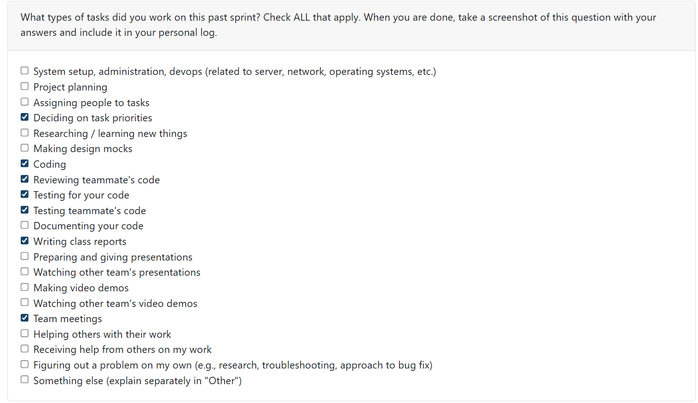
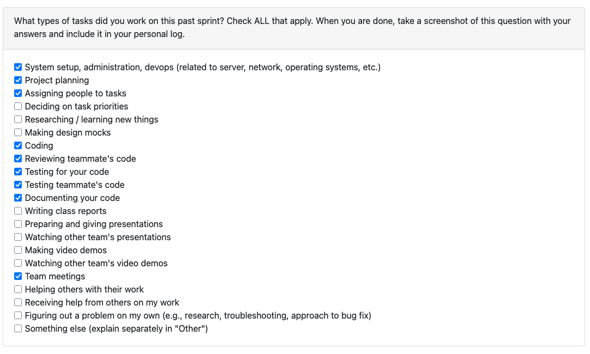

# Mandira Samarasekara

## Date Ranges
March 9 - March 15

## Goals for this week (planned last sprint)
- Incorporated role prediction into resume and portfolio generation
- Change the loading animation in the Analyze page to better account for multi-project analysis

## What went well
This week went well overall because I was able to complete the role prediction frontend feature end-to-end across all three project-facing pages. One of the more satisfying parts was tracing the existing backend role data through multiple query paths and getting it to flow consistently to the frontend, so users can now see predicted roles on the Projects, Resume, and Portfolio pages and override them directly from the Projects page. Manual testing went smoothly across the full stack and I was also able to review and test two teammate PRs and confirm both sets of fixes were working.

## What could have been done better
- The role data already existed in parts of the backend but was not flowing consistently through every query path the frontend needed. It would have been more efficient to map all affected paths before starting the UI work rather than discovering gaps during development.
- I did not get to the Analyze page loading animation update this week. The role prediction curation flow ended up requiring more backend and frontend coordination than anticipated, which pushed that task to next week.

## Coding tasks
- Implemented the **role prediction frontend feature** in PR [#444](https://github.com/COSC-499-W2025/capstone-project-team-6/pull/444)
  - Surfaced role prediction across all three project-facing pages: **Projects**, **Resume**, and **Portfolio**
  - Enriched backend query paths so `predicted_role`, `predicted_role_confidence`, and `curated_role` are included where needed for frontend rendering
  - Added `GET /api/curation/roles` endpoint returning the 12 available developer roles
  - Added `POST /api/curation/role` endpoint to save or clear a curated role for a project
  - Added an interactive role pill on the Projects page with inline editing
  - Added a dropdown of predefined roles plus a **Custom role...** free-text option
  - Added **Save**, **Reset**, and **Cancel** controls for role curation
  - Added role badges to the Resume selection list and Portfolio project views
  - Used distinct visual states for curated roles, predicted roles, and projects with no role data

## Testing or debugging tasks
- Manually tested the full stack locally for PR [#444](https://github.com/COSC-499-W2025/capstone-project-team-6/pull/444)
  - Verified predicted roles display on Projects, Resume, and Portfolio pages after analysis
  - Verified clicking the role pill on the Projects page opens the inline editor
  - Verified selecting a predefined role from the dropdown and saving persists to the database
  - Verified entering a custom role and saving persists to the database
  - Verified **Reset** clears the curated role and reverts to the predicted role
  - Verified **Cancel** closes the editor without saving
  - Verified curated role changes are reflected on Resume and Portfolio after navigation
  - Verified projects with no role prediction display **Not set** gracefully

## Document tasks
- Wrote a detailed guide for the TA so she can veriy the role prediction feature on the backend
## Reviewing or collaboration tasks
- Reviewed **duplicate file analysis detection bug fix** PR [#431](https://github.com/COSC-499-W2025/capstone-project-team-6/pull/431)
  - Verified that the deleted-project re-upload fix works correctly
  - Confirmed deduplication is now analysis-type agnostic
  - Confirmed duplicate handling and messaging are more reliable in single and multi-upload flows
  - Approved the PR after testing and noted a small possible improvement for preserving skipped-duplicate messaging through polling
- Reviewed **Fixed syntax errors** PR [#439](https://github.com/COSC-499-W2025/capstone-project-team-6/pull/439)
  - Verified the frontend build succeeds again
  - Confirmed the Settings page JSX issues were resolved
  - Confirmed the missing `deleteAccount` API method was added correctly
  - Approved the PR after verifying the app compiles and runs successfully

## Issues / Blockers
No major blockers this week.

## PR's initiated
- Feature/role prediction frontend [#444](https://github.com/COSC-499-W2025/capstone-project-team-6/pull/444)

## PR's reviewed
- duplicate file analysis detection bug fix [#431](https://github.com/COSC-499-W2025/capstone-project-team-6/pull/431) : approved after testing duplicate handling scenarios and confirming the major fixes worked as expected
- Fixed syntax errors [#439](https://github.com/COSC-499-W2025/capstone-project-team-6/pull/439) : approved after verifying the frontend and Docker build issues were resolved

## Plan for next week
- Continue milestone 3 frontend integration work
- Return to the Analyze page loading animation update for multi-project analysis
- Support testing and review for related frontend/backend integration PRs

# Aakash Tirithdas

## Date Ranges
March 9 - March 15

## Goals for this week (planned last sprint)

## What went well

## What could have been done better

## Coding tasks

## Testing or debugging tasks

## Document tasks

## Reviewing or collaboration tasks

## Issues / Blockers

## PR's initiated

## PR's reviewed

## Plan for next week

# Mithish Ravisankar Geetha

## Date Ranges
March 9 - March 15

## Goals for this week (planned last sprint)
- Verify Docker functionality on Windows environments.
- Begin implementation of Milestone 3 core requirements based on team discussion.
- Complete docker documentation
- Fix any bugs related to milestone 2 
- Modify resume format for milestone 3 requirements
- Complete documentation for docker

## What went well

This week saw significant progress in refining the core user experience, particularly concerning the Resume and Project management features. Successfully implementing the Education section allows for a much more comprehensive professional profile, and resolving the persistent project deletion bug was a major win for system reliability. By ensuring that deleted projects are truly scrubbed from the database, we've enabled users to re-analyze repositories without encountering stale data errors. 
Additionally, completing the Docker documentation ensures that the unified environment we built last week is now accessible and reproducible for the entire team.

## What could have been done better
While the Docker documentation is complete, the actual verification on Windows environments remains an ongoing task that needs more rigorous cross-platform testing to ensure no edge cases exist with volume mounting. There was also a slight delay in beginning the core Milestone 3 implementation as the focus shifted toward fixing frontend syntax issues and API regressions introduced in earlier merges, which required immediate attention to restore build stability.

## Coding tasks
- **Resume Enhancement:** Implemented the Education and Awards section to support detailed academic credentials.
- **Database Logic Refinement:** Fixed a critical bug in the project deletion flow to allow for clean re-analysis of previously deleted projects.
- **System Stability:** Resolved various JSX and API service syntax errors on the Settings page to restore successful frontend compilation.

## Testing or debugging tasks

- **Project Lifecycle Testing:** Verified that deleting a project successfully clears all associated artifacts, allowing for a fresh re-import without database conflicts.
- **Frontend Build Validation:** Used Vite/Docker build logs to identify and resolve mismatched JSX structures in settings.
- **API Connectivity:** Tested the delete project method and validated personal information update flows.

## Document tasks
- **Docker System Guide:** Authored detailed instructions for setting up and running containers, including environment-specific configurations.

## Reviewing or collaboration tasks
- **Feature Review:** Evaluated the new role prediction frontend, focusing on the interactive UI for overriding predicted developer roles.
- **Validation Oversight:** Reviewed changes to the personal information validation logic to ensure consistency across both the Resume and Settings pages.

## Issues / Blockers
No major blockers this week

## PR's initiated
- Delete project bug fix and Education Section for Resume #440 (https://github.com/COSC-499-W2025/capstone-project-team-6/pull/440)
- Docker documentation #441 (https://github.com/COSC-499-W2025/capstone-project-team-6/pull/441)

## PR's reviewed
- Fixed syntax errors #439 (https://github.com/COSC-499-W2025/capstone-project-team-6/pull/439)
- Feature/role prediction frontend #444 (https://github.com/COSC-499-W2025/capstone-project-team-6/pull/444)
- Aakash/validate settings #443 (https://github.com/COSC-499-W2025/capstone-project-team-6/pull/443)

## Plan for next week
- Attend peer testing and receive feedback, work on the same
- Finalize M3 requirements including heatmap generation

# Harjot Sahota

## Date Ranges
March 9 - March 15

## Goals for this week (planned last sprint)

## What went well

## What could have been done better

## Coding tasks

## Testing or debugging tasks

## Document tasks

## Reviewing or collaboration tasks

## Issues / Blockers

## PR's initiated

## PR's reviewed

## Plan for next week

# Mohamed Sakr

## Date Ranges
March 9 - March 15

## Goals for this week (planned last sprint)

## What went well

## What could have been done better

## Coding tasks

## Testing or debugging tasks

## Document tasks

## Reviewing or collaboration tasks

## Issues / Blockers

## PR's initiated

## PR's reviewed

## Plan for next week

# Ansh Rastogi

## Date Ranges
March 9 - March 15

## Goals for this week (planned last sprint)

## What went well

## What could have been done better

## Coding tasks

## Testing or debugging tasks

## Document tasks

## Reviewing or collaboration tasks

## Issues / Blockers

## PR's initiated

## PR's reviewed

## Plan for next week
