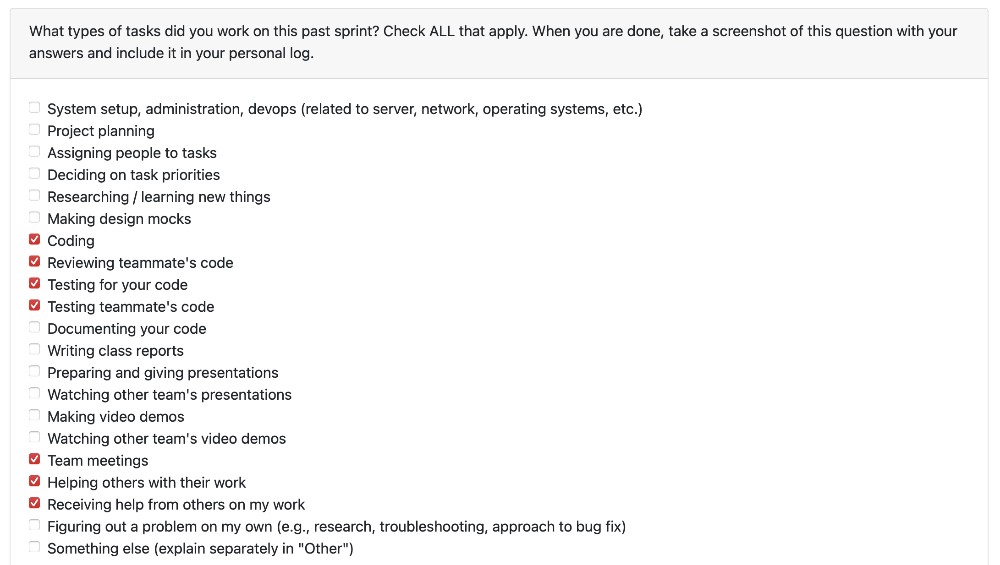
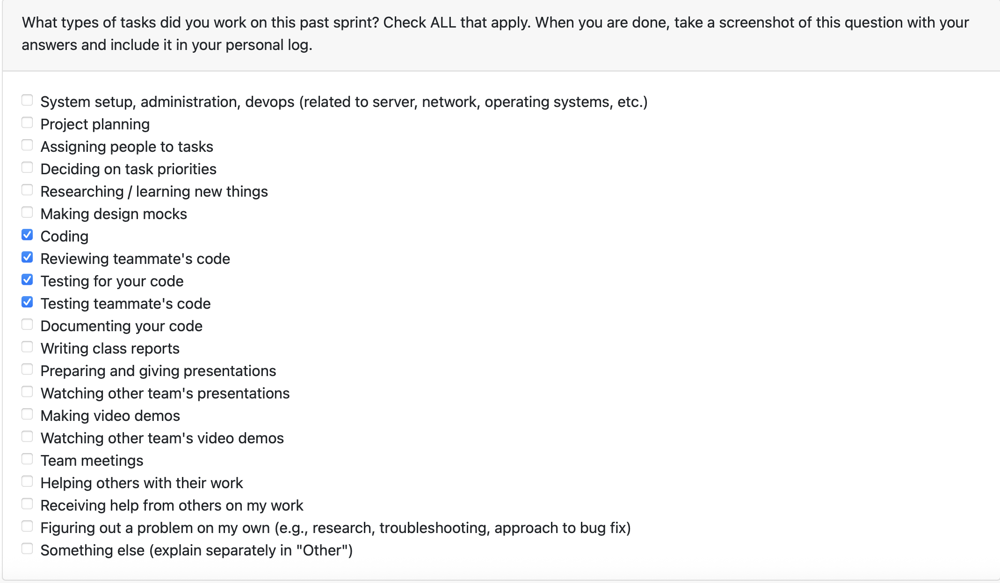

# Mandira Samarasekara

## Date Ranges

March 9 - March 15

## Goals for this week (planned last sprint)

- Incorporated role prediction into resume and portfolio generation
- Change the loading animation in the Analyze page to better account for multi-project analysis

## What went well

This week went well overall because I was able to complete the role prediction frontend feature end-to-end across all three project-facing pages. One of the more satisfying parts was tracing the existing backend role data through multiple query paths and getting it to flow consistently to the frontend, so users can now see predicted roles on the Projects, Resume, and Portfolio pages and override them directly from the Projects page. Manual testing went smoothly across the full stack and I was also able to review and test two teammate PRs and confirm both sets of fixes were working.

## What could have been done better

- The role data already existed in parts of the backend but was not flowing consistently through every query path the frontend needed. It would have been more efficient to map all affected paths before starting the UI work rather than discovering gaps during development.
- I did not get to the Analyze page loading animation update this week. The role prediction curation flow ended up requiring more backend and frontend coordination than anticipated, which pushed that task to next week.

## Coding tasks

- Implemented the **role prediction frontend feature** in PR [#444](https://github.com/COSC-499-W2025/capstone-project-team-6/pull/444)
  - Surfaced role prediction across all three project-facing pages: **Projects**, **Resume**, and **Portfolio**
  - Enriched backend query paths so `predicted_role`, `predicted_role_confidence`, and `curated_role` are included where needed for frontend rendering
  - Added `GET /api/curation/roles` endpoint returning the 12 available developer roles
  - Added `POST /api/curation/role` endpoint to save or clear a curated role for a project
  - Added an interactive role pill on the Projects page with inline editing
  - Added a dropdown of predefined roles plus a **Custom role...** free-text option
  - Added **Save**, **Reset**, and **Cancel** controls for role curation
  - Added role badges to the Resume selection list and Portfolio project views
  - Used distinct visual states for curated roles, predicted roles, and projects with no role data

## Testing or debugging tasks

- Manually tested the full stack locally for PR [#444](https://github.com/COSC-499-W2025/capstone-project-team-6/pull/444)
  - Verified predicted roles display on Projects, Resume, and Portfolio pages after analysis
  - Verified clicking the role pill on the Projects page opens the inline editor
  - Verified selecting a predefined role from the dropdown and saving persists to the database
  - Verified entering a custom role and saving persists to the database
  - Verified **Reset** clears the curated role and reverts to the predicted role
  - Verified **Cancel** closes the editor without saving
  - Verified curated role changes are reflected on Resume and Portfolio after navigation
  - Verified projects with no role prediction display **Not set** gracefully

## Document tasks

- Wrote a detailed guide for the TA so she can veriy the role prediction feature on the backend

## Reviewing or collaboration tasks

- Reviewed **duplicate file analysis detection bug fix** PR [#431](https://github.com/COSC-499-W2025/capstone-project-team-6/pull/431)
  - Verified that the deleted-project re-upload fix works correctly
  - Confirmed deduplication is now analysis-type agnostic
  - Confirmed duplicate handling and messaging are more reliable in single and multi-upload flows
  - Approved the PR after testing and noted a small possible improvement for preserving skipped-duplicate messaging through polling
- Reviewed **Fixed syntax errors** PR [#439](https://github.com/COSC-499-W2025/capstone-project-team-6/pull/439)
  - Verified the frontend build succeeds again
  - Confirmed the Settings page JSX issues were resolved
  - Confirmed the missing `deleteAccount` API method was added correctly
  - Approved the PR after verifying the app compiles and runs successfully

## Issues / Blockers

No major blockers this week.

## PR's initiated

- Feature/role prediction frontend [#444](https://github.com/COSC-499-W2025/capstone-project-team-6/pull/444)

## PR's reviewed

- duplicate file analysis detection bug fix [#431](https://github.com/COSC-499-W2025/capstone-project-team-6/pull/431) : approved after testing duplicate handling scenarios and confirming the major fixes worked as expected
- Fixed syntax errors [#439](https://github.com/COSC-499-W2025/capstone-project-team-6/pull/439) : approved after verifying the frontend and Docker build issues were resolved

## Plan for next week

- Continue milestone 3 frontend integration work
- Return to the Analyze page loading animation update for multi-project analysis
- Support testing and review for related frontend/backend integration PRs

# Aakash Tirithdas

## Date Ranges

March 9 - March 15

## Goals for this week (planned last sprint)

## What went well

## What could have been done better

## Coding tasks

## Testing or debugging tasks

## Document tasks

## Reviewing or collaboration tasks

## Issues / Blockers

## PR's initiated

## PR's reviewed

## Plan for next week

# Mithish Ravisankar Geetha

## Date Ranges

March 9 - March 15

## Goals for this week (planned last sprint)

- Verify Docker functionality on Windows environments.
- Begin implementation of Milestone 3 core requirements based on team discussion.
- Complete docker documentation
- Fix any bugs related to milestone 2
- Modify resume format for milestone 3 requirements
- Complete documentation for docker

## What went well

This week saw significant progress in refining the core user experience, particularly concerning the Resume and Project management features. Successfully implementing the Education section allows for a much more comprehensive professional profile, and resolving the persistent project deletion bug was a major win for system reliability. By ensuring that deleted projects are truly scrubbed from the database, we've enabled users to re-analyze repositories without encountering stale data errors.
Additionally, completing the Docker documentation ensures that the unified environment we built last week is now accessible and reproducible for the entire team.

## What could have been done better

While the Docker documentation is complete, the actual verification on Windows environments remains an ongoing task that needs more rigorous cross-platform testing to ensure no edge cases exist with volume mounting. There was also a slight delay in beginning the core Milestone 3 implementation as the focus shifted toward fixing frontend syntax issues and API regressions introduced in earlier merges, which required immediate attention to restore build stability.

## Coding tasks

- **Resume Enhancement:** Implemented the Education and Awards section to support detailed academic credentials.
- **Database Logic Refinement:** Fixed a critical bug in the project deletion flow to allow for clean re-analysis of previously deleted projects.
- **System Stability:** Resolved various JSX and API service syntax errors on the Settings page to restore successful frontend compilation.

## Testing or debugging tasks

- **Project Lifecycle Testing:** Verified that deleting a project successfully clears all associated artifacts, allowing for a fresh re-import without database conflicts.
- **Frontend Build Validation:** Used Vite/Docker build logs to identify and resolve mismatched JSX structures in settings.
- **API Connectivity:** Tested the delete project method and validated personal information update flows.

## Document tasks

- **Docker System Guide:** Authored detailed instructions for setting up and running containers, including environment-specific configurations.

## Reviewing or collaboration tasks

- **Feature Review:** Evaluated the new role prediction frontend, focusing on the interactive UI for overriding predicted developer roles.
- **Validation Oversight:** Reviewed changes to the personal information validation logic to ensure consistency across both the Resume and Settings pages.

## Issues / Blockers

No major blockers this week

## PR's initiated

- Delete project bug fix and Education Section for Resume #440 (https://github.com/COSC-499-W2025/capstone-project-team-6/pull/440)
- Docker documentation #441 (https://github.com/COSC-499-W2025/capstone-project-team-6/pull/441)

## PR's reviewed

- Fixed syntax errors #439 (https://github.com/COSC-499-W2025/capstone-project-team-6/pull/439)
- Feature/role prediction frontend #444 (https://github.com/COSC-499-W2025/capstone-project-team-6/pull/444)
- Aakash/validate settings #443 (https://github.com/COSC-499-W2025/capstone-project-team-6/pull/443)

## Plan for next week

- Attend peer testing and receive feedback, work on the same
- Finalize M3 requirements including heatmap generation

# Harjot Sahota

## Date Ranges

March 9 - March 15

## Goals for this week (planned last sprint)

## What went well

## What could have been done better

## Coding tasks

## Testing or debugging tasks

## Document tasks

## Reviewing or collaboration tasks

## Issues / Blockers

## PR's initiated

## PR's reviewed

## Plan for next week

# Mohamed Sakr

## Date Ranges

March 9 - March 15

## Goals for this week (planned last sprint)

- Continue working on Milestone 3 features
- Look into further improvements to the resume generation output quality

## What went well

The LLM analysis feature is now fully end-to-end functional. After a methodical debugging process involving backend logging, direct database inspection, and tracing through the full task pipeline, I was able to pinpoint all root causes blocking the analysis from displaying. The frontend panel I built to surface the Gemini output turned out to be solid, the issues were all in the data pipeline, not the UI. Writing focused automated tests for each bug site made the fixes verifiable and should prevent silent regressions.

## What could have been done better

- The root cause of the most critical bug (`sqlite3.Row` not supporting the `in` operator) was subtle and only found after adding extensive diagnostic logging. Knowing the quirks of `sqlite3.Row` upfront would have saved significant debugging time.
- The database ended up in a corrupted state (analyses with `total_projects = 0` and no project rows) from prior partial runs during development, which masked whether fixes were working. It would have been better to clean the test database earlier in the process rather than late in debugging.

## Coding tasks

- Implemented the **LLM analysis display panel** on the Projects page (`ProjectsPage.jsx`)
  - The base prompt output section is always shown for each project
  - A side dropdown lets users select and toggle additional categories from `PROMPT_MODULES` (architecture, security, complexity, skills, domain, resume)
  - Added `parseLlmSections` to transform the Gemini markdown output into rendered React subsections
  - Added `GET /api/projects/{project_id}/llm-analysis` endpoint in `projects.py` to serve `llm_summary` per project
  - Fixed a `NameError` in `projects.py` caused by a missing `Response` import
- Fixed the **LLM summary not being persisted** despite the pipeline running successfully
  - Root cause: `"analysis_uuid" in row` always returned `False` for `sqlite3.Row` objects, so `analysis_uuid` was always set to `None` and the `update_llm_summary` call was skipped
  - Fix: removed the `in row` guard — `analysis_uuid = row["analysis_uuid"] if row else None`
- Fixed **silently suppressed LLM errors** in `llm_pipeline.py`
  - All `logger.error` calls were guarded by `if not progress_callback:`, meaning errors from the Gemini API were never logged when a callback was active
  - Removed all such guards so errors are always logged
- Fixed **frontend dropdown scrolling** for analysis categories in `ProjectsPage.jsx`
  - Changed the dropdown container from `overflow: hidden` to `maxHeight: 320px, overflowY: auto`
  - Removed `overflow: hidden` from the parent panel container which was clipping the absolute-positioned dropdown
- Added **diagnostic logging** to `task_manager.py`, `llm_pipeline.py`, and `analysis_database.py` to track the full LLM pipeline flow: API key presence, pipeline result content, `analysis_uuid` value at save time, and project row counts after `record_analysis`

## Testing or debugging tasks

- Created `tests/backend_test/test_llm_summary.py` with 18 unit tests covering:
  - `update_llm_summary` and `get_llm_summary_for_analysis` round-trip correctness
  - `record_analysis` project row persistence and `total_projects` count accuracy
  - `sqlite3.Row` `in` operator regression (documents the bug and verifies the fix)
  - `_process_new_portfolio` in `task_manager`: LLM summary saved when UUID is available, not saved when UUID is `None`, skipped without consent, and does not crash on Gemini errors
- Created `tests/api_test/test_llm_analysis_endpoint.py` with 6 integration tests covering:
  - Returns `llm_summary` when present for an authenticated user's project
  - Returns `null` summary when LLM has not run
  - Returns 404 for non-existent or other users' projects
  - Rejects unauthenticated requests
  - Response always contains `project_id` and `llm_summary` keys
- Updated `tests/backend_test/test_task_manager_llm.py` to replace the stale test (which tested the old `record_analysis("llm", ...)` architecture) with two new tests verifying the current behavior:
  - `update_llm_summary` is called once with the correct UUID and summary text
  - `record_analysis` is called exactly once (not a second time for the LLM result)
- Diagnosed database corruption by running direct SQL queries confirming `total_projects = 0` and empty `projects` table; cleared corrupted rows and re-ran a clean upload to verify the full pipeline end-to-end

## Reviewing or collaboration tasks

- Reviewed role prediciton frontend edits, validation settings, and docker documentation

## Issues / Blockers

- No blockers

## PR's initiated

-https://github.com/COSC-499-W2025/capstone-project-team-6/pull/446

## PR's reviewed

- https://github.com/COSC-499-W2025/capstone-project-team-6/pull/444 (first review)
- https://github.com/COSC-499-W2025/capstone-project-team-6/pull/443
- https://github.com/COSC-499-W2025/capstone-project-team-6/pull/441

## Plan for next week

- Continue Milestone 3 frontend integration work
- Look into further output quality improvements for the Gemini analysis sections
- Support review of related frontend/backend integration PRs from teammates

# Ansh Rastogi

## Date Ranges

March 9 – March 15

## Goals for this week (planned last sprint)

- Begin working on a Milestone 3 feature task
- Continue supporting teammates with frontend integration and review work
- Address any remaining polish or bugs identified during testing

## What went well

This week went well overall. I tracked down and fixed two bugs that were silently breaking the project thumbnail feature end-to-end. The CORS issue was caused by the axios `baseURL` being hardcoded to the backend port directly, bypassing the Vite dev proxy entirely. Once identified, the fix was a one-line change that also improves the production setup since a relative `/api` base URL resolves correctly regardless of where the app is hosted. The 500 error was a missing `Response` import in the thumbnail endpoint, subtle but straightforward once the backend error was surfaced by routing requests through the proxy. I also reviewed PR [#440](https://github.com/COSC-499-W2025/capstone-project-team-6/pull/440) and confirmed the education section and project deletion fixes worked correctly end-to-end.

## What could have been done better

- The CORS issue could have been caught earlier if the `baseURL` had been set to a relative path from the start of the project. Hardcoding the backend port made development appear to work in some configurations while silently failing in others.
- I did not get to starting the Milestone 3 feature task this week as the debugging work took priority.

## Coding tasks

- Fixed **CORS errors on the thumbnail endpoint** by changing the axios `baseURL` in `src/frontend/src/services/api.js` from `http://localhost:8000/api` to `/api`
  - Requests now go through the Vite dev proxy, eliminating the cross-origin mismatch between port 5173 and port 8000
  - Also corrects production behavior: a relative base URL resolves against whatever origin serves the frontend, rather than a hardcoded localhost address
- Fixed **500 Internal Server Error on the thumbnail GET endpoint** in `src/backend/api/projects.py`
  - `Response` was used to return a 204 No Content for projects with no thumbnail set but was never imported
  - Added `Response` to the `fastapi.responses` import, resolving the `NameError` that caused every request for a project with no thumbnail to crash

## Testing or debugging tasks

- Reproduced the CORS failure in the browser console by loading the Projects page and observing blocked XMLHttpRequest errors for the thumbnail endpoint
- Confirmed the fix by verifying thumbnail requests go through `localhost:5173/api/...` after changing the base URL, with no CORS errors in the console
- Reproduced the 500 by confirming the endpoint crashed for a project with no thumbnail set, then verified it returns 204 correctly after adding the missing import
- Confirmed thumbnail loading works correctly for both projects with and without thumbnails after both fixes were applied

## Document tasks

- Wrote PR description for [#450](https://github.com/COSC-499-W2025/capstone-project-team-6/pull/450) detailing the two bugs, their root causes, and how each fix addresses them

## Reviewing or collaboration tasks

- Reviewed **Delete project bug fix and Education Section for Resume** PR [#440](https://github.com/COSC-499-W2025/capstone-project-team-6/pull/440)
  - Verified that deleting a project fully clears associated data and allows clean re-analysis
  - Confirmed the Education section renders correctly on the Resume page
  - Approved after testing both fixes locally

## Issues / Blockers

No major blockers this week.

## PR's initiated

- #450: Fix CORS and thumbnail 500 error – https://github.com/COSC-499-W2025/capstone-project-team-6/pull/450

## PR's reviewed

- #440: Delete project bug fix and Education Section for Resume – https://github.com/COSC-499-W2025/capstone-project-team-6/pull/440

## Plan for next week

- Begin working on the assigned Milestone 3 feature task
- Continue supporting teammates with frontend integration and review work
