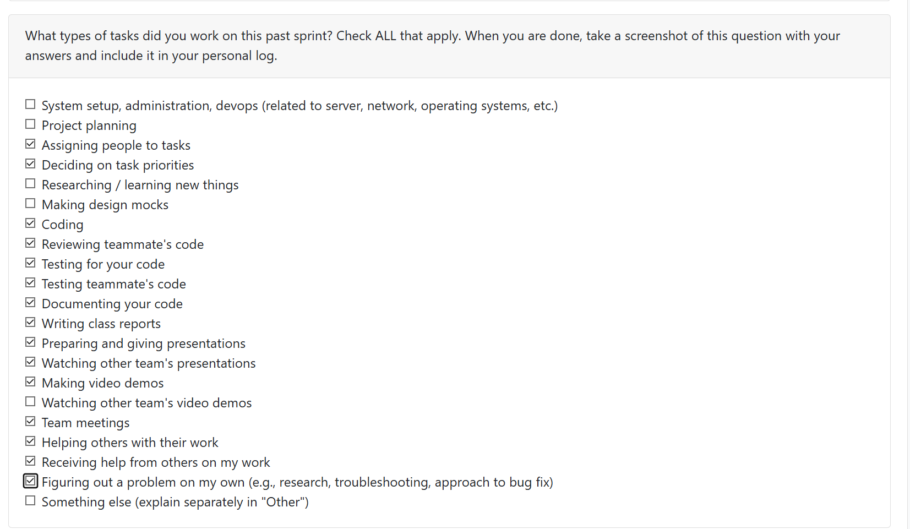

# Mandira Samarasekara

# Aakash Tirithdas

## Date Ranges

March 15 - March 29

## What went well
The presentation went well
majority of bugs were fixed

## Coding tasks
- implemented saving job analysis, can delete and view them

## Testing or debugging tasks
- partially fixed increamental upload. was a deep seeded bug which could not be fixed, small fixes were made
- fixed bugs in portfolio tests
- curate ranking debug to show numbers instead of checks
- fixed  small bugs in multi-project analysis
  - loading bar bug
  - error message now more user friendly
- fixed delete account bug

## Document tasks
- finalaized architecture and data flow diagrams for milestone 3

## Reviewing or collaboration tasks
Too many to refer to reviewed PR to find what was reviewed

## Issues / Blockers

No major blockers this week

## PR's initiated
- https://github.com/COSC-499-W2025/capstone-project-team-6/pull/503
- https://github.com/COSC-499-W2025/capstone-project-team-6/pull/500
- https://github.com/COSC-499-W2025/capstone-project-team-6/pull/496
- https://github.com/COSC-499-W2025/capstone-project-team-6/pull/483
- https://github.com/COSC-499-W2025/capstone-project-team-6/pull/481
- https://github.com/COSC-499-W2025/capstone-project-team-6/pull/480
- https://github.com/COSC-499-W2025/capstone-project-team-6/pull/464

## PR's reviewed
- https://github.com/COSC-499-W2025/capstone-project-team-6/pull/494
- https://github.com/COSC-499-W2025/capstone-project-team-6/pull/492
- https://github.com/COSC-499-W2025/capstone-project-team-6/pull/490
- https://github.com/COSC-499-W2025/capstone-project-team-6/pull/489
- https://github.com/COSC-499-W2025/capstone-project-team-6/pull/485
- https://github.com/COSC-499-W2025/capstone-project-team-6/pull/479
- https://github.com/COSC-499-W2025/capstone-project-team-6/pull/470
- https://github.com/COSC-499-W2025/capstone-project-team-6/pull/462
- https://github.com/COSC-499-W2025/capstone-project-team-6/pull/452
- 

## Plan for next week
tie up loose ends and complete the project

# Mithish Ravisankar Geetha
## Date Ranges

March 9 - March 15

## Goals for this week (planned last sprint)

- Finalize Milestone 3 core requirements, including the Portfolio customization system.
- Resolve session persistence issues caused by Docker container restarts.
- Implement visual data representations (Activity Heatmap) for the developer portfolio.
- Execute full project rebranding to "Blume" for consistent UI/UX across the platform.
- Fix critical bugs regarding duplicate project uploads and orphaned portfolio entries.

## What went well

This week marked the successful wrap-up of Milestone 3. The implementation of the **GitHub-style activity heatmap** and the **Smart Role Assessment** significantly enhances the professional utility of the portfolio. A major technical hurdle was cleared by moving authentication tokens from in-memory storage to a persistent SQLite database; this ensures users remain logged in even after server restarts. Additionally, the transition to the "Blume" branding was executed across all UI elements, providing a much cleaner and more professional identity for the application.
## What could have been done better
While the automated portfolio cleanup logic was successfully implemented, the initial logic for "Smart Role Assessment" required several rounds of debugging to ensure it correctly aggregated skills across multiple projects without performance lag. Earlier communication on the rebranding assets could have streamlined the CSS updates, as the process involved touching 16+ frontend files simultaneously to ensure consistency.

## Coding tasks

- **Session Persistence:** Developed a custom class behaving like a dictionary but backed by a SQLite `tokens` table to persist Auth tokens across backend restarts.
- **Portfolio Heatmap:** Created a calendar-style activity grid that visualizes project intensity via dot size and color density, including productivity stats like streaks and total commits.
- **Smart Portfolio Summary:** Built a dynamic branding system and an analyzer that scans all projects to determine primary developer roles and aggregate the top 8 skills.
- **Project Rebranding:** Updated all UI elements and naming conventions from "MDA Portfolio" to "Blume" for a unified brand identity.
- **Duplicate Detection:** Implemented client-side file signature comparison to prevent users from uploading duplicate projects.

## Testing or debugging tasks
- **Persistence Testing:** Verified that restarting Docker containers no longer clears the `tokens` dictionary, allowing sessions to remain active.
- **Portfolio Cleanup Validation:** Confirmed that deleting the last project in a portfolio now triggers an automatic cleanup of orphaned analysis entries.
- **UI Responsiveness:** Tested the new heatmap and portfolio summary sections across desktop, tablet, and mobile views to ensure visual consistency.

## Document tasks
- **Milestone 3 Documentation:** List of any unsolved bugs has been created. 

## Reviewing or collaboration tasks

- **UI Layout Review:** Reviewed PR #460 to ensure the new persistent education entries and inline PDF preview matched the updated resume layout.
- **Bug Validation:** Collaborated with team members on fixing frontend bugs and multi-project upload issues (PR #477, #480).
- **Public Mode Strategy:** Reviewed the implementation of the Portfolio public mode (PR #494) to ensure data privacy and customization settings are respected.

## Issues / Blockers

No major blockers this week

## PR's initiated
- **Bug Fix: Persist Auth tokens across backend restarts #465** (https://github.com/COSC-499-W2025/capstone-project-team-6/pull/465)
- **Portfolio heatmap #468** (https://github.com/COSC-499-W2025/capstone-project-team-6/pull/468)
- **Bug Fixes and Enhancements + Rebranding #475** -https://github.com/COSC-499-W2025/capstone-project-team-6/pull/475
- **Merge Branch Development to Main for milestone - Project Wrap up #488** -https://github.com/COSC-499-W2025/capstone-project-team-6/pull/488

## PR's reviewed
- **Improve Resume page layout + persistent education entries #460** (https://github.com/COSC-499-W2025/capstone-project-team-6/pull/460)
- **Frontend bug fixes #477** (https://github.com/COSC-499-W2025/capstone-project-team-6/pull/477)
- **Aakash/multiproject bug #480** (https://github.com/COSC-499-W2025/capstone-project-team-6/pull/480)
- **Added Initialisation Document #489** (https://github.com/COSC-499-W2025/capstone-project-team-6/pull/489)
- **Portfolio public mode #494** (https://github.com/COSC-499-W2025/capstone-project-team-6/pull/494)

## Plan for next week

- Fix any other bugs found during testing
- Milestone complete.

# Harjot Sahota

## Date Ranges

March 16 - March 29

## What went well

these weeks were very busy, and I made several major improvements to the resume page and overall user experience of the application.

I improved the layout of the Resume page to make it easier for users to navigate and use. As part of that work, I added an inline preview section so users can now preview their generated resume before downloading it, which makes the resume generation flow much more convenient and user-friendly.

I also made generated resumes savable, and they can now be viewed later in a stored resumes section. In that section, users can view and delete previous resume generations. This makes the feature much more user-friendly because users can keep the resumes they want instead of losing them after generation. Saving is also optional, so users can choose whether or not they want to store a generated resume.

I updated the Education section to support full CRUD functionality. Users can now save, edit, and delete their education entries, which means they no longer have to re-enter their education information every time they log in and generate a resume. This makes the feature much more practical for repeated use.

In addition, I added a Work Experience section to the Resume page. Users can now enter work experience entries that are automatically displayed in reverse chronological order, and this section also supports full CRUD functionality so users can save their work history for future resume generations.

Outside of the Resume page, I also added a logout button to the navigation bar. Previously, the logout option was only available on the dashboard, which was inconvenient for users. Moving it to the navigation bar makes logging out much easier and more accessible from anywhere in the app.

I also fixed several smaller bugs in the codebase in preparation for the final demo, including UI issues, visibility problems, and other minor fixes that helped make the application feel more polished and stable.

Another thing that went well was that our group met together for the project demo, and we all collaborated to create the demo video. That was a good team effort and helped us prepare our final presentation as a group.

Overall, this week went well because I contributed multiple meaningful frontend improvements that made the application more functional, persistent, and user-friendly, while also helping the team prepare for the final demo.

## What didn’t go well

One thing that did not go well this week was that two of my PRs for the Resume page were very large and closely connected, with a lot of new implementation and changes across the page.

My first PR had a bug where the resume PDF preview would not display correctly, even though the follow-up PR, which depended on the first one, had the preview working properly. After debugging, I realized that I had fixed the issue in the second PR but forgot to apply the same fix back to the first PR. This caused extra confusion and made the review process harder.

This taught me that large connected PRs can be difficult to manage, especially when fixes are made in one branch but not carried back into the earlier dependent branch. It was a good lesson in being more careful when working across stacked or related PRs.

## PRs initiated

Work experience section  https://github.com/COSC-499-W2025/capstone-project-team-6/pull/462

Added logout button to navigation bar  https://github.com/COSC-499-W2025/capstone-project-team-6/pull/458

Improve Resume page layout + add persistent education entries + inline PDF preview  https://github.com/COSC-499-W2025/capstone-project-team-6/pull/460

frontend bug fixes https://github.com/COSC-499-W2025/capstone-project-team-6/pull/477 

Implemeted save resume generation + tests https://github.com/COSC-499-W2025/capstone-project-team-6/pull/479

## PRs reviewed

Job description Matching  https://github.com/COSC-499-W2025/capstone-project-team-6/pull/467

made changes to the database to fix the delete account bug  https://github.com/COSC-499-W2025/capstone-project-team-6/pull/464

Aakash/multiproject bug  https://github.com/COSC-499-W2025/capstone-project-team-6/pull/480

Bug Fixes and Enhancements + Rebranding  https://github.com/COSC-499-W2025/capstone-project-team-6/pull/475

Job Match Page UX Improvements https://github.com/COSC-499-W2025/capstone-project-team-6/pull/473

Portfolio Private Mode and Interactive Portfolio Summary https://github.com/COSC-499-W2025/capstone-project-team-6/pull/471

## Plans for next week

Next week I plan to improve the stored resumes feature by allowing users to download resumes they have saved. Right now, users can only view their stored resumes, so adding download support would make the feature much more useful and complete.

If I have time, I also want to improve the existing feature that lets users update a resume by adding content from their saved projects. Currently, this feature is only available for markdown resumes, so I would like to add support for PDF uploads as well.

# Mohamed Sakr

# Ansh Rastogi

