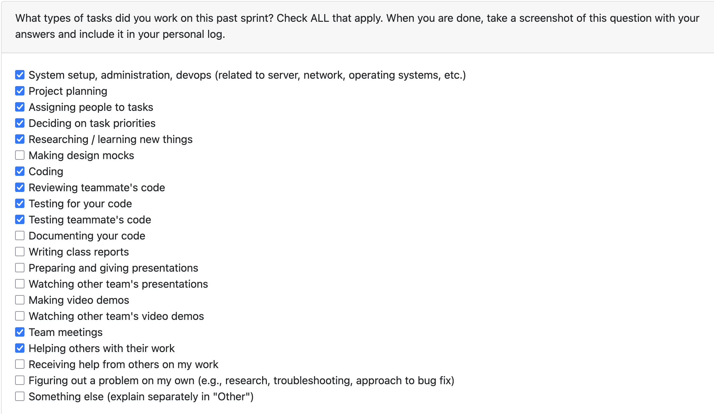
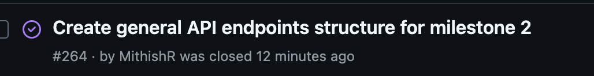

# Mandira Samarasekara

# Aakash Tirithdas

# Mithish Ravisankar Geetha

## Date Ranges

January 12-January 18

## Goals for this week (planned last sprint)

- Discuss milestone 2 requirements with the team
- Complete requirement 21 (Allow incremental information by adding another zipped folder of files for the same portfolio or résumé)
- Clean up API endpoints structure if anything is missing

## What went well 

Building on last week’s implementation of the core REST API endpoint structure and authentication setup, this week I leveraged that foundation to implement and validate a key Milestone 2 requirement: allowing users to incrementally add information by uploading additional zipped folders for the same portfolio or résumé at a later time. This involved ensuring the new uploads integrated cleanly with the existing data model and API flow without breaking previously stored information.

In addition, I actively participated in team meetings focused on refining Milestone 2 requirements and planning the prototype for peer testing, helping align technical decisions with upcoming evaluation needs. I also thoroughly tested the API endpoints introduced in my pull requests to confirm correct behavior and stability, building on the stable codebase established through last week’s PR reviews.## What didn't go well

## What didn't go well
One challenge this week was that parts of the API broke temporarily while adapting the existing endpoints to support the new incremental upload requirement. Some assumptions made in the original API flow did not fully account for multiple uploads tied to the same portfolio or résumé, which led to unexpected behavior during testing. Resolving these issues required extra debugging and refactoring to stabilize the endpoints and ensure the new functionality worked as intended.

## Coding tasks
- Implemented the Milestone 2 requirement to allow incremental information uploads by enabling users to add additional zipped folders to an existing portfolio or résumé.
- Opened and completed PR #283 (https://github.com/COSC-499-W2025/capstone-project-team-6/pull/283) to introduce this functionality, building on the existing REST API structure..

## Testing or debugging tasks
- Tested the incremental upload functionality introduced in PR #283 to ensure new files integrate correctly with existing data.
- Tested related API endpoints to verify stability and correct behavior after the changes.

## Reviewing or collaboration tasks
- Discussed frontend implementation details for the prototype with Ansh to ensure backend support aligns with UI needs.
- Reviewed PR #278 – User curation controls Tests https://github.com/COSC-499-W2025/capstone-project-team-6/pull/278
- Reviewed PR #282 – Added more tests for analysis output based on user ID: https://github.com/COSC-499-W2025/capstone-project-team-6/pull/282

## **Issues / Blockers**
- No major blockers this week. 

## PR's initiated
- Allow incremental information by adding another zipped folder of files #283: https://github.com/COSC-499-W2025/capstone-project-team-6/pull/283

## PR's reviewed

- #278 – User curation controls Tests https://github.com/COSC-499-W2025/capstone-project-team-6/pull/278
- #282 – Added more tests for analysis output based on user ID: https://github.com/COSC-499-W2025/capstone-project-team-6/pull/282

## Issue board

## Plan for next week

- Complete the prototype for the peer testing session.
- Continue working on milestone 2 plans and create more API endpoints for the same. 

# Ansh Rastogi

# Harjot Sahota

# Mohamed Sakr

## Date Ranges
January 12 - January 19
 

## Weekly recap goals
- Ship user-scoped portfolio storage so projects are isolated per authenticated user.
- Add high-coverage tests to guard user isolation and DB migration behavior.
- Keep continuity with last week’s schema/ranking work by ensuring ownership data persists cleanly.

## What was done
**Coding tasks**
- Added `username` ownership to analyses, wiring task processing to persist the logged-in user on each analysis record and filter list/get/delete queries by owner.
- Added backward-compatible migration logic to inject the `username` column when missing without dropping existing data.

**Testing or debugging tasks**
- Created a comprehensive user-scoping test suite covering ownership persistence, filtered listings, scoped fetch/delete, NULL-username compatibility, and legacy-schema migration.
- Fixed fixture setup to initialize user and analysis DBs together and seed users to satisfy FK constraints.
- Ran focused suites: `pytest src/tests/backend_test/test_analysis_database.py -q` and `pytest src/tests/backend_test/test_user_scoping.py -q` (all passing).

**Reviewing or collaboration tasks**
- Verified behavior against API flow expectations (upload/list/delete isolation) and aligned tests with ownership enforcement; no external PR reviews this week.

## How this builds up on last weeks work
- Building on last week’s schema and ranking work (ownership/skills storage, contributor metrics), this week moved the ownership data into active use: analyses now persist the logged-in username, API list/get/delete calls are user-scoped, and high-coverage tests verify isolation and legacy DB migration. The richer ownership data added previously is now enforced end-to-end so portfolios are isolated per user.

## What went well
- User isolation is now enforced end-to-end (storage, queries, deletion), eliminating cross-user leakage.
- Tests provide high coverage, including migration of legacy DBs, reducing regression risk.
- Fixture seeding resolved FK issues quickly, keeping the test loop fast.

## What didn't go well
- Hit a foreign-key blocker (“no such table: users”) until fixtures initialized the user DB and seeded accounts before analysis inserts; resolved by reordering init and seeding test users.

## Plan for next week
- Exercise full API flow manually with two users (upload/list/delete) to mirror the automated coverage.
- Backfill any docs on the new user-scoping behavior and migrations.
- Monitor for performance impacts and consider indexing on `analyses.username` if query volume grows.

## PR's initiated
- #281 https://github.com/COSC-499-W2025/capstone-project-team-6/pull/281
- #282 https://github.com/COSC-499-W2025/capstone-project-team-6/pull/282

## PR's reviewed
- #278 https://github.com/COSC-499-W2025/capstone-project-team-6/pull/278
- #280 https://github.com/COSC-499-W2025/capstone-project-team-6/pull/280
- #283 https://github.com/COSC-499-W2025/capstone-project-team-6/pull/283
- #288 https://github.com/COSC-499-W2025/capstone-project-team-6/pull/288