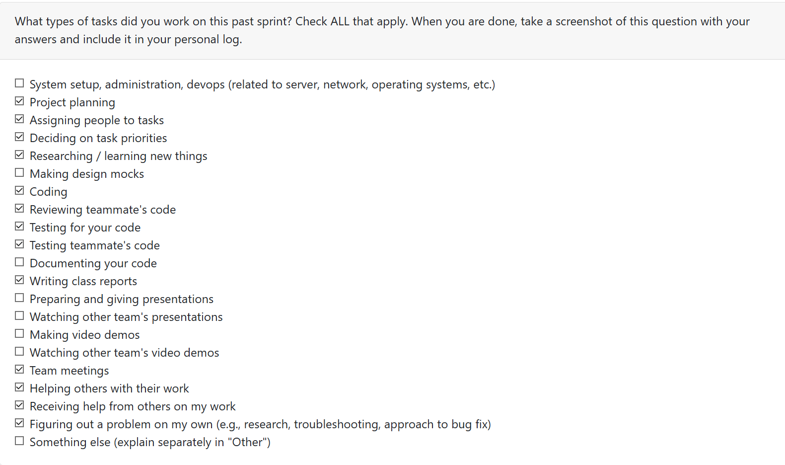
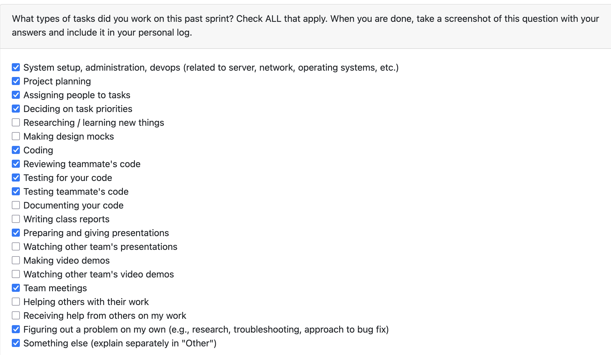
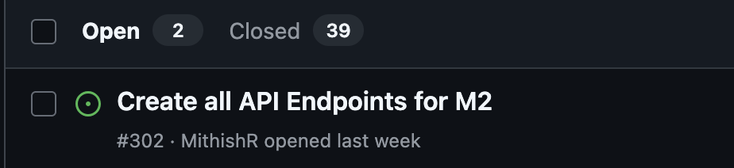
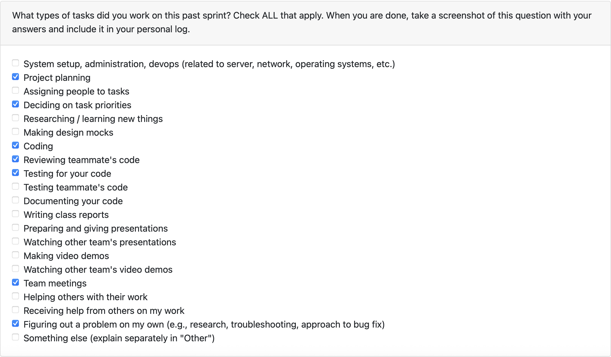

# Mandira Samarasekara

# Aakash Tirithdas

## Date Ranges

January 19-January 25

## Goals for this week (planned last sprint)

- Team goal - complete the main structure of the frontend so that it is presentational ready with few polishes ready
- Complete the tests for the curate portion I coded last week
- Help Mithish with the frontend API endpoints
- Do not leave evrything for last minute work

## What went well

- Ended up helping Ansh with coding portion due to lack of work to do.
- completed the code for the analysis frontend connection.
- Frontend analysis is majority setup and only need to be integrated
- No one had clashing work
- Debugged some prior tests

## What didnt go well

- I was supposed to work this Mithish this week, He started and copleted the work alone by Wednesday which is good. I should have asked eariler how i could have helped
- Misjudged the amount of time it would take to do the task preventing me from writing tests for last weeks and this weeks code.
- Although the team communicated well we missed a meeting due to all of us being busy this week.
- Could have started work eariler this week

## Coding

Coded in react and python this week in connecting the backend to frontend, this was my first time doing the linking. Learnt a lot on how the systems are connected and seperated.

### PR initiated

https://github.com/COSC-499-W2025/capstone-project-team-6/pull/317

## PR reviewed

https://github.com/COSC-499-W2025/capstone-project-team-6/pull/298
https://github.com/COSC-499-W2025/capstone-project-team-6/pull/301
https://github.com/COSC-499-W2025/capstone-project-team-6/pull/304
https://github.com/COSC-499-W2025/capstone-project-team-6/pull/315
https://github.com/COSC-499-W2025/capstone-project-team-6/pull/319
https://github.com/COSC-499-W2025/capstone-project-team-6/pull/324

## Issues

https://github.com/COSC-499-W2025/capstone-project-team-6/issues/316

## plan for next week

- start my work earlier in the week
- complete the tests cases that have been delayed by me
- complete the integration of the project analysis
- look to small bugs in the system
- team goal - get a stable working version of the frontend so that only polishes are left.

# Mithish Ravisankar Geetha

## Date Ranges

January 19-January 25

## Goals for this week (planned last sprint)

- Work on creating all the API endpoints.
- Test the API endpoints created.
- Check if the prototype looks good
- Attend team meetings and review other teams codes.

## What went well

I successfully implemented all major API endpoints for projects, resume, portfolio, and privacy consent, meeting requirement 32 of Milestone 2. The monolithic `api_server.py` was refactored into a modular architecture, which improved maintainability, scalability, and readability. Most of the backend work was completed ahead of schedule, providing the team with a stable foundation for frontend integration and additional features.
I also added comprehensive unit tests for all major components, including projects, portfolio, resume, analysis, authentication, tasks, and health endpoints, ensuring proper functionality, error handling, and security. Additionally, I attended team meetings and reviewed other team members’ code, and my PRs were well-documented and structured, making it easier for the team to follow the changes and merge smoothly.

## What didn't go well

What didn’t go as smoothly was that the initial PR implementing all the API endpoints became quite large, which meant unit tests had to be added in separate PRs (#318 and #319). While refactoring the monolithic API server improved long-term maintainability, it required additional coordination and time that slightly slowed initial progress. Overall, however, the work was completed efficiently and laid a strong foundation for the rest of the milestone.

## Coding tasks

- Implemented all major API endpoints for projects, resume, portfolio, and privacy consent, and refactored the API server into a modular, maintainable structure.
- Opened and completed PR #283 (https://github.com/COSC-499-W2025/capstone-project-team-6/pull/301) to introduce this functionality.

## Testing or debugging tasks

- Tested all the API endpoints (analysis, auth, portfolios, projects, tasks, resume, health and API servers)
- Opened PRs #318 (https://github.com/COSC-499-W2025/capstone-project-team-6/pull/318) and PR #319 for the same (https://github.com/COSC-499-W2025/capstone-project-team-6/pull/319).

## Reviewing or collaboration tasks

- Reviewed PR #290 – Enhanced Contribution Ranking Integration: https://github.com/COSC-499-W2025/capstone-project-team-6/pull/290
- Reviewed PR #306 – Project thumbnail: https://github.com/COSC-499-W2025/capstone-project-team-6/pull/306
- Reviewed PR #308 - Updated Dashboard: https://github.com/COSC-499-W2025/capstone-project-team-6/pull/308
- Reviewed PR #311 - Store + serve resume_items/portfolio_items and display on Projects page : https://github.com/COSC-499-W2025/capstone-project-team-6/pull/311
- Reviewed PR #304 - Fix: Prevent Duplicate LLM Saves During Analysis : https://github.com/COSC-499-W2025/capstone-project-team-6/pull/304

## **Issues / Blockers**

- No major blockers this week.

## PR's initiated

- #318 - Unit tests for analysis, auth, porfolios and projects endpoints: https://github.com/COSC-499-W2025/capstone-project-team-6/pull/318
- #319 - Unit tests for tasks, resume, health and API Server endpoints: https://github.com/COSC-499-W2025/capstone-project-team-6/pull/319
- #301 - API Endpoints: https://github.com/COSC-499-W2025/capstone-project-team-6/pull/301

## PR's reviewed

- #290 – Enhanced Contribution Ranking Integration: https://github.com/COSC-499-W2025/capstone-project-team-6/pull/290
- #306 – Project thumbnail: https://github.com/COSC-499-W2025/capstone-project-team-6/pull/306
- #308 - Updated Dashboard: https://github.com/COSC-499-W2025/capstone-project-team-6/pull/308
- #311 - Store + serve resume_items/portfolio_items and display on Projects page : https://github.com/COSC-499-W2025/capstone-project-team-6/pull/311
- #304 - Fix: Prevent Duplicate LLM Saves During Analysis : https://github.com/COSC-499-W2025/capstone-project-team-6/pull/304

## Issue board

## Plan for next week

- Attend Peer testing.
- Provide feedback for other teams during peer testing.
- Implement communication using FastAPI between backend and frontend
- Fix bugs found during peer testing.

# Ansh Rastogi

## Date Ranges

January 19-January 25

## Goals for this week (planned last sprint)

- Complete the prototype for the peer testing session
- Continue working on Milestone 2 implementation tasks
- Address any additional feedback on authentication frontend and ranking integration
- Collaborate with team on integrating frontend components with backend API endpoints

## How this builds on last week's work

Building on last week's authentication frontend and Enhanced Contribution Ranking integration, this week I focused on creating a polished, user-facing dashboard and implementing the project thumbnail feature. The dashboard connects to the backend APIs established by the team, displaying real-time statistics about user projects and providing quick access to core functionality. The thumbnail feature extends the project management capabilities, allowing users to visually identify their portfolio projects.

## What went well

This week was productive with significant frontend improvements. I successfully implemented a comprehensive dashboard redesign with modern UI patterns, including navigation components with active state indicators, statistical cards showing projects count, AI-analyzed projects, lines of code, and detected skills. The dashboard also features quick action cards for uploading, viewing projects, generating portfolios, and generating resumes.

I also implemented the complete project thumbnail upload system with REST API endpoints for uploading, retrieving, and deleting thumbnails. This included database schema updates, file storage management, and security measures like authentication, ownership validation, file type restrictions (JPG, PNG, GIF, WebP), and 5MB size limits.

## What didn't go well

During the thumbnail feature review, a storage leak issue was identified where re-uploading thumbnails would leave orphaned files on disk. This required an additional commit to properly delete previous thumbnails before saving new ones. This edge case should have been caught earlier during initial implementation.

## Coding tasks

- Implemented comprehensive dashboard redesign with modern UI patterns and real-time data integration
- Created reusable Navigation component with clean styling and active state indicators
- Built dashboard statistics cards displaying projects, AI-analyzed projects, lines of code, and detected skills
- Added quick action cards for common tasks (Upload, View Projects, Generate Portfolio, Generate Resume)
- Created placeholder pages for Upload, Portfolio, Resume, and Settings sections
- Integrated Inter font for improved typography
- Implemented project thumbnail upload system with REST API endpoints
- Added database schema updates with `thumbnail_image_path` column
- Built three API endpoints: POST, GET, DELETE for thumbnail management
- Added security measures: authentication, ownership validation, file type restrictions, 5MB size limit

## Testing or debugging tasks

- Fixed SQL query in `curation.py` to properly filter projects by username
- Corrected API response handling in `api.js` to extract projects array correctly
- Fixed storage leak issue where re-uploads orphaned old thumbnail files
- Verified all backend and API tests pass
- Tested frontend and backend server integration with proper authentication and routing

## Reviewing or collaboration tasks

- Reviewed PR #318 – Unit tests for analysis, auth, portfolios and projects endpoints
- Reviewed PR #311 – Store + serve resume_items/portfolio_items and display on Projects page
- Reviewed PR #313 – Consent revocation and reanalysis deduplication
- Reviewed PR #301 – API Endpoints implementation

## Issues / Blockers

No major blockers this week.

## PR's initiated

- #308: Updated Dashboard - https://github.com/COSC-499-W2025/capstone-project-team-6/pull/308
- #306: Project thumbnail - https://github.com/COSC-499-W2025/capstone-project-team-6/pull/306

## PR's reviewed

- #318: Unit tests for analysis, auth, portfolios and projects endpoints - https://github.com/COSC-499-W2025/capstone-project-team-6/pull/318
- #311: Store + serve resume_items/portfolio_items and display on Projects page - https://github.com/COSC-499-W2025/capstone-project-team-6/pull/311
- #313: Consent revocation and reanalysis deduplication - https://github.com/COSC-499-W2025/capstone-project-team-6/pull/313
- #301: API Endpoints - https://github.com/COSC-499-W2025/capstone-project-team-6/pull/301
- #324 - https://github.com/COSC-499-W2025/capstone-project-team-6/pull/324

## Plan for next week

- Attend peer testing session and gather feedback
- Provide feedback for other teams during peer testing
- Fix any bugs identified during peer testing
- Continue polishing frontend UI based on user feedback
- Integrate remaining frontend components with backend API endpoints

# **Harjot Sahota**

## **Date ranges**

January 19 – January 26

---

## **What went well**

- This week I completed the **end-to-end storage and frontend display of resume_items and portfolio_items**, which included updating the SQLite schema, adding backend DB helper functions, implementing new protected API endpoints, and building the frontend UI to render project-specific summaries and resume bullet lists.

- I also successfully fixed a critical bug in the analysis flow with PR **#304 (Prevent Duplicate LLM Saves During Analysis)**. This required tracing the full CLI flow, debugging how analysis metadata was stored, and redesigning the logic so LLM-consented users no longer create duplicate rows. Both LLM and non-LLM paths now behave correctly.

- I resolved several CI failures and test issues on my branch by updating unit tests, fixing import mismatches, addressing stale bytecode cache problems, and properly resolving merge conflicts. After these fixes, **all tests passed and CI turned fully green**.
- I also added tests for my last weeks work on the frontend, Projects Page

- Overall, I learned a lot about **test-driven debugging, merge conflict resolution, interactive rebasing, API routing, and how frontend and backend layers integrate across the stack**.

---

## **What didn’t go well**

- A lot of unexpected time was spent fixing failing tests and CI issues after merging new updates from Development. Some failures were caused by cache inconsistencies, outdated imports, and mismatched API expectations, which made debugging slower than expected.

---

## **PRs initiated**

- **Store + serve resume_items/portfolio_items and display on Projects page**  
  https://github.com/COSC-499-W2025/capstone-project-team-6/pull/311

- **Fix: Prevent Duplicate LLM Saves During Analysis**  
  https://github.com/COSC-499-W2025/capstone-project-team-6/pull/304

- **Add frontend tests configuration and ProjectsPage tests**  
  https://github.com/COSC-499-W2025/capstone-project-team-6/pull/322

---

## **PRs reviewed**

- **Revoke Consent Feature**  
  https://github.com/COSC-499-W2025/capstone-project-team-6/pull/315

- **Unit tests for tasks, resume, health and API Server endpoints**  
  https://github.com/COSC-499-W2025/capstone-project-team-6/pull/319

---

## **Plans for next week**

- Finish polishing the resume/portfolio integration and begin working on UI improvements so the Projects page is more readable and user-friendly.
- Add more robust unit tests for the resume_items/portfolio endpoints to ensure ordering and authorization rules are enforced correctly.

# Mohamed Sakr

## Date Ranges

January 19 - January 25

## Weekly recap goals

- Ship built-in consent revocation and enforce consent gating on analyze/login.
- Align CLI outputs and tests to keep consent workflows stable.
- Harden prompts to avoid stdin capture failures during automated runs.
- Prevent duplicate project analyses by scoping dedup per-user with overwrite semantics.
- Tested project thumbnails and frontend demos

## What was done

**Coding tasks**

- Added consent revocation to `mda consent --update`, persisting revoked state and disabling AI-powered features.
- Restored first-time login consent gate; block login when consent is denied.
- Enforced consent requirement before running `analyze`; made JSON save prompt EOF-safe.
- Scoped project dedup to `(project_name, project_path, owner_username)` with upserted children and safe migrations to avoid cross-user overwrite.
- Added owner-aware upsert path that clears/reinserts child tables (languages, frameworks, contributions, blame, resume items) so latest run fully replaces prior data.
- Hardened migrations: drop/recreate unique index during normalization, guard legacy analyses from deletion when no projects exist.

**Testing or debugging tasks**

- Updated CLI integration tests to reflect consent flows and current analyze output strings.
- Investigated pytest stdin capture crashes; adjusted prompt handling to avoid EOF errors under capture.
- Added high-coverage reanalysis tests (upsert refresh, null-path normalization, per-user separation) to prevent duplicate projects and ensure latest-run wins without cross-user collisions.
- Covered owner-scoped dedup (same name/path different users keep separate rows) and same-user overwrite (row id reused, children refreshed, obsolete analyses cleaned safely).

**Reviewing or collaboration tasks**

- Reviewed thumbnail backend feature (DB migration, helper fns, upload/get/delete endpoints, project detail thumbnail_url). Found re-uploads leave old files, path safety could be tighter, and file-type check is extension-only.
- Ran `python -m pytest src/tests/api_test/test_project_thumbnails.py -v` (system Python; venv path missing) — 9 tests passed.

## How this builds up on last weeks work

- Extends prior consent/privacy work by adding revocation and enforcing gates before analysis.
- Keeps integration coverage aligned with evolving CLI outputs to reduce regressions.
- Extends earlier analysis storage work by making dedup multi-tenant aware and resilient through migrations and tests (including legacy schemas and empty-project edge cases).

## What went well

- Consent flows now clearly support both opt-in and opt-out, with matching tests.
- Prompt handling is more resilient in automated test environments.
- Reanalysis dedup now behaves correctly per user, and tests guard against regression; child tables refresh cleanly on overwrite.

## What didn't go well

- Pytest runs intermittently crash in sandbox due to stdin capture/segfault; needs follow-up outside sandbox.
- Migration for the new unique key needed iterative fixes to avoid legacy data loss; still need broader validation on seeded data.

## Plan for next week

- Add documentation for consent management and edge cases around analyze gating.
- Validate the per-user dedup migration on fresh and legacy databases and document rollback steps; add a short ops runbook for the unique-index rebuild.
- Refactor as needed after all major milestone 2 requirements are met

## PR's initiated

- #313 https://github.com/COSC-499-W2025/capstone-project-team-6/pull/313
- #315 https://github.com/COSC-499-W2025/capstone-project-team-6/pull/315

## PR's reviewed

- #306 https://github.com/COSC-499-W2025/capstone-project-team-6/pull/306
- #317 https://github.com/COSC-499-W2025/capstone-project-team-6/pull/317 (First review)
- #322 https://github.com/COSC-499-W2025/capstone-project-team-6/pull/322 (first review)
