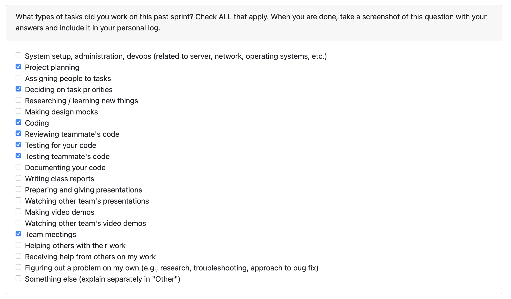

# Mandira Samarasekara

# Aakash Tirithdas

# Mithish Ravisankar Geetha

# Ansh Rastogi

# **Harjot Sahota**

## **Date ranges**

January 26th – February 8th

---
## **What went well**

- These 2 weeks I completed two major features: the **Settings consent update UI** and the **Delete All Projects** functionality. Both included full frontend work, backend updates, and database tests.

- In **PR #348**, I added the consent toggle on the Settings page, including loading the user’s consent status, a confirmation modal, and clear success/error feedback. The UI now matches the app’s style, and all related frontend tests are passing.

- In **PR #345**, I added a bulk project deletion flow with a new `DELETE /api/projects` endpoint, full user-scoped backend logic, UI updates, and database tests to verify that only the authenticated user’s projects are removed.

- I also merged **PR #338**, which added per-project deletion with improved Projects page UI and full backend authorization checks. Both manual and automated tests confirmed the end-to-end flow works reliably.

- All PRs passed CI, and manual checks ensured UI updates, confirmation flows, and DB state behaved correctly after deletion and after logout/login. Overall, I shipped multiple stable features and strengthened my understanding of frontend–backend integration and testing.

- I identified and fixed a critical data-model bug in the resume generation flow where portfolio (analysis) IDs were incorrectly used instead of project IDs. I refactored the backend resume API, resume generator, and frontend resume page to be fully project-based, ensuring resume bullets are correctly sourced per project and that project deletion now cascades cleanly without breaking resume generation. This resolved duplicated/missing resume entries and aligned the feature with the database ownership model.

---
## **What didn’t go well**

- Nothing major went wrong this week, but I did discover an important bug in our system: we were using two different unique identifiers for projects, which caused portfolio_items not to delete when the associated project was deleted. This issue wasn’t obvious at first and took time to trace through the database and backend logic.

- The bug is now fully fixed, but identifying it highlighted how critical consistent IDs are for future features and data integrity. While it didn’t block my work, it added extra debugging time and reminded me to double-check identifier flow across the stack.

---
## **PRs initiated**

- **Add update consent feature in Settings + tests**  
  https://github.com/COSC-499-W2025/capstone-project-team-6/pull/348

- **Add delete all projects functionality (UI + backend + DB tests)**  
  https://github.com/COSC-499-W2025/capstone-project-team-6/pull/345

- **Add per-project delete feature with UI updates and backend cleanup**  
  https://github.com/COSC-499-W2025/capstone-project-team-6/pull/338

- **Migrate resume generation from portfolio IDs to project IDs**    
https://github.com/COSC-499-W2025/capstone-project-team-6/pull/350

---
## **PRs reviewed**

- **Markdown resume preview and resume information bug fixes**  
  https://github.com/COSC-499-W2025/capstone-project-team-6/pull/346

- **Role prediction curation (CLI + database + tests)**  
  https://github.com/COSC-499-W2025/capstone-project-team-6/pull/342

- **Interactive resume generator**  
  https://github.com/COSC-499-W2025/capstone-project-team-6/pull/336

- **Frontend Resume Generator**  
  https://github.com/COSC-499-W2025/capstone-project-team-6/pull/334

- **Role prediction tests**  
  https://github.com/COSC-499-W2025/capstone-project-team-6/pull/330

---

## **Plans for next week**

Next week I will work on removing portfolio_id usage end-to-end (it still exists in the database + tests + function calls). This will require refactoring backend endpoints and database access patterns that still depend on portfolio UUIDs, updating frontend flows (Upload/Analyze/Curate), and rewriting/adjusting related tests to match the new project-based model.

# Mohamed Sakr

# Date Ranges

January 26-February 8

## Goals for this week (planned last sprint)

- Attend peer testing session and gather feedback
- Provide feedback for other teams during peer testing
- Fix any bugs identified during peer testing
- Expand automated tests (resume API coverage) to catch regressions before peer feedback cycles.
- Solidify stored-resume workflow so users can manage/import resumes and layer generated project bullets on top.
- Ensure the new resume + portfolio integrations stay synced with backend APIs so `npm run build` passes and all dashboard sections show live data.
- Hook the Portfolio page up to real backend data so it surfaces summaries, skills, and project highlights/stats instead of a placeholder message.
- Ensure the Resume page uses the correct API helpers so `npm run build` succeeds and matches the new portfolio integration.
- Reviewed my peers work

## What went well

- Built out a comprehensive test suite for the resume API (`src/tests/api_test/test_resume.py`), covering auth, resume generation (including markdown/pdf/latex formats), stored resume CRUD, and stored resume + resume item error cases.
- Verified the new tests exercise failure paths (missing portfolios, stored resume ownership, invalid resume items) by mocking analysis lookup and the resume generator, eliminating flakiness while gaining 85% coverage for `backend.api.resume`.
- Ported the Portfolio page from a static placeholder to a data-rich dashboard; it now surfaces hero metrics, detailed summaries, highlighted skills, timeline/resume bullets, CTA buttons, and a debug panel via the new `portfoliosAPI`.
- Added Vitest coverage for the new Portfolio flows and switched the Resume page to the right API so the build succeeds, giving the UI immediate access to backend summaries once generated.
- Built backend stored resume support (DB tables, CRUD API, merge logic) and wired the UI so stored resumes become generation bases that append project bullets inside a single Projects section.
- Extended the resume API tests to cover CRUD, stored-resume merges, and access control so the new logic stays protected and backend coverage reaches ~85%.

## What didn't go well

- While writing access-control/update tests I uncovered that `PATCH /api/resumes/{id}` raises a `TypeError` if the resume row is missing instead of returning 404, which made the assertions focus on the failing response/exception and exposed an API gap.

## Coding tasks

 - Replaced the placeholder Portfolio page with a data-driven dashboard that renders hero metrics, summary text, skills, project highlights, resume bullets, and portfolio items pulled from `/api/portfolios/{id}` while mirroring the Projects layout navigation.
 - Added `portfoliosAPI` helpers (list, detail, document generation), wired the UI to surface loading/error/empty states, filter pills, CTA buttons, and a debug panel so every backend field returns is visible.
 - Extended `src/tests/pages/Portfolio.test.jsx` to cover auth gating, loading/error states, timeline/resume sections, filters, and the “Generate document” CTA to lock down regressions.
 - Swapped `Resume.jsx` from the nonexistent `portfolioAPI` to `portfoliosAPI.listPortfolios` so `npm run build` completes successfully.
- Implemented stored resume management: persisted stored resume/table support, new CRUD merge endpoints, and UI wiring so stored markdown can be used as the base for generated resumes.
- Added `resumeAPI` tests covering stored resume CRUD, merge behavior, and authorization; updated backend/fetch helpers so added resumes load in dropdowns and the generation options always include the Projects section.
 
## Testing or debugging tasks

- Ran the full `test_resume.py` suite verbosely to exercise every new scenario.
- Repeat runs with `--tb=short` confirmed clean stack traces and consistent behavior.
- Coverage report execution verified that `backend.api.resume` now hits 85% coverage thanks to the new tests.

## Reviewing or collaboration tasks
- Reviewed thumbnail upload PR; backend still has debug/log noise and missing `composite_id` on showcase projects, while frontend needs blob URL cleanup/fix and remove console logs.
- Reviewed Role Prediction PR: The test suite provides excellent coverage with comprehensive unit, integration, performance, and end-to-end tests. Noted a critical missing `AnalysisDatabase` import in one of the integration test fixtures, which should be addressed. Overall, the PR significantly strengthens the testing foundation for role prediction.
- Reviewed Projects filtering/sorting PR; new filters, search, sort controls, APIs, localStorage mock, and tests look comprehensive, though double-checking empty-state guards on the filter bar and API resilience with missing IDs is still worth it.
- Summarized the upload/analysis PR as delivering a complete happy path from upload through analysis while noting extra error handling could follow.

## **Issues / Blockers**

- No major blockers this week.

## PR's initiated
 - https://github.com/COSC-499-W2025/capstone-project-team-6/pull/359
 - https://github.com/COSC-499-W2025/capstone-project-team-6/pull/352
 - https://github.com/COSC-499-W2025/capstone-project-team-6/pull/340

## PR's reviewed
- https://github.com/COSC-499-W2025/capstone-project-team-6/pull/354 (First Review)
- https://github.com/COSC-499-W2025/capstone-project-team-6/pull/333
- https://github.com/COSC-499-W2025/capstone-project-team-6/pull/330
- https://github.com/COSC-499-W2025/capstone-project-team-6/pull/362 (First Review)
- https://github.com/COSC-499-W2025/capstone-project-team-6/pull/364 (First Review)

## Plan for next week

-Next week I will work on removing portfolio_id usage end-to-end (it still exists in the database + tests + function calls). This will require refactoring backend endpoints and database access patterns that still depend on portfolio UUIDs, updating frontend flows (Upload/Analyze/Curate), and rewriting/adjusting related tests to match the new project-based model.

- Validate that completed analyses reliably populate `summary`, `skills`, and `portfolio_items`/`items` so the Portfolio page can replace the placeholder messaging with actual highlights.
- Continue polishing how backend metadata (quality scores, skill counts, document URLs) surfaces in the frontend while keeping the UI resilient when the payload changes.
- Audit stored resume merge behavior end-to-end to ensure personal info is copied once, projects merge cleanly, and users can pick a stored resume inside the generation options without extra steps.