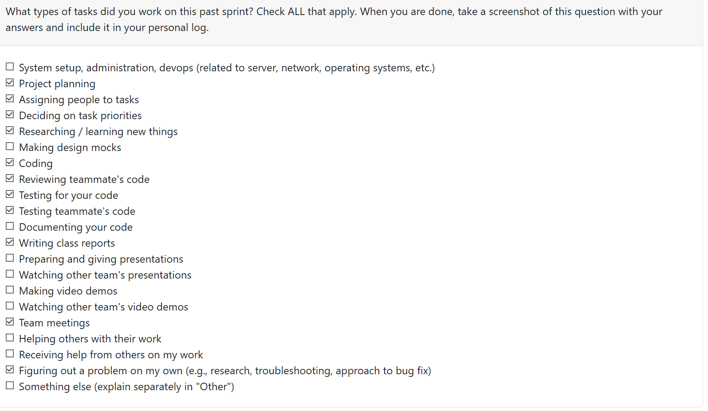
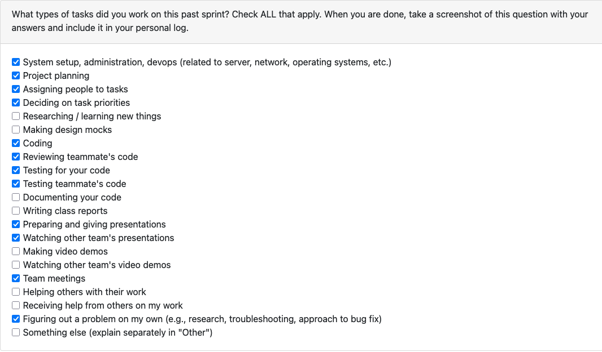

# Mandira Samarasekara

## Date Ranges

January 26-February 8

## Weekly recap (planned last sprint)
- Completed the planned test coverage for role curation and verified end-to-end behavior.
- Implemented project/portfolio curation functionality on the frontend (Curate page + tabbed workflow).
- Initiated and progressed the Projects page filtering/search/sort feature with full test coverage.
- Reviewed a large number of teammate PRs and provided actionable feedback during code review.
- Performed thorough manual validation of teammate features to ensure cross-feature compatibility.
- Attended weekly check-ins and incorporated feedback from peer/heuristic evaluations.
- Wrote and consolidated team logs for this sprint.

## What went well

Overall, this sprint was productive and moved the frontend forward in a meaningful way. I shipped two substantial UI improvements,**Portfolio Curation** and **Project Filtering/Sorting** that directly improve usability and give users more control over how their work is presented. The in class heuristic evaluation was especially useful, it helped us identify concrete UI/UX refinements and confirm that our current direction is aligned with user expectations. 

On the collaboration side, I reviewed many PRs across the team and backed that up with hands on testing, which helped catch integration issues early and improved overall stability before merges.

## What didn't go well

I ran into cross platform inconsistencies between macOS and Windows that exposed gaps in our containerization and test environment parity. Some code paths that worked on macOS threw errors on Windows, and I had to manually investigate and patch these issues to ensure consistent behavior across both platforms. One example was `localStorage.clear` behaving unexpectedly depending on the environment, reinforcing how important it is that our Docker setup and test mocks accurately replicate real runtime conditions.  

Additionally, although PRs **#329** and **#330** were completed during the Week 3 window, they weren’t merged in time for grading, which impacted marks despite the work being done. They were merged shortly after, so I’m counting their impact toward this sprint’s delivered progress and included them in my summary.

## PR's Initiated
- **Portfolio curation frontend:**
https://github.com/COSC-499-W2025/capstone-project-team-6/pull/368
Added a dedicated Curation page with a 5 tab UI (Showcase, Comparison Attributes, Highlighted Skills, Chronology Correction, Project Order) plus backend endpoints and persistent storage so users can customize how their projects are presented. Deferred portfolio/resume generation integration to a later PR.

- **Project Filtering and Sorting Feature:**
https://github.com/COSC-499-W2025/capstone-project-team-6/pull/362
Implemented search, filtering, and sorting on the Projects page (by name/language, test status, date, file count) with a clear filters reset, filtered count display, supporting API helpers, and comprehensive frontend test coverage.

- **Role prediction curation:**
https://github.com/COSC-499-W2025/capstone-project-team-6/pull/342
Introduced role curation via an interactive CLI that lets users override predicted roles with predefined selections or fully custom role descriptions, stores curated roles in the DB, enforces user/project ownership, and includes a robust automated test suite.

- **Role prediction:**
https://github.com/COSC-499-W2025/capstone-project-team-6/pull/329
Built the role prediction system that analyzes project characteristics and predicts one of 12 developer roles using a weighted scoring approach, outputs confidence + reasoning, integrates with the analysis pipeline/DB, and supports CLI usage.

- **Role prediction tests:**
https://github.com/COSC-499-W2025/capstone-project-team-6/pull/330
Added a full test suite for the role prediction system (unit + integration + performance + edge cases) to validate correctness, DB/CLI compatibility, and ensure reliable behavior across diverse project inputs.

## PR's reviewed

- Added Ansh Rastogi week 4 and 5 personal logs:
https://github.com/COSC-499-W2025/capstone-project-team-6/pull/360

- Incremental Information Upload-Updated:
https://github.com/COSC-499-W2025/capstone-project-team-6/pull/356

- project thumbnail upload functionality:
https://github.com/COSC-499-W2025/capstone-project-team-6/pull/354

- added update consent feature in settings + tests:
https://github.com/COSC-499-W2025/capstone-project-team-6/pull/348

- Wire Portfolio page to list analyses + add regression tests:
https://github.com/COSC-499-W2025/capstone-project-team-6/pull/340

- delete project functionality (UI + backend + DB tests):
https://github.com/COSC-499-W2025/capstone-project-team-6/pull/338

- Add frontend tests configuration and ProjectsPage tests
https://github.com/COSC-499-W2025/capstone-project-team-6/pull/322

- Unit tests for analysis, auth, porfolios and projects endpoints
https://github.com/COSC-499-W2025/capstone-project-team-6/pull/318

- Frontend analysis
https://github.com/COSC-499-W2025/capstone-project-team-6/pull/317

- Duplicate Projects Analysis Outputs
https://github.com/COSC-499-W2025/capstone-project-team-6/pull/313

- Updated dashboard
https://github.com/COSC-499-W2025/capstone-project-team-6/pull/308

## Distinct PR review

**Incremental Information Upload-Updated:**
https://github.com/COSC-499-W2025/capstone-project-team-6/pull/356

For this review, I used a combination of automated testing, manual validation, and code inspection to evaluate correctness and design quality. I ran the backend test suite to confirm the change-detection pipeline behaves correctly across key scenarios (unchanged projects, minor edits, and major refactors), and all tests passed successfully. I also traced the API flow and examined the multi-factor similarity scoring and threshold logic to ensure the decision boundaries were reasonable and consistently applied.

During review, I suggested a potential improvement around metadata merging: the current additive approach may inflate metrics across repeated updates over time. However, given the sprint scope and the fact that the backend behavior is stable and well-tested, I agreed this refinement can be deferred. I also agreed with deferring frontend integration until the UX and data presentation requirements are finalized. Based on the testing results and overall implementation quality, I approved the PR for merge.

## **Issues / Blockers**

- No major blockers this week.
 

## Plan for next week

- Attend both Monday and Wednesday guest lectures and incorporate any relevant project feedback.
- Work toward eliminating cross-platform inconsistencies by improving Docker/container parity and test environment mocks.
- Integrate frontend curation preferences into Portfolio and Resume generation so outputs reflect curated ordering, highlights, and showcase selections.

# Aakash Tirithdas

## Date Ranges

January 26-February 8

## Goals for this week (planned last sprint)
- complete the analysis and upload section
- fix the bug with the consent during login 

## What went well
- The peer review session went well. Got good pointers from other teams as well as got an opportunity to compare our work to other teams work. We found several aspects where we were lacking and aspects which we excelled at. Should have been a bit more prepared but overall it went well. 
- completed 1 of my tasks sucessfully. the upload works well with the analysis. 

## What didn't go well
- week 4 due to my dependency on others work I had to start my work extremely late. this cause me to fail to produce a working PR for that week. 
- I only took 1 big task in week 4 which due to backlog was not complete. I should have taken another smaller task that i could garentee complete that week.
- I completed 1 of the 2 tasks i planned on completing, This task took several failed attmepts from me which lead to new branches being created and several not published to get a working version. This  took too much time and therefore could not complete the smaller task. 
- We did not have a team meeting due to clashing schedules.

## Coding tasks

- Successfully finished the analysis cycle.
- Connected the upload frontend to the analyze backend
- made sure that the zip file uploaded was stored temporally 
- stored path of zip file, uuid and created a uploadid. this was stored in a new table in teh database.
- passed relevent information to analyze api. 
- changed the fixed path analysis to use the path passsed through. 
- ensured that the analysis upon complete stores the data in teh correct table in the database so that it is accessible for projects page.

- started but have not completed the consent update branch
- started but not completed the styling of teh analyze loading page for the frontend.

## Testing or debugging tasks
A large amount of manual testing was done to get the analyze cycle to complete. Tested with several files and accounts. Ensure that llm and non-llm works. correct database table filling was done. 

## **Issues / Blockers**

- No major blockers this week.

## PR's initiated
- https://github.com/COSC-499-W2025/capstone-project-team-6/pull/364
  

## PR's reviewed
- https://github.com/COSC-499-W2025/capstone-project-team-6/pull/350
- https://github.com/COSC-499-W2025/capstone-project-team-6/pull/359
- https://github.com/COSC-499-W2025/capstone-project-team-6/pull/352
- https://github.com/COSC-499-W2025/capstone-project-team-6/pull/342
- https://github.com/COSC-499-W2025/capstone-project-team-6/pull/336
- https://github.com/COSC-499-W2025/capstone-project-team-6/pull/329

## Plan for next week
- complete multi- upload compatibility
- enhance the current analyze and upload feature in the frontend
- complete the consent fix for llm and non llm

# Mithish Ravisankar Geetha

## Date Ranges

January 26-February 8

## Goals for this week (planned last sprint)

- Attend peer testing session and gather feedback
- Provide feedback for other teams during peer testing
- Fix any bugs identified during peer testing
- Continue polishing frontend UI based on user feedback
- Integrate remaining frontend components with backend API endpoints
- Create interactive resume generator module including pdf and mark generaation
- Expand on the incremental upload feature.

## What went well

On the backend, I implemented all major API endpoints for projects, resume, portfolio, privacy consent, tasks, analysis, authentication, and health, fulfilling the Milestone 2 requirements. I also refactored the original monolithic api_server.py into a modular structure, which greatly improved maintainability, readability, and scalability. Comprehensive unit tests were added across these services to ensure correct functionality, error handling, and security.

On the frontend and feature side, I built a complete interactive resume generation system that allows users to create professional resumes in Markdown, PDF, and LaTeX (Jake’s Resume template) formats directly from their portfolio and project data. This included proper markdown resume preview rendering, fixes for missing resume information (such as location and website links), token storage fixes to resolve authentication issues between endpoints, PDF generation using reportlab, LaTeX generation using pdflatex, and support for personal information customization.

I also implemented intelligent incremental upload handling to detect project changes and merge updates without creating duplicates, improving overall portfolio data consistency.

The peer testing session went well and provided useful, actionable feedback. We identified a security issue where passwords were visible in the CLI and learned that, while the system functioned correctly, the CLI was not intuitive due to the lack of menu guidance. It was also helpful to see how different teams interpreted the CLI requirements. Additionally, I reviewed several PRs from teammates and other groups, contributing to collaboration and code quality.

## What didn't go well

The initial API PR was very large due to the scope of work, which required unit tests to be split into separate follow-up PRs. While the refactor was beneficial long-term, it required extra coordination and time.

Peer testing also highlighted that although the system functioned correctly, the CLI lacked intuitiveness due to the absence of menu guidance, which will need to be addressed in future iterations.

## Coding tasks

- Implemented and refactored all major API endpoints into a modular architecture
- Built a complete interactive resume generator (Markdown, PDF, LaTeX)
- Implemented markdown resume preview rendering
- Fixed resume information bugs (location, website, formatting)
- Implemented incremental project upload intelligence with change detection
- Implemented token storage module to fix authentication issues
- Integrated resume generation APIs with frontend interface

**PRs:**

- #301 – API Endpoints
- #324 – Fix consent form bug
- #334 – Frontend Resume Generator
- #336 – Interactive Resume Generator
- #346 – Markdown resume preview and resume information bug fixes
- #356 – Incremental Information Upload (Updated)

## Testing or debugging tasks

- Wrote unit tests for:
  - analysis, auth, portfolios, projects
  - tasks, resume, health, API server
- Tested resume generation across Markdown, PDF, and LaTeX outputs
- Debugged authentication token recognition across endpoints
- Fixed resume rendering and missing information bugs
- Identified and documented security issue from peer testing (password visibility in CLI)

**PRs:**

- #318 – Unit tests for analysis, auth, portfolios, projects
- #319 – Unit tests for tasks, resume, health, API server

## Reviewing or collaboration tasks

- #290 – Enhanced Contribution Ranking Integration
- #306 – Project thumbnail
- #308 – Updated Dashboard
- #311 – Resume/portfolio items display on Projects page
- #304 – Prevent Duplicate LLM Saves During Analysis
- #350 – Migrate resume generation from portfolio IDs to project IDs
- #348 – Update consent feature in settings + tests
- #345 – Delete button functionality + UI + tests
- #333 – Upload zip file page

## **Issues / Blockers**

- No major blockers this week.

## PR's initiated

- [#301 – API Endpoints](https://github.com/COSC-499-W2025/capstone-project-team-6/pull/301)
- [#318 – Unit tests (analysis, auth, portfolios, projects)](https://github.com/COSC-499-W2025/capstone-project-team-6/pull/318)
- [#319 – Unit tests (tasks, resume, health, API server)](https://github.com/COSC-499-W2025/capstone-project-team-6/pull/319)
- [#324 – Fix consent form bug](https://github.com/COSC-499-W2025/capstone-project-team-6/pull/324)
- [#334 – Frontend Resume Generator](https://github.com/COSC-499-W2025/capstone-project-team-6/pull/334)
- [#336 – Interactive Resume Generator](https://github.com/COSC-499-W2025/capstone-project-team-6/pull/336)
- [#346 – Markdown resume preview and resume information bug fixes](https://github.com/COSC-499-W2025/capstone-project-team-6/pull/346)
- [#356 – Incremental Information Upload (Updated)](https://github.com/COSC-499-W2025/capstone-project-team-6/pull/356)
- [#318 – Unit tests for analysis, auth, portfolios, projects](https://github.com/COSC-499-W2025/capstone-project-team-6/pull/318)
- [#319 – Unit tests for tasks, resume, health, API server](https://github.com/COSC-499-W2025/capstone-project-team-6/pull/319)

## PR's reviewed

- [#290 – Enhanced Contribution Ranking Integration](https://github.com/COSC-499-W2025/capstone-project-team-6/pull/290)
- [#306 – Project thumbnail](https://github.com/COSC-499-W2025/capstone-project-team-6/pull/306)
- [#308 – Updated Dashboard](https://github.com/COSC-499-W2025/capstone-project-team-6/pull/308)
- [#311 – Resume/portfolio items display on Projects page](https://github.com/COSC-499-W2025/capstone-project-team-6/pull/311)
- [#304 – Prevent Duplicate LLM Saves During Analysis](https://github.com/COSC-499-W2025/capstone-project-team-6/pull/304)
- [#350 – Migrate resume generation from portfolio IDs to project IDs](https://github.com/COSC-499-W2025/capstone-project-team-6/pull/350)
- [#348 – Update consent feature in settings + tests](https://github.com/COSC-499-W2025/capstone-project-team-6/pull/348)
- [#345 – Delete button functionality + UI + tests](https://github.com/COSC-499-W2025/capstone-project-team-6/pull/345)
- [#333 – Upload zip file page](https://github.com/COSC-499-W2025/capstone-project-team-6/pull/333)

## Plan for next week

- Complete frontend integration for incremental upload feature
- Continue improving frontend-backend communication using FastAPI
- Fix any additional bugs found during peer testing

# Ansh Rastogi

## Date Ranges

January 26 – February 8

## Goals for this week (planned last sprint)

- Attend peer testing session and gather feedback
- Provide feedback for other teams during peer testing
- Fix any bugs identified during peer testing
- Continue polishing frontend UI based on user feedback
- Integrate remaining frontend components with backend API endpoints

## How this builds on last week's work

Building on the dashboard and thumbnail backend work from the previous weeks, this sprint focused on completing the end-to-end user experience for file uploads and project management. I implemented the frontend thumbnail upload functionality to connect with the existing backend, and created a complete ZIP file upload page that enables users to submit their code projects for analysis through an intuitive drag-and-drop interface.

## What went well

This was a productive two-week sprint with significant frontend feature completions. I successfully implemented the project thumbnail upload UI with image preview, upload button, loading indicators, and comprehensive error handling. The implementation required fixing axios multipart/form-data handling and updating Content Security Policy to support blob URLs.

I also built a complete upload page for ZIP files with tab-based selection for single vs. multiple project modes, drag-and-drop functionality, file validation (100MB limit), and proper error handling with API integration. A critical routing bug in `App.jsx` was fixed during this process.

The peer testing session provided valuable feedback about CLI usability and helped identify areas for improvement. I reviewed numerous PRs from teammates, contributing to code quality and gaining exposure to features like role prediction, resume generation, delete functionality, and portfolio analysis integration.

## What didn't go well

During the thumbnail feature implementation, I needed to address several issues identified in code review including removing debug statements, preventing memory leaks with proper blob URL revocation, ensuring proper async handling, and strengthening file path validation for security. These issues should have been caught earlier during initial development.

## Coding tasks

- Implemented project thumbnail upload UI with image preview, upload button, and loading indicators
- Fixed axios multipart/form-data handling by unsetting the Content-Type header
- Updated Content Security Policy to support blob URLs for image previews
- Created ZIP file upload page with drag-and-drop and click-to-upload functionality
- Implemented tab-based selection for single vs. multiple project upload modes
- Added file size validation (100MB limit) and error aggregation for batch uploads
- Fixed critical routing bug in `App.jsx` (changing `<route>` to `<Route>`)
- Integrated upload page with backend API endpoint (`POST /api/portfolios/upload`)

## Testing or debugging tasks

- Manually verified thumbnail uploads (JPG, PNG, GIF, WebP) and persistence after refresh
- Tested file validation for max 5MB thumbnail size limit and error messaging
- Verified upload page functionality with various ZIP file sizes and formats
- Fixed memory leak by implementing blob URL revocation
- Addressed security considerations for file path validation

## Reviewing or collaboration tasks

- Reviewed PR #356 – Incremental Information Upload: Intelligent project change detection with >50% change threshold
- Reviewed PR #352 – Stored Resume Support: Users can save multiple base resumes and merge portfolio analysis
- Reviewed PR #340 – Portfolio page wiring: Frontend fetching portfolios with analysis summaries and sidebar switching
- Reviewed PR #329 – Role Prediction: Multi-factor analysis predicting developer roles with confidence scoring
- Reviewed PR #334 – Frontend Resume Generator: Resume generation with Markdown/PDF format selection
- Reviewed PR #338 – Delete project functionality: End-to-end project deletion with UI, backend, and DB tests
- Reviewed PR #345 – Delete all projects: Bulk deletion with confirmation dialog and user-scoped operations
- Reviewed PR #346 – Markdown resume preview: Rich markdown styling and bug fixes for missing resume information

## Issues / Blockers

No major blockers this week.

## PR's initiated

- #354: Project thumbnail upload functionality - https://github.com/COSC-499-W2025/capstone-project-team-6/pull/354

- #333: Upload zip file page - https://github.com/COSC-499-W2025/capstone-project-team-6/pull/333

## PR's reviewed

- #356: Incremental Information Upload - https://github.com/COSC-499-W2025/capstone-project-team-6/pull/356
- #352: Add Stored Resume Support - https://github.com/COSC-499-W2025/capstone-project-team-6/pull/352
- #340: Wire Portfolio page to list analyses - https://github.com/COSC-499-W2025/capstone-project-team-6/pull/340
- #329: Role prediction - https://github.com/COSC-499-W2025/capstone-project-team-6/pull/329
- #334: Frontend Resume Generator - https://github.com/COSC-499-W2025/capstone-project-team-6/pull/334
- #338: Delete project functionality - https://github.com/COSC-499-W2025/capstone-project-team-6/pull/338
- #345: Delete all projects functionality - https://github.com/COSC-499-W2025/capstone-project-team-6/pull/345
- #346: Markdown resume preview and bug fixes - https://github.com/COSC-499-W2025/capstone-project-team-6/pull/346

## Plan for next week

- Continue polishing frontend UI based on peer testing feedback
- Integrate any remaining frontend components with backend endpoints
- Address any additional bugs or issues identified during testing
- Support teammates with frontend-backend integration work

# **Harjot Sahota**

## **Date ranges**

January 26th – February 8th

---

## **What went well**

- These 2 weeks I completed two major features: the **Settings consent update UI** and the **Delete All Projects** functionality. Both included full frontend work, backend updates, and database tests.

- In **PR #348**, I added the consent toggle on the Settings page, including loading the user’s consent status, a confirmation modal, and clear success/error feedback. The UI now matches the app’s style, and all related frontend tests are passing.

- In **PR #345**, I added a bulk project deletion flow with a new `DELETE /api/projects` endpoint, full user-scoped backend logic, UI updates, and database tests to verify that only the authenticated user’s projects are removed.

- I also merged **PR #338**, which added per-project deletion with improved Projects page UI and full backend authorization checks. Both manual and automated tests confirmed the end-to-end flow works reliably.

- All PRs passed CI, and manual checks ensured UI updates, confirmation flows, and DB state behaved correctly after deletion and after logout/login. Overall, I shipped multiple stable features and strengthened my understanding of frontend–backend integration and testing.

- I identified and fixed a critical data-model bug in the resume generation flow where portfolio (analysis) IDs were incorrectly used instead of project IDs. I refactored the backend resume API, resume generator, and frontend resume page to be fully project-based, ensuring resume bullets are correctly sourced per project and that project deletion now cascades cleanly without breaking resume generation. This resolved duplicated/missing resume entries and aligned the feature with the database ownership model.

---

## **What didn’t go well**

- Nothing major went wrong this week, but I did discover an important bug in our system: we were using two different unique identifiers for projects, which caused portfolio_items not to delete when the associated project was deleted. This issue wasn’t obvious at first and took time to trace through the database and backend logic.

- The bug is now fully fixed, but identifying it highlighted how critical consistent IDs are for future features and data integrity. While it didn’t block my work, it added extra debugging time and reminded me to double-check identifier flow across the stack.

---

## **PRs initiated**

- **Add update consent feature in Settings + tests**  
  https://github.com/COSC-499-W2025/capstone-project-team-6/pull/348

- **Add delete all projects functionality (UI + backend + DB tests)**  
  https://github.com/COSC-499-W2025/capstone-project-team-6/pull/345

- **Add per-project delete feature with UI updates and backend cleanup**  
  https://github.com/COSC-499-W2025/capstone-project-team-6/pull/338

- **Migrate resume generation from portfolio IDs to project IDs**  
  https://github.com/COSC-499-W2025/capstone-project-team-6/pull/350

---

## **PRs reviewed**

- **Markdown resume preview and resume information bug fixes**  
  https://github.com/COSC-499-W2025/capstone-project-team-6/pull/346

- **Role prediction curation (CLI + database + tests)**  
  https://github.com/COSC-499-W2025/capstone-project-team-6/pull/342

- **Interactive resume generator**  
  https://github.com/COSC-499-W2025/capstone-project-team-6/pull/336

- **Frontend Resume Generator**  
  https://github.com/COSC-499-W2025/capstone-project-team-6/pull/334

- **Role prediction tests**  
  https://github.com/COSC-499-W2025/capstone-project-team-6/pull/330

---

## **Plans for next week**

Next week I will work on removing portfolio_id usage end-to-end (it still exists in the database + tests + function calls). This will require refactoring backend endpoints and database access patterns that still depend on portfolio UUIDs, updating frontend flows (Upload/Analyze/Curate), and rewriting/adjusting related tests to match the new project-based model.

# Mohamed Sakr
