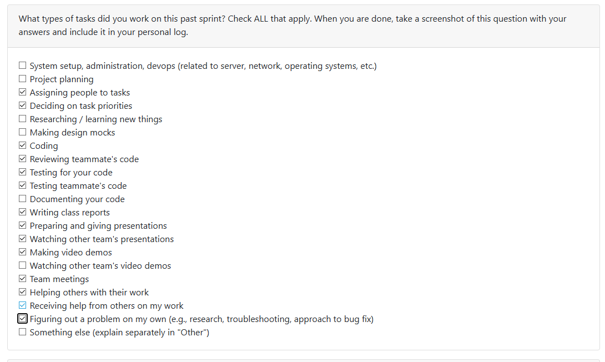
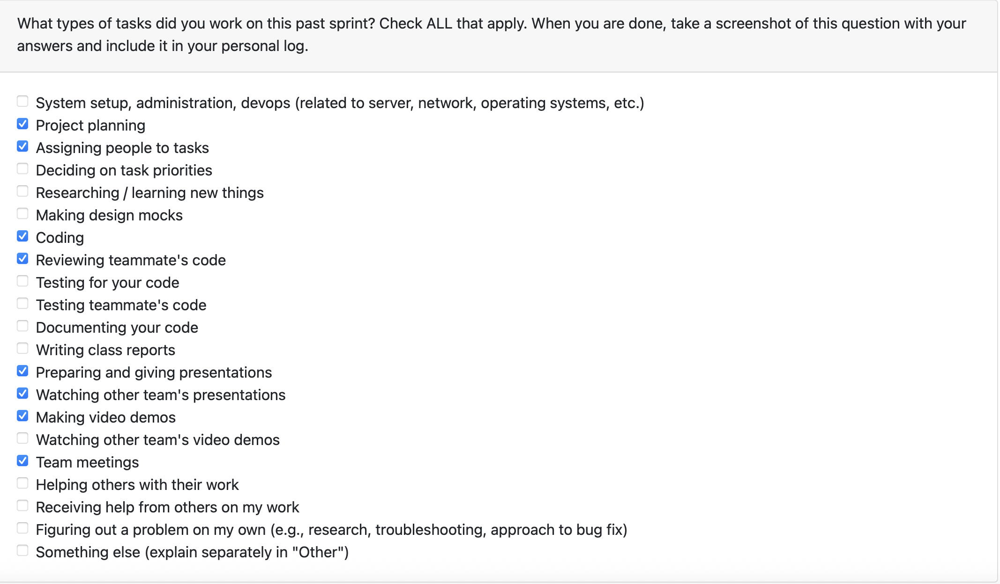

# Mandira Samarasekara
## Date Ranges
February 9–March 1  

## Goals for this week (planned last sprint)
- Prepare the Milestone 2 demo video
- Integrate curation into frontend
- Attend and contribute to team meetings
- Present the milestone 2 requirements in class

## What went well
- Almost all Milestone 2 features were completed this week, so most remaining time was spent on bug hunting and polishing.
- Fully integrated curation into the frontend and linked it across the Portfolio, Resume/Dashboard, and Projects pages.
- Curated settings now correctly reflect across the app (showcase rankings, highlighted skills, comparison attributes, chronology corrections, and custom project order).

## What didn’t go well
- The milestone 2 presentation didn’t go well.
- We went slightly over the time limit.
- Slide content could have been clearer and more concise to improve audience understanding.

## Coding tasks
- Built the portfolio curation foundation (backend API + frontend UI + persistent storage) with authenticated endpoints and validation.
- Implemented a 5-tab curation workflow:
  - Showcase (Top 3)
  - Comparison attributes
  - Highlighted skills (max 10)
  - Chronology correction
  - Project order
- Integrated curated settings throughout the application:
  - **Portfolio:** curated badges, Top # ranking badges, curated ordering, curated attribute filtering
  - **Resume:** curated project preselection + ordering, chronology correction notices, forwarding highlighted_skills to resume generator
  - **Projects:** Top # badges, curated sort option, filtered navigation from dashboard showcase cards
  - **Dashboard:** new “Showcase Projects” section displaying curated Top 3 projects and navigation to filtered Projects view

## Testing or debugging tasks
- Added comprehensive automated coverage for curation integration across backend + frontend.
- Verified resume generation behavior with highlighted_skills (fallback logic, edge cases, request payload forwarding).
- Tested Dashboard showcase rendering/navigation and ProjectsPage showcase filtering/sort behavior.

## PR’s initiated
- Portfolio curation frontend #368 https://github.com/COSC-499-W2025/capstone-project-team-6/pull/368
- Curation integration #395 https://github.com/COSC-499-W2025/capstone-project-team-6/pull/395
- Curation integration tests #399 https://github.com/COSC-499-W2025/capstone-project-team-6/pull/399

## PR’s reviewed
- Fix and update tests for API #390 https://github.com/COSC-499-W2025/capstone-project-team-6/pull/390
- Test bug fix #385 https://github.com/COSC-499-W2025/capstone-project-team-6/pull/385
- Extended tests for portfolio items rendering #377 https://github.com/COSC-499-W2025/capstone-project-team-6/pull/377

## Issues / Blockers
- No major blockers this week

## Plan for next week
- Discuss milestone 3 requirements
- Fix any bugs found during milestone 2 wrap up
- Study for quizz 3

# Aakash Tirithdas
## Date Ranges

February 9-March 1

## Goals for this week (planned last sprint)
- complete the analyze pipeline for the fronntend completely
- deal with depricated and incorrect tests
- help in the making of the presentation for the presentation in front of the class
- review others presentations and give meaningful feedback
- help prepare the video demonstration

## What went well
- all tasks went well.
- all tasks were complete
  
## *What could have been done better
- There was large waiting times for the approval of branches for merge. 
- the prsentation could have gone better. 
    - We realised last minnute that we were missing a arcitecture diagram and had to make do with what we had.
    - We took too long to start our presentation due to technnical issues leading to a loss of critical time.
- We could have completed some tasks before sunday where several bugs had to be fixed 

## Coding tasks
- complete the analysis pipeline so that project could be analyzed with and without llm use. 
  - ensure that llm analysis works well.
  - the project is stored correctly
  - prevent analysis without a project title
  - started on the implementation of multi-project analysis

## Testing or debugging tasks
- Ensure that all relevet tests passed from the start of the project with the exception of depricated tests. 
- maually and automatically tests that the analysis pipeline worked as expected. 

## PR's initiated
- Test bug fix #385 https://github.com/COSC-499-W2025/capstone-project-team-6/pull/385
- Analyze bug fix #382 https://github.com/COSC-499-W2025/capstone-project-team-6/pull/382
- Bug fix consent #373 https://github.com/COSC-499-W2025/capstone-project-team-6/pull/373

## PR's reviewed
- updated readme with Milestone 2 work #403 https://github.com/COSC-499-W2025/capstone-project-team-6/pull/403
- Remove information button #402 https://github.com/COSC-499-W2025/capstone-project-team-6/pull/402
- duplicate file handling #398 https://github.com/COSC-499-W2025/capstone-project-team-6/pull/398
- Incremental upload bug fix #394 https://github.com/COSC-499-W2025/capstone-project-team-6/pull/394
- Added delete all function + updated delete function #387 https://github.com/COSC-499-W2025/capstone-project-team-6/pull/387
- Improved Portfolio Page Rendering #375 https://github.com/COSC-499-W2025/capstone-project-team-6/pull/375
- Incremental upload detection and frontend sync #372 https://github.com/COSC-499-W2025/capstone-project-team-6/pull/372
- Fix API Server and projects test + API Documentation #391 https://github.com/COSC-499-W2025/capstone-project-team-6/pull/391

## Plan for next week

- Discuss milestone 3 requirements
- Fix any bugs found during milestone 2 wrap up.
- Fix the bug from our extra multiproject analysis

# Mithish Ravisankar Geetha

## Date Ranges

February 9-March 1

## Goals for this week (planned last sprint)

- Complete frontend integration for incremental upload feature
- Complete the incremental upload feature
- Continue improving frontend-backend communication using FastAPI
- Fix any additional bugs found during peer testing
- Finalize all API endpoints and fix tests
- Present the milestone 2 requirements in class

## What went well

The most significant achievement this sprint was the successful stabilization and delivery of Milestone 2.
On the technical side, the Incremental Upload system is now fully operational. This was a complex requirement; the system successfully detects if an uploaded project has more than 30% changes compared to the existing version. If it exceeds this threshold, the portfolio and database are updated accordingly. I also built a specialized frontend polling mechanism that tracks the background analysis task. Once complete, it triggers a detailed results modal that gives the user granular feedback on exactly which projects were newly added, which were updated with specific change percentages, and which were skipped to avoid duplicates.

Furthermore, the API documentation was a major success. By adding a comprehensive guide and satisfying all Milestone 2 API requirements, I’ve made the backend significantly more accessible for the frontend team, reducing the time spent on "trial and error" integration.

## What didn't go well

The primary challenge this sprint was technical debt. After refactoring our monolithic server into a modular FastAPI structure, our test suite was breaking. I encountered a significant number of errors in the portfolio tests and incorrect patch paths in the curation tests, where mocks were not targeting the correct functions.

Specifically, ensuring that all API tests were properly executed over HTTP (rather than direct function calls) required a massive overhaul of our testing infrastructure. While I managed to fix the majority of failing tests for the API server and Projects endpoints, there were some outstanding tasksregarding lingering failures in the resume and tasks endpoints. These required extra debugging time that ate into the schedule for new feature development, highlighting the difficulty of maintaining high test coverage while simultaneously moving the architecture to a modular design.

## Coding tasks

- **Incremental Sync Engine:** Completed the logic to detect >30% project changes and trigger database updates, fulfilling the "later point in time" information requirement.
- **Frontend Feedback Loop:** Developed a new "incremental upload" UI section and result modal with real-time status polling for background tasks.
- **Test Infrastructure:** Migrated legacy backend tests to use `FastAPI.TestClient` for true HTTP-level validation.
- **Milestone 2 Integration:** Performed the final merge of the development branch to main and ensured all features (Resume, Portfolios, Projects) were synced.

**PRs:**

- #372 – Incremental upload detection and frontend sync
- #390 – Fix and update tests for API
- #391 – Fix API Server and projects test + API Documentation
- #392 – Merge Development to Main for milestone 2

## Testing or debugging tasks

- **Portfolios & Curation Tests:** Fixed "id" mismatch errors and corrected mock patching in curation tests to ensure accurate backend simulation.
- **HTTP Validation:** Ensured all main API endpoints have comprehensive test coverage that executes over the network stack via `TestClient`.
- **Project/Resume Regressions:** Identified and addressed failing test cases in the projects endpoints caused by the recent data-model migrations.

**PRs:**

- #390 – Fix and update tests for API
- #391 – Fix API Server and projects test + API Documentation

## Reviewing or collaboration tasks

- #290 – Enhanced Contribution Ranking Integration
- #306 – Project thumbnail
- #308 – Updated Dashboard
- #311 – Resume/portfolio items display on Projects page
- #304 – Prevent Duplicate LLM Saves During Analysis
- #350 – Migrate resume generation from portfolio IDs to project IDs
- #348 – Update consent feature in settings + tests
- #345 – Delete button functionality + UI + tests
- #333 – Upload zip file page

## **Issues / Blockers**

-No major blockers this week

## PR's initiated

- [#372 – Incremental upload detection and frontend sync](https://github.com/COSC-499-W2025/capstone-project-team-6/pull/372)
- [#390 – Fix and update tests for API](https://github.com/COSC-499-W2025/capstone-project-team-6/pull/390)
- [#391 – Fix API Server and projects test + API Documentation](https://github.com/COSC-499-W2025/capstone-project-team-6/pull/391)
- [#392 – Merge Development to Main for milestone 2](https://github.com/COSC-499-W2025/capstone-project-team-6/pull/392)

## PR's reviewed

- [#387 – Added delete all function + updated delete function](https://github.com/COSC-499-W2025/capstone-project-team-6/pull/387)
- [#382 – Analyze bug fix](https://github.com/COSC-499-W2025/capstone-project-team-6/pull/382)
- [#381 – Dashboard Statistics](https://github.com/COSC-499-W2025/capstone-project-team-6/pull/381)
- [#379 – Added save personal information section in settings page + backend support](https://github.com/COSC-499-W2025/capstone-project-team-6/pull/379)
- [#373 – Bug fix consent](https://github.com/COSC-499-W2025/capstone-project-team-6/pull/373)
- [#364 – Upload api](https://github.com/COSC-499-W2025/capstone-project-team-6/pull/364)

## Plan for next week

- Discuss milestone 3 requirements
- Fix any bugs found during milestone 2 wrap up.

# Ansh Rastogi

## Date Ranges

February 9 – March 1

## Goals for this week (planned last sprint)

- Continue polishing frontend UI based on peer testing feedback
- Integrate any remaining frontend components with backend endpoints
- Address any additional bugs or issues identified during testing
- Support teammates with frontend-backend integration work

## How this builds on last week's work

Building on the thumbnail upload and ZIP upload page work from the previous sprint, this sprint focused on polish, correctness, and usability across the frontend. I fixed dashboard statistics that were either hardcoded or returning errors, improved the thumbnail management experience by adding removal support, and implemented duplicate ZIP file detection to prevent unnecessary re-analysis runs.

## What went well

This was a productive sprint with several meaningful improvements to the frontend and backend. The dashboard statistics fix resolved real user-facing issues: the skills endpoint was returning errors due to a bad import, AI analysis counts were hardcoded to zero, and the "Total Lines of Code" label was misleading since the database actually tracks file counts. All three were corrected and verified manually.

The thumbnail removal feature was a natural extension of the previous sprint's thumbnail upload work. Adding the remove button, properly revoking blob URLs to prevent memory leaks, and handling 404s gracefully as an expected state rather than an error condition made the feature feel complete. I also cleaned up leftover debug console.log statements during this process.

The duplicate file detection feature added meaningful value for users who might re-upload the same project. Using SHA-256 hashing at both the API and task level to detect duplicates before triggering analysis prevents wasted compute and gives users clear feedback through an informational banner.

On the review side, I provided feedback across a wide range of teammate PRs spanning test fixes, incremental upload, portfolio rendering, personal info management, and curation integration.

## What didn't go well

The thumbnail removal PR required a backend change (returning 204 instead of 404 for missing thumbnails) to properly suppress console noise, which meant coordinating across the stack rather than keeping the fix purely frontend. This added some back-and-forth during review.

For the duplicate detection feature, deferring the LLM pipeline import to avoid the `No module named 'google'` startup error was a workaround rather than a root fix. The underlying dependency issue should be addressed more cleanly in a future sprint.

## Coding tasks

- Fixed `/api/skills` endpoint that was returning errors due to incorrect `db` import (should be `get_connection`)
- Implemented dynamic AI analysis count on the dashboard by fetching portfolio data and counting projects where `analysis_type === 'llm'`
- Updated dashboard label from "Total Lines of Code" to "Total Files" to match what the database actually stores
- Added remove thumbnail functionality with a "Remove" button that calls the existing backend delete endpoint and clears UI state
- Implemented blob URL revocation on thumbnail removal to prevent memory leaks
- Modified `getThumbnail` in the API module to handle 404 responses gracefully as expected state
- Removed debug console.log statements left over from thumbnail development
- Added SHA-256 hash column to the analyses table to track uploaded ZIP files
- Implemented duplicate ZIP detection at both API and task levels, returning existing analysis on re-upload
- Added informational banner: "This project has already been analyzed. You can view it in your projects."
- Fixed `No module named 'google'` startup error by deferring LLM pipeline import until actually needed

## Testing or debugging tasks

- Manually verified all three dashboard statistics (skills count, AI analyzed count, total files) display correct live data
- Tested thumbnail removal flow and confirmed blob URLs are properly revoked
- Verified 404 handling for missing thumbnails no longer produces console errors
- Tested duplicate ZIP detection with previously analyzed files to confirm the banner appears and no re-analysis is triggered

## Reviewing or collaboration tasks

- Reviewed PR #385 – Test bug fix
- Reviewed PR #391 – Fix API Server and projects test + API Documentation
- Reviewed PR #362 – Project Filtering and Sorting Feature
- Reviewed PR #372 – Incremental upload detection and frontend sync
- Reviewed PR #375 – Improved Portfolio Page Rendering
- Reviewed PR #379 – Save personal information in settings + backend support
- Reviewed PR #399 – Curation integration
- Reviewed PR #402 – Remove information button

## Issues / Blockers

No major blockers this week.

## PR's initiated

- #381: Dashboard Statistics – https://github.com/COSC-499-W2025/capstone-project-team-6/pull/381
- #389: Added remove thumbnail option and suppress 404 console errors – https://github.com/COSC-499-W2025/capstone-project-team-6/pull/389
- #398: Duplicate file handling – https://github.com/COSC-499-W2025/capstone-project-team-6/pull/398

## PR's reviewed

- #385: Test bug fix – https://github.com/COSC-499-W2025/capstone-project-team-6/pull/385
- #391: Fix API Server and projects test + API Documentation – https://github.com/COSC-499-W2025/capstone-project-team-6/pull/391
- #362: Project Filtering and Sorting Feature – https://github.com/COSC-499-W2025/capstone-project-team-6/pull/362
- #372: Incremental upload detection and frontend sync – https://github.com/COSC-499-W2025/capstone-project-team-6/pull/372
- #375: Improved Portfolio Page Rendering – https://github.com/COSC-499-W2025/capstone-project-team-6/pull/375
- #379: Added save personal information section in settings page + backend support – https://github.com/COSC-499-W2025/capstone-project-team-6/pull/379
- #399: Curation integration tests – https://github.com/COSC-499-W2025/capstone-project-team-6/pull/399
- #402: Remove information button – https://github.com/COSC-499-W2025/capstone-project-team-6/pull/402

## Plan for next week

- Discuss and plan Milestone 3 requirements with the team
- Continue addressing any bugs or polish items surfaced during Milestone 2 wrap-up
- Support curation and portfolio feature integration on the frontend as the team moves into the next phase

# Harjot Sahota

## **What went well**

- This week I completed all major updates to the Settings page by adding full support for persistent personal information management. This included backend updates, the new `DELETE /api/resume/personal-info` endpoint, improved UI, and full Vitest coverage for loading, saving, deleting, and consent behavior.

- I also helped organize and assign tasks for our team’s video demonstration. I created clear lists of all bugs and remaining todos on our branch, which helped the team stay coordinated and finish recording efficiently.

- I restored the “Delete All Projects” button since it was removed accidentally in a previous PR and fixed the broken single-project deletion flow. After debugging, both delete actions now call the correct project-based API endpoints and work cleanly end-to-end.

- During preparation for the demo, our team found small errors in the app. I helped identify and fix these so our demonstration could run smoothly.

---

## **What didn’t go well**

- My previous delete implementation stopped working because another PR changed how the delete endpoint worked. This caused a lot of debugging before I finally discovered the root cause and fixed it properly.

- While preparing for the video demonstration, we found several small code issues that took extra time to fix. It didn’t block progress, but it slowed things down and added extra stress to the week.

---

## **PRs initiated**

- **Extend Settings page with personal info deletion + full test coverage**  
  https://github.com/COSC-499-W2025/capstone-project-team-6/pull/379  

- **Fix delete buttons + restore Delete All Projects functionality**  
  https://github.com/COSC-499-W2025/capstone-project-team-6/pull/387  

- **Improve Personal Information + Resume workflow (backend + UI integration)**  
  https://github.com/COSC-499-W2025/capstone-project-team-6/pull/402  

---

## **PRs reviewed**

- https://github.com/COSC-499-W2025/capstone-project-team-6/pull/390  
- https://github.com/COSC-499-W2025/capstone-project-team-6/pull/398  
- https://github.com/COSC-499-W2025/capstone-project-team-6/pull/394  
- https://github.com/COSC-499-W2025/capstone-project-team-6/pull/389  
- https://github.com/COSC-499-W2025/capstone-project-team-6/pull/382  
- https://github.com/COSC-499-W2025/capstone-project-team-6/pull/381  
- https://github.com/COSC-499-W2025/capstone-project-team-6/pull/377  
- https://github.com/COSC-499-W2025/capstone-project-team-6/pull/373  
- https://github.com/COSC-499-W2025/capstone-project-team-6/pull/368  

---

## **Plans for next week**

Next week, I plan to implement an API key input feature in the Settings page so users can enter their own key and enable LLM-based analysis. This will require new UI work, backend support, and updates to the resume/analysis pipeline to allow the system to use the user’s stored key during generation.

# Mohamed Sakr

## Date Ranges

February 9-March 1

## Goals for this week (planned last sprint)

- Continue improving frontend-backend communication using FastAPI
- Fix any additional bugs found during peer testing
- Finalize all API endpoints and fix tests
- Present the milestone 2 requirements in class
- Stabilize Portfolio page end-to-end rendering by aligning backend response contracts with frontend expectations
- Improve Portfolio UI resilience (deduplication, fallback highlighted skills, and clearer available analyses labels)
- Align and expand Portfolio test coverage to prevent regressions after recent UI and API-contract updates
- Expand Milestone 2 README Service/API + Human-in-the-Loop documentation with clear high-level architecture and low-level implementation guidance
- Expanded the architecture and DFD diagrams to reflect the changes in terms of new features, API endpoints, and the frontend.
- Perform detailed code reviews across major curation/portfolio PRs to validate architecture quality, UX behavior, and backend/frontend integration risks.
- Verify that newly added curation features are protected by strong automated tests and call out any remaining regression or usability gaps.

## What went well

This week went well because I was able to fix a full end-to-end Portfolio rendering issue by aligning backend responses with frontend expectations. I updated the portfolio detail response contract so it consistently returns `items` and `portfolio_items`, which allowed the Portfolio page to render portfolio points reliably instead of showing empty states.

I also improved UI resilience by making highlighted skills derive from `portfolio_items[].skills_exercised` whenever `skills` is empty. This prevented missing-skill states when analysis data existed but was shaped differently than older frontend assumptions. In addition, I updated the "Available analyses" cards to use project names from the analysis payload instead of generic analysis type labels (LLM/NON_LLM), which made the page much clearer from a user perspective.

Another major positive was test alignment. I expanded the Portfolio page test suite so it now covers current behavior: portfolio metadata rendering, quality/sophistication display (including `project_statistics` fallback), derived highlighted skills behavior, project-name card titles, and empty-state handling. This gave me stronger confidence that these fixes are stable and less likely to regress.

## What didn't go well

The biggest challenge was debugging root causes that were split across multiple layers. The frontend symptoms looked simple ("No portfolio items", missing highlighted skills), but the real issues involved API response shape mismatches, field availability differences, and stale test expectations after UI changes. Tracing and validating all of these together took longer than expected.

I also had to spend extra effort on duplicate item behavior during reanalysis. To fully resolve it, I implemented both cleanup and fetch-side controls: removing `portfolio_items` on child reanalysis and returning only the latest portfolio item per project during analysis item fetch. This was necessary, but it added complexity and increased implementation/testing time.

## Coding tasks

- **API contract alignment:** Updated portfolio detail responses to include portfolio items in a consistent structure (`items` and `portfolio_items`) for reliable frontend rendering.
- **Deduplication and lifecycle cleanup:** Prevented duplicate portfolio items by cleaning `portfolio_items` on reanalysis and limiting analysis item fetches to the latest item per project.
- **Highlighted skills fallback logic:** Added derivation of highlighted skills from `portfolio_items[].skills_exercised` when `skills` is empty.
- **Available analyses card title fix:** Switched card titles to project names from the analysis payload instead of analysis type labels.
- **Portfolio page product update:** Removed the Summary section from the Portfolio page based on product request.
- **End-to-end rendering stabilization:** Verified that portfolio points now render consistently with real analysis data paths.

## Testing or debugging tasks

- **Portfolio test suite refresh:** Updated tests to match current UI behavior and removed outdated checks tied to the removed Summary section.
- **Metadata rendering coverage:** Added/updated tests for portfolio title, summary, tech stack, and skills rendering behavior.
- **Quality/sophistication fallback coverage:** Added explicit tests for nested `project_statistics` fallback display logic.
- **Derived highlighted skills validation:** Added tests ensuring highlighted skills still populate when `skills` is empty by using portfolio item data.
- **Available analyses labeling checks:** Added assertions that card titles come from `project_names` rather than LLM/NON_LLM labels.
- **Empty-state regression checks:** Added coverage for responses with no portfolio items to ensure graceful and correct empty-state UI.

## Reviewing or collaboration tasks

- **Reviewed comprehensive curation platform PR (backend + frontend + persistence):** Assessed the 8-endpoint FastAPI curation API, JWT-protected routes, Pydantic validation, SQLite persistence, and the full 5-tab React curation experience (showcase, comparison attributes, highlighted skills, chronology correction, custom order). Feedback highlighted strong validation/error handling, good state persistence, and well-scoped tests.
- **Reviewed consent flow bug-fix PR with UX risk callout:** Confirmed backend boolean-consent handling improvements (`save_user_consent(..., False)` default and migration helper) and new tests, while flagging a non-blocking but important UX regression: users who decline consent now enter the app and only encounter downstream 403s without clear guidance. Requested explicit messaging/gating or restoration of the prior logout clarity.
- **Reviewed thumbnail removal + console-noise cleanup PR:** Validated the new remove-thumbnail flow, blob URL revocation to avoid memory leaks, expected 404 handling for "no thumbnail" cases, and cleanup robustness. Provided polish feedback to ensure delete action feedback is visible during async operations.
- **Reviewed curation integration across Portfolio/Resume/Projects/Dashboard PR:** Manually tested curated ranking, ordering, skills/attributes propagation, chronology overrides, showcase filtering/navigation, and dashboard showcase presentation. Confirmed curated behavior works consistently across pages and called out the implementation as production-ready.
- **Reviewed follow-up curation integration test-coverage PR:** Found no blocking issues; verified backend/frontend coverage for highlighted-skills precedence, API forwarding, showcase rendering/navigation, sorting/filter states, and error/empty/loading paths. Confirmed test execution results (20/20 backend pass, 29/29 frontend pass) and noted only minor environment-warning noise with no functional impact.

## Non coding tasks

- **README documentation PR (Milestone 2 Service/API + HITL):** Expanded the README section to clearly describe the FastAPI service as the frontend/backend mediator and added implementation-level details for API contracts/OpenAPI generation, async job lifecycle orchestration, local session/profile isolation, incremental ZIP ingest behavior, deduplication + canonical artifact storage, and Human-in-the-Loop curation workflows (representation overrides, role attribution, evidence linking, thumbnail association, saved showcase/resume wording customization, and portfolio/resume text rendering). Also added a dedicated FastAPI endpoint map covering health checks, portfolio lifecycle, ingest/jobs, curation updates, and text rendering endpoints.
- **Updated our architecture and DFD diagrams:** Expanded the architecture and DFD diagrams to reflect the changes in terms of new features, API endpoints, and the frontend.

## **Issues / Blockers**

-No major blockers this week

## PR's initiated

- https://github.com/COSC-499-W2025/capstone-project-team-6/pull/375
- https://github.com/COSC-499-W2025/capstone-project-team-6/pull/377
- https://github.com/COSC-499-W2025/capstone-project-team-6/pull/403

## PR's reviewed

- https://github.com/COSC-499-W2025/capstone-project-team-6/pull/399
- https://github.com/COSC-499-W2025/capstone-project-team-6/pull/395
- https://github.com/COSC-499-W2025/capstone-project-team-6/pull/389
- https://github.com/COSC-499-W2025/capstone-project-team-6/pull/373
- https://github.com/COSC-499-W2025/capstone-project-team-6/pull/368
