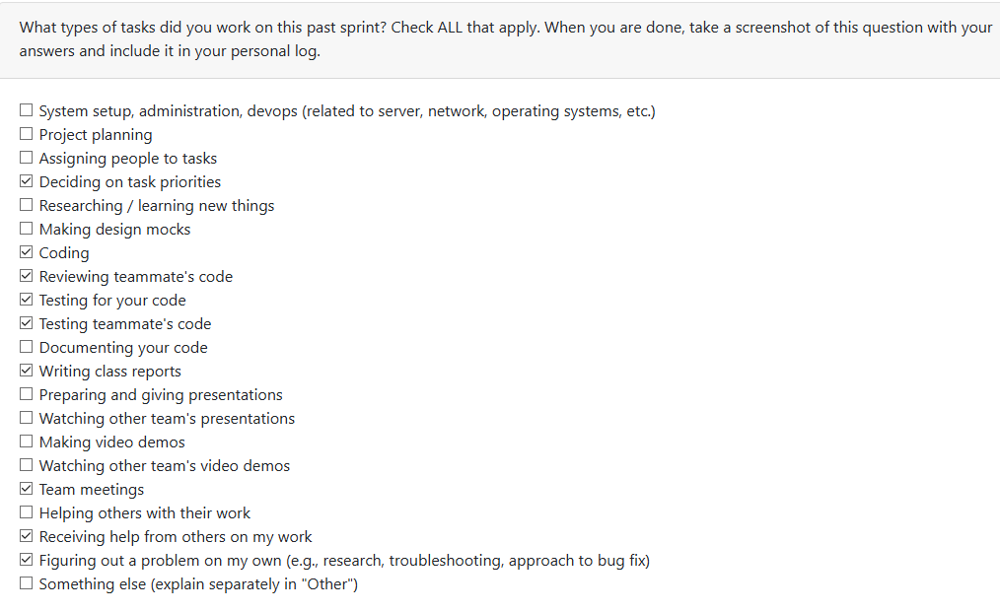
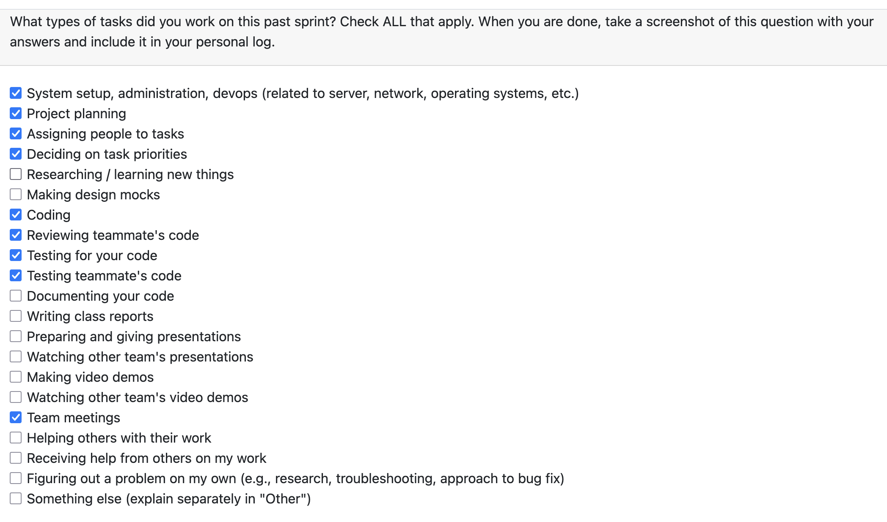
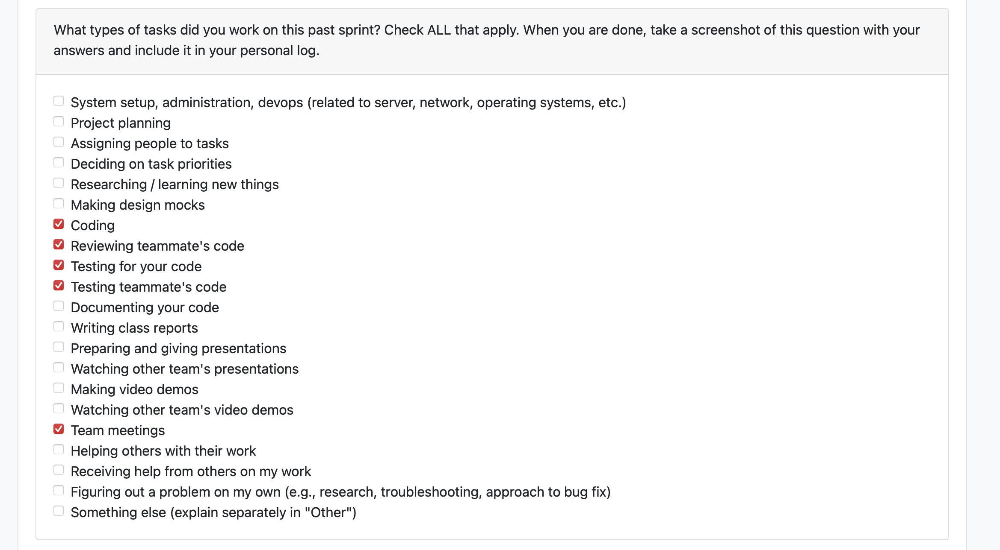

# Mandira Samarasekara

## Date Ranges
March 2 - March 8

## Goals for this week (planned last sprint)
- Discuss milestone 3 requirements
- Fix any bugs found during milestone 2 wrap up
- Fix the bug from our extra multiproject analysis
- Redesign the Analyze page and fix the loading bar

## What went well
This week went well overall because I completed my assigned tasks on time and was able to contribute across setup, UI, and debugging work. One of the biggest wins was helping improve the unified Docker setup by testing it on Windows after it was dockerized on macOS, then fixing the missing pieces needed to make it run properly on Windows as well. I also caught project setup issues that could have caused problems for our TA, including missing setup instructions and deprecated dependencies in the root `requirements.txt`, and I was able to address those quickly.

## What could have been done better
- There were no team meetings this week because everyone was busy, which made coordination more difficult.
- I only realized later that our project setup documentation was missing clear instructions for the TA. Although I fixed this within the week, it would have been better to catch it earlier.

## Coding tasks
- Contributed fixes to **Docker Containerization - Unified Setup** PR [#416](https://github.com/COSC-499-W2025/capstone-project-team-6/pull/416)
  - Removed `-v` from `docker-compose down -v` in both `run.sh` and `run.bat` so the `postgres_data` volume is no longer deleted on every run
  - Added automatic `.env` creation from `.env.example` when missing, so setup does not fail immediately
  - Standardized Docker commands to Docker Compose v2 (`docker compose`)
  - Replaced the hardcoded CORS port (`5173`) with `CORS_ORIGINS` from environment variables
  - Added a Windows test script: `test-docker-setup.bat`
- Restyled the **Analyze Page** in PR [#420](https://github.com/COSC-499-W2025/capstone-project-team-6/pull/420)
  - Hid the raw task ID from users
  - Added a project name display card
  - Added badges for project type (Single/Multi Project) and analysis type (LLM/Non-LLM)
  - Updated the page styling to match the Dashboard and Upload design system
- Fixed the **Analyze page progress bar** so it reflects real analysis progress more accurately
  - Added a `progress_callback` parameter to `analyze_folder()` in `cli.py`
  - Added 6 real phase-boundary progress updates: Preparing → Main pipeline → C/C++ analysis → Git analysis → Role prediction → Finalizing
  - Updated `task_manager.py` to map `analyze_folder()` progress from 0–100% into the task’s 35–80% range instead of using the old hardcoded 50%

## Testing or debugging tasks
- Tested the unified Docker setup on **Windows**
  - Verified build and startup
  - Verified container health checks
  - Verified frontend accessibility
  - Verified authentication flow
  - Verified data persistence works correctly
- Debugged setup issues related to missing `.env` handling, Docker command compatibility, and broken persistence caused by volume deletion
- Tested the resume generation fixes in PR [#425](https://github.com/COSC-499-W2025/capstone-project-team-6/pull/425)
  - Confirmed generating resumes no longer causes the previous white screen
  - Verified that selecting one or multiple projects now works correctly
  - Confirmed the backend retrieves project, resume item, and portfolio data properly
  - Verified the added React `ErrorBoundary` and increased axios timeout resolve the previous failure path
- Tested UI updates in PR [#423](https://github.com/COSC-499-W2025/capstone-project-team-6/pull/423)
  - Confirmed the removed resume selection section no longer appears
  - Verified resume bullets display correctly as plain bullet points
  - Verified the moved delete button still works
  - Verified the thumbnail upload area appears correctly and at the intended size

## Document tasks
- Fixed outdated and deprecated dependencies in the root `requirements.txt` in PR [#411](https://github.com/COSC-499-W2025/capstone-project-team-6/pull/411)
- Added `SETUP_INSTRUCTIONS.md` under the `docs` folder with detailed instructions for setting up the project from scratch for the TA

## PR's initiated
- Setup fix [#411](https://github.com/COSC-499-W2025/capstone-project-team-6/pull/411)
- Analyze Page Restyled [#420](https://github.com/COSC-499-W2025/capstone-project-team-6/pull/420)

## PR's reviewed
- Update week9.md [#429](https://github.com/COSC-499-W2025/capstone-project-team-6/pull/429)
- added week9 logs [#415](https://github.com/COSC-499-W2025/capstone-project-team-6/pull/415)
- Fixed bugs that broke resume generation [#425](https://github.com/COSC-499-W2025/capstone-project-team-6/pull/425) — approved after testing locally
- Updated Projects Page UI [#423](https://github.com/COSC-499-W2025/capstone-project-team-6/pull/423) — approved after verifying UI behavior
- Docker Containerization - Unified Setup [#416](https://github.com/COSC-499-W2025/capstone-project-team-6/pull/416) — reviewed and pushed Windows/setup fixes
- made changes to the tests so that all tests pass [#412](https://github.com/COSC-499-W2025/capstone-project-team-6/pull/412) — noted a minor issue with a weak assertion but approved to merge

## Plan for next week
- Change the loading animation in the Analyze page to better account for multi-project analysis
- Incorporate role prediction into resume and portfolio generation

  
# Aakash Tirithdas
## Date Ranges

February 9-March 1

## Goals for this week (planned last sprint)
- Discuss milestone 3 requirements
- Fix any bugs found during milestone 2 wrap up.
- Fix the bug from our extra multiproject analysis

## What went well
- all tasks went well.
- all tasks were complete
  
## What could have been done better
- There were no team meetings that occured this week due to everyone being busy

## Coding tasks
- fixed the multi-project analysis bug.
  - the bug stemmed from the task analysis only being able to assign 1 task id. 
  - the code was adjusted to be compatible with multiple task ids fixing the bug
- 2 new bugs were found
  - 1 duplication in mult-analysis is not implemented
  - duplicatio of deleted projects is still found meaning there is a logical error in the duplication identification

## Testing or debugging tasks
- Ensure that all relevet tests passed from the start of the project with the exception of depricated tests. (closed last weeks branch as there were too may merge conflicts causing several new errors, was easier to make the same fixes in a new branch with a few slight changes)
- maually and automatically tests that the multiple analysis fix worked as expected. 

## Document tasks
- updated our DFD1 and architecture diagram

## PR's initiated
- fixed the multiproject bug. #414 https://github.com/COSC-499-W2025/capstone-project-team-6/pull/414
- made changes to the tests so that all tests pass #412 https://github.com/COSC-499-W2025/capstone-project-team-6/pull/412
- updated documentation for milestone2 #410 https://github.com/COSC-499-W2025/capstone-project-team-6/pull/410

## PR's reviewed
- Settings page: change password #418 https://github.com/COSC-499-W2025/capstone-project-team-6/pull/418
- Analyze Page Restyled #420 https://github.com/COSC-499-W2025/capstone-project-team-6/pull/420
- Fixed bugs that broke resume generation #425 https://github.com/COSC-499-W2025/capstone-project-team-6/pull/425
 
## Plan for next week

- fix the 2 new bugs that i found
  - 1 duplication in mult-analysis is not implemented
  - duplicatio of deleted projects is still found meaning there is a logical error in the duplication identification

# Mithish Ravisankar Geetha

## Date Ranges

March 2-March 8

## Goals for this week (planned last sprint)

- Discuss milestone 3 requirements
- Fix any bugs found during milestone 2 wrap up.
- Dockerize the application with a unified frontend/backend script
- Implement the change password feature

## What went well
The transition to a unified Docker environment was a significant success this week, as merging the React frontend and FastAPI backend into a single container has greatly streamlined the local development workflow. This change, along with the implementation of a persistent SQLite database through volume mounting, provides a much more stable foundation for the team. 
On the feature side, the settings page was successfully enhanced with the change password functionality and a direct logout button, which noticeably improves the user experience by centralizing account controls. Additionally, providing detailed architectural feedback on the Milestone 2 documentation helped ensure our system design. The modular connections between the FastAPI server and Gemini AI is accurately represented for future milestones.

## What didn't go well
Despite the progress with containerization, a primary concern remains the lack of verification for Windows environments; since the script was developed on macOS, there may be minor compatibility issues that haven't been surfaced yet. The migration to the new Docker setup constitutes a breaking change regarding local data. Because the application now relies on a new SQLite volume mounting strategy, all previously saved local login credentials will no longer function, requiring all team members and testers to create new accounts.

## Coding tasks

- **Unified Dockerization:** Created a multi-service Docker configuration to run the entire stack on port 8000.
- **User Management Features:** Developed the backend logic and frontend UI for the new password change functionality.
- **Settings Page Enhancements:** Integrated a logout trigger directly into the settings interface.

**PRs:**
- Docker Containerization - Unified Setup [#416](https://github.com/COSC-499-W2025/capstone-project-team-6/pull/416)
- Settings page: change password [#418](https://github.com/COSC-499-W2025/capstone-project-team-6/pull/418)

## Testing or debugging tasks
- **Auth Testing:** Verified password change and logout logic using `pytest src/tests/api_test/test_auth.py`.
- **Persistence Validation:** Tested Docker volume mounting to ensure SQLite data persists across container restarts.
- **Container Health:** Used `test-docker-setup.sh` to verify API and Frontend availability on the new unified port.

**PRs:**
- Fix the multiproject bug [#414](https://github.com/COSC-499-W2025/capstone-project-team-6/pull/414)
- Settings page: change password [#418](https://github.com/COSC-499-W2025/capstone-project-team-6/pull/418)

## Reviewing or collaboration tasks
- **Architecture Guidance:** Requested specific changes to the Milestone 2 documentation to correctly map the relationship between the FastAPI server, Gemini AI, and the independent Task/Project/Portfolio modules.
- **Bug Triaging:** Reviewed and approved fixes for the multiproject bug and general setup issues.

## **Issues / Blockers**

-No major blockers this week

## PR's initiated
- Docker Containerization - Unified Setup #416 (https://github.com/COSC-499-W2025/capstone-project-team-6/pull/416)
- Settings page: change password #418 (https://github.com/COSC-499-W2025/capstone-project-team-6/pull/418)

## PR's reviewed
- fixed the multiproject bug #414: (https://github.com/COSC-499-W2025/capstone-project-team-6/pull/414)
- Setup fix #411 (https://github.com/COSC-499-W2025/capstone-project-team-6/pull/411)
- updated documentation for milestone2 #410 (https://github.com/COSC-499-W2025/capstone-project-team-6/pull/410) (Changes Requested)

## Plan for next week
- Verify Docker functionality on Windows environments.
- Begin implementation of Milestone 3 core requirements based on team discussion.

# Harjot Sahota

## Date Range
March 1 - March 8

## What went well

This week I completed two meaningful improvements to the application: a Projects page UI cleanup and a full Delete Account feature.

I updated the Projects page UI to make project cards cleaner, more readable, and easier to use. I removed the unused “Select stored resume” / “Add selected bullets” section, removed checkbox selection from resume bullets so they are now displayed as plain bullet points only, and improved the overall card layout and styling. These changes made the page feel more polished and user-friendly without changing the main functionality.
I successfully added a Delete Account feature that allows an authenticated user to permanently remove their account and all associated data from the system through the Settings page. This included adding a new Delete Account section and confirmation modal in the frontend, wiring the frontend API call, creating the backend delete account endpoint, and adding helper logic to remove the user and related stored data. I also added Settings page tests covering the new delete account flow.

Overall, this week went well because I was able to both improve the usability of the app and add a valuable account management feature for users who no longer want to use the system.

## What didn’t go well

While implementing the Delete Account feature, I discovered that some database relationships were not set up with the correct cascading delete behavior. Because of that, deleting an account was not as straightforward as it should have been.

Given the size and scope of the PR, I decided to use a backend helper function to work around the current database relationship issues by deleting dependent data in the correct order before removing the user row. This allowed me to complete the feature without expanding the PR too far, but it also highlighted an area of the database design that still needs improvement.

## PRs initiated

Projects page UI cleanup and card layout improvements  https://github.com/COSC-499-W2025/capstone-project-team-6/pull/423

Add delete account feature with frontend, backend, and tests  https://github.com/COSC-499-W2025/capstone-project-team-6/pull/428

## PRs reviewed

added tests to verify resume bugs are fixed  https://github.com/COSC-499-W2025/capstone-project-team-6/pull/426

fixed the multiproject bug setup fix  https://github.com/COSC-499-W2025/capstone-project-team-6/pull/414

Setup fix https://github.com/COSC-499-W2025/capstone-project-team-6/pull/411

updated documentation for milestone2  https://github.com/COSC-499-W2025/capstone-project-team-6/pull/410

## Plans for next week

Next week I plan to work on a cleanup PR that migrates the remaining relevant foreign key relationships to use `ON DELETE CASCADE` where appropriate. This should simplify the delete-account flow and reduce the need for manual ordered cleanup in backend helper logic.

I also plan to work on a feature that allows users to upload or paste in their own API key in the app so they can use the LLM analysis feature through the frontend.

# Mohamed Sakr
## Date Ranges

February 9-March 1

## Goals for this week (planned last sprint)
- Investigate and fix the resume generation white screen bug
- Write tests to cover resume generation

## What went well
- Identified and fixed all root causes of the resume generation crash
- Tests pass cleanly across backend and frontend

## Coding tasks
- Diagnosed and fixed the resume generation feature which was completely broken — clicking "Generate Resume" caused a white screen with no error shown
  - Fixed field name mismatch: backend `ResumeRequest` used `portfolio_ids` (UUID strings) while frontend sent `project_ids` (integers), causing an immediate 422 rejection on every request
  - Rewrote the `generate_resume` endpoint to look up projects by integer ID using `get_projects_for_user`, fetch resume items and portfolio data per project, parse JSON fields, and assemble the correct `{project, resume_items, portfolio}` bundle structure expected by `generate_resume_impl`
  - Removed the single-portfolio constraint that blocked multi-project selection
  - Added a React `ErrorBoundary` to `App.jsx` so render crashes show a readable error card instead of a blank white screen
  - Increased axios timeout from 10 s to 60 s

## Testing or debugging tasks
- Updated all stale tests in `test_resume.py` that were using the old `portfolio_ids` field and `get_analysis_by_uuid` mocks — replaced with `project_ids` and the three new DB helper mocks
- Created `test_resume_generate_bugfix.py` with 19 regression tests, one class per bug, ensuring each root cause cannot silently regress
- Created `Resume.test.jsx` covering initial render, button state, success path (verifies integer `project_ids` are sent), and error path (confirms a failing API call shows an error message rather than a blank screen)
- Created `App.test.jsx` verifying the `ErrorBoundary` catches render crashes and displays "Something went wrong" with a reload button instead of a white screen
- All 85 tests (64 backend, 21 frontend) pass locally

## PR's initiated
- Resume generation bug fix #resume-fix https://github.com/COSC-499-W2025/capstone-project-team-6/pull/425
- Tests to verify resume bugs are fixed #426 https://github.com/COSC-499-W2025/capstone-project-team-6/pull/426

## PR's reviewed
- https://github.com/COSC-499-W2025/capstone-project-team-6/pull/420 (first review)
- https://github.com/COSC-499-W2025/capstone-project-team-6/pull/428 (first review)

## Plan for next week
- Continue working on Milestone 3 features
- Look into further improvements to the resume generation output quality
