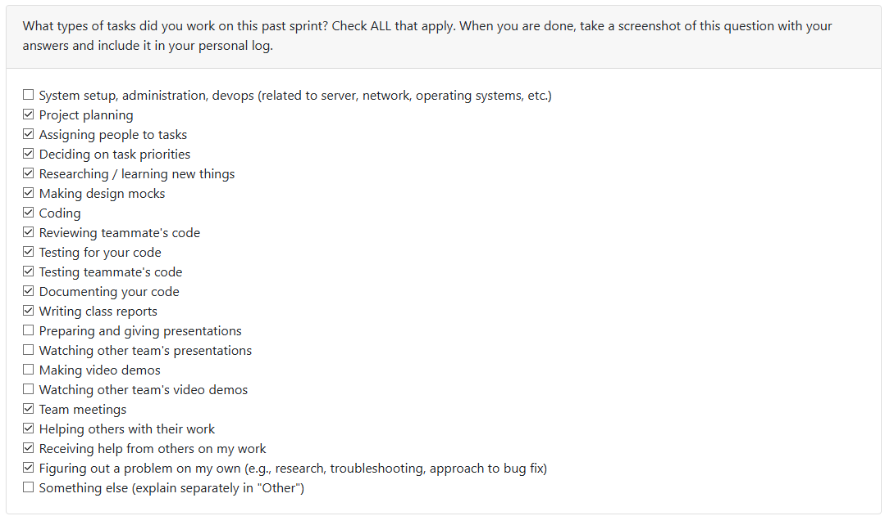

# Mandira Samarasekara

## Date Range

October 13–20

## Tasks Worked On

- Attended team meetings to discuss weekly goals, assign tasks, and resolve small issues related to our current sprint.
- Created and finalized the _consent page_ content for our application. The page explains how data is handled and gives users a clear choice between using local or cloud-based LLM processing.
- Conducted _research on LLMs (Large Language Models)_, including OpenAI, Llama Stack, and others, focusing on their privacy policies, data retention practices, and suitability for our project.
- Helped the team decide on the _best LLM_ to integrate into our app based on performance, privacy, and implementation feasibility.
- Reviewed the _DFD, **requirements, and **architecture diagram_ to prepare for the upcoming quiz and ensure a clear understanding of how each component connects.
- Reviewed and serviced _pull requests (PRs)_ from teammates, ensuring their code was consistent and properly integrated.
- Researched _Electron_, exploring its use in creating desktop applications and familiarising myself with its tech stack and how it connects to React and Node.js.
- Completed both _team_ and _personal logs_ for documentation and milestone tracking.

## Weekly Goals Recap

- This week was quite busy due to midterms, but I managed to complete all assigned tasks.
- The _consent page_ content was written correctly and ready for integration, though I initially created it in Markdown format instead of implementing it as an Electron interface. I’ll be updating it soon so that it displays automatically after login and before users upload files.
- I also spent extra time doing _in-depth research on LLMs_, which helped the team make informed decisions about model privacy and architecture design.
- Overall, despite time constraints, I balanced academics and project work effectively and made steady progress on both documentation and development tasks.

# Mithish Ravisankar Geetha

## Date Range

October 13-20

## Tasks Worked On

- Researched about Electron and React, and understanding how the packages and code structure works in electron in order to build efficiently.
- Continued working on docker containerization, fixing several bugs and errors.
- Automated running the docker file.
- Created a login page with login and signup functionality.
- Tested the features added this sprint.
- Assigned teammate's to tasks.
- Studied for the quiz held on Wednesday Oct 15.

## PR's initiated
- Login page draft funcitionality (#34)
- Added complete cross-platform docker containerization. (#30)

## PR's reviewed
- Set up SQLite environment with a test database
- Harjot week7logs

## Weekly Goals Recap

- **Features I was responsible for (this milestone):** Create user login/signup page, Complete docker containerization for MacOS and windows
- **Progress in the last 2 weeks:** Completed the login page, researched about react and electron and completed containerization work.

The goal for this week was to learn about react and electron and how it's linked to each other. I went through the documentation in detail in order to efficiently start working on the project. I continued working on Docker containerization and automation, however due to a lot of bugs and issues I could only automate the backend through Docker, and the frontend could only be done locally. This took atleast 4 hours to understand and fix. I created the login page with draft functionality, and the goal for next week is to create the complete functionality for the same once the database is created and finalized. Finally, I added unit tests to all my code, cleaned up the codebase and assigned my teammates to tasks. Overall, it was a really busy week and considering it was peak midterm season, it took a lot of time to work on the features assigned to me this week.

# Aakash

## Date Range

October 13-20

## Tasks Worked On

- Researched about Electron and React, and understanding how the packages and code structure works in electron in order to build efficiently.
- Worked on Folder sorting and folder parsing
- Wrote tests for the folder parsing
- Combined a depth first search and breadth first search.

## PR's initiated (branches)
- folder parsing

## PR's reviewed (branches)
- mithish-week7-code
- database-setup
- ansh/file_upload

## Weekly Goals Recap

- Start the Folder sorting process and create a traversal plan for the zipped folder.

# Ansh Rastogi

## Date Range

October 13-20

### Tasks Worked On

- Completed the file upload system for the FastAPI backend, including a command-line interface (CLI) for local-to-server uploads.
- Wrote the CLI usage flow and verified end-to-end uploads against the running backend.
- Added issues to the Kanban board and assigned weekly tasks to team members.
- Researched direct extraction from `.zip` archives during upload to improve efficiency;
- Studied for the quiz held on Wednesday Oct 15.

## Weekly Goals Recap

- **Features I was responsible for (this milestone):** Backend file upload: FastAPI upload endpoint + CLI tool; exploration of direct `.zip` extraction for efficient processing.
- **Progress in the last 2 weeks:** Delivered a working upload pipeline with CLI support and integrated it with the backend; organized and assigned work items on the Kanban; investigated zip auto-extraction for performance. Set up backend environment.

## PR's initiated (branches)

- ansh/file_upload

## PR's reviewed (branches)

- database-setup
- mithish-loginpage
- mithish-week7logs
- harjot-week7logs
- Mohamed-logs-w7

# Harjot Sahota

## Date Range

October 13-20

## Tasks Worked On
## Weekly Goals Recap
- Recearched more about electron and react js, learnt about react (vite), and learnt more about sqlite and how to set it up
- setup our database environment (sqlite)
- wrote tests for our database
- tested review on docker, wrote test commands given and approved the pr after testing docker image
- studied for the quiz (oct 15)

- **Features I was responsible for (this milestone):** I was responisble for setting up our database using SQLite
- **Progress in the last 2 weeks:** I setup our frontend environment using electron + react (vite), I setup our database using SQLite

## PR's initiated (branches)
- database-setup https://github.com/COSC-499-W2025/capstone-project-team-6/issues/32
- harjot-week7logs

## PR's reviewed (branches)
- mithish-week7-code

# Mohamed Sakr

## Date Range

October 13-20

## Tasks Worked On

- Researched about Electron and React.
- Tested the features added to this sprint.
- Studied for the quiz held on Wednesday Oct 15.
- Researched and worked on the database design.
- Helped set up the database

## Weekly Goals Recap

- **Features I was responsible for (this milestone):**
- **Progress in the last 2 weeks:**

- **Features I was responsible for (this milestone):**
- **Progress in the last 2 weeks:**
