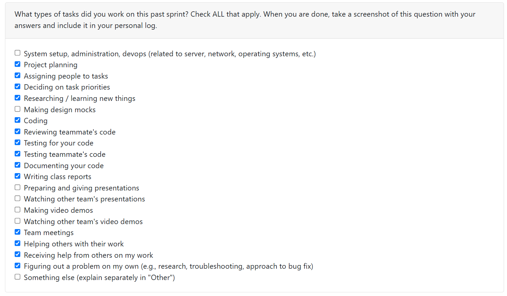
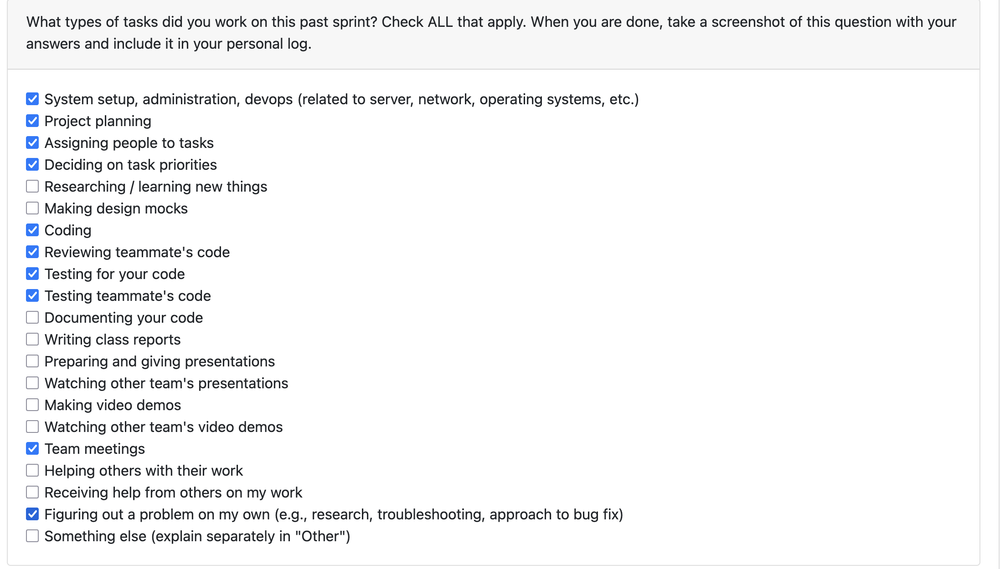
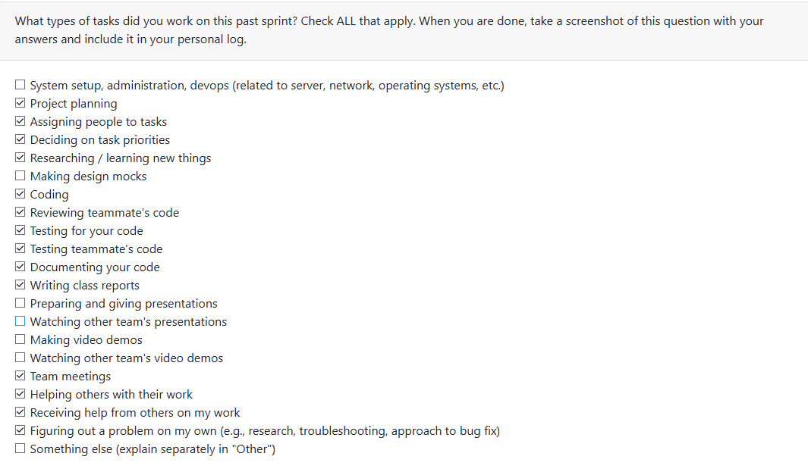
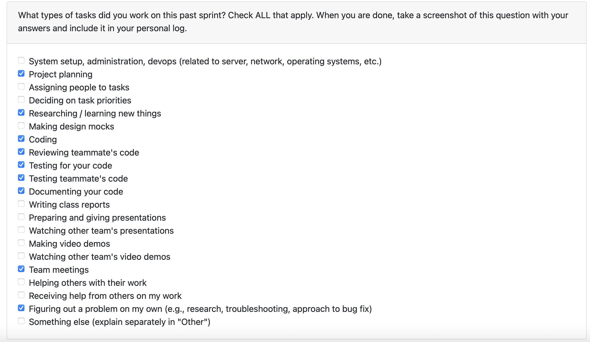
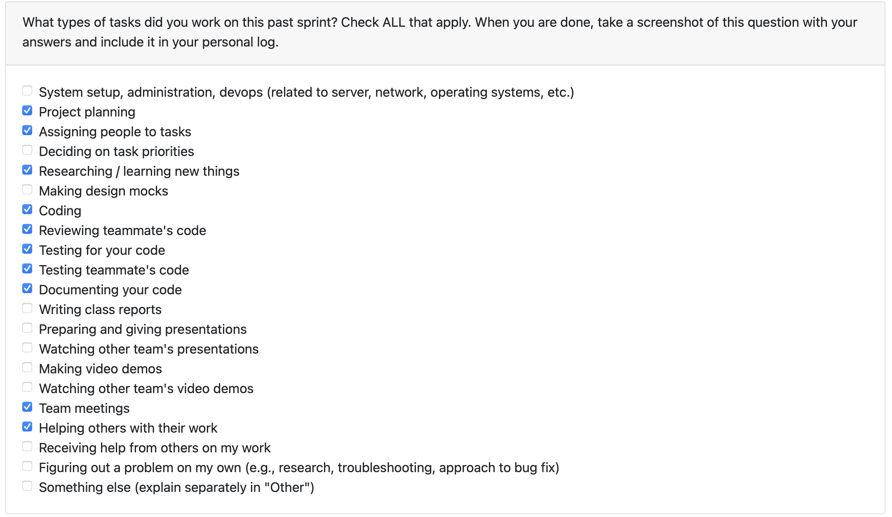

# Mandira Samarasekara  

## Date Range  
October 21–26  

  

## Tasks Worked On  

- Created **consent-form.md**, which contains the updated consent form text reflecting the use of **Llama Stack (local AI)** only, and removed references to external AIs (OpenAI).  
- Developed **consent.py**, a Python script that displays the consent form in the terminal, prompts the user for “yes” or “no,” and stores the response as a boolean variable.  
  - The variable is passed to the file upload program (to be linked) to determine whether to proceed with file parsing.  
- Conducted research on **Large Language Models (LLMs)** and compared their strengths and weaknesses.  
  - Compiled all findings and viable alternatives in **LLM-comparisons.md** for future consideration.  
- Created and ran **unit tests (test_consent.py)** to validate the consent workflow.  
  - Tests include checking printed text, input variants, error handling, EOF handling, and message output.  
- Tested other teammates' code.  
- Serviced many PRs.  

### Tests  
- `test_prints_consent_form_once`  
- `test_yes_variants_return_true`  
- `test_no_variants_return_false`  
- `test_invalid_then_yes`  
- `test_invalid_then_no`  
- `test_eof_returns_false`  

**Path:** `capstone-project-team-6\src\tests\backend_test\test_consent.py`  

## Weekly Goals Recap  

- The focus this week was on implementing the **consent system** and ensuring proper **user input validation and testing**.  
- Also researched and documented **alternative LLMs** for flexibility in future development.  
- Tested and reviewed teammates’ PRs to maintain overall project stability.  
- Currently working on **integrating all the individual components together**:  
  `login/signup -> file upload -> consent -> analysis`  

**Closes:** Issue #26  

# Mithish Ravisankar Geetha

## Date Range

October 21-26

## Tasks Worked On

- Completed the login and sign up authentication and connected everything to the backend.
- Created the command line interface and an interactive shell interface for testing.
- Linked the analysis on the CLI.
- Tested the features I have added.
- Assigned teammate's to tasks and conducted meetings.
- Tested other teammates code.

## Weekly Goals Recap

- **Features I was responsible for (this milestone):** Create command line interface and shell interface for the project and link everything merged so far.
- **Progress in the last 2 weeks:** Completed the login page, completed containerization work.

The goal for this week was to initially create a project dashboard, however I realized that the frontend is not needed for this milestone, hence I closed the PR associated with that. I then worked on the command line interface for the project and I linked everything done so far in this. Created the CLI prompts took a lot of time as it had several bugs and I had to go through python documentation as well. The CLI now works with login/sign up -> file analysis. The consent form and file upload will be linked to the CLI in the next sprint.

# Aakash

## Date Range
October 21-26

## Tasks Worked On
- Completed the Folder Sorting and project identification
    - Created 2 new classes DirectoryNode and Project Heuristics
    - updated the DFS function to calculate the heuristic score
    - for more details of this look at doc/Folder-parsing-explained,md
- Implemented the Heuristic evaluation for a project root
- Attended team meetings and helped prioritize and distribute tasks for the week
- Helped review Ansh code on zipped folder implementation in folder sorting and Tests for the folder sorting. 
- Documented my working a markdown file in documents explaining about the new traversal features

## Weekly Goals Recap
- **Features I was responsible for (this milestone):**
- Complete File sorting and project identification- the heuristic evaluation and testing of code.
(Note I completed my code but got help from Ansh to write the tests for my code).

## PR's initiated
- file-sorting-2

## PR's reviewed
- ansh/zipFileUpload

# Ansh Rastogi

## Date Range

October 21-26

## Tasks Worked On

- Implemented ZIP file traversal functionality that analyzes compressed archives without extracting them to disk.
- Created file system abstraction layer with interfaces for both regular directories and ZIP archives using Python's `zipfile` module.
- Developed `Folder_traversal_fs()` function that automatically detects and handles both directory and ZIP file inputs.
- Updated `DirectoryNode` class to support both Path objects and string paths for unified handling.
- Created comprehensive test suite with 5 different test ZIP files covering various project structures (simple projects, monorepos, Python projects, non-projects, and mixed structures).
- Wrote automated tests using pytest with 11 test cases validating all ZIP traversal scenarios.
- Fixed critical bugs in subproject counting logic and path normalization for ZIP entries.
- Added extensive documentation including usage examples, API reference, and feature guide in `ZIP_TRAVERSAL_FEATURE.md`.
- Verified backward compatibility with existing `Folder_traversal()` function for regular directories.

## Weekly Goals Recap

- **Features I was responsible for (this milestone):** ZIP file traversal without extraction; file system abstraction layer; comprehensive testing and documentation.

# Harjot Sahota

## Date Range

October 21-26

## Tasks Worked On

- extended our database to include a new table called uploaded_files for sorting file_name, extracted_text, and uploaded_at for every file the user uploads
- researched about OCR, and the different OCR tools we could possibly choose, and decided to use Tesseract OCR to extract text from files
- implemented text_extractor.py to automatically extract text from uploaded files, it uses Tesseract OCR and pdf2image for image and PDF files, reads text-based files directly, and returns the extracted text in a consistent format for database storage.
- created tests for our uploaded_files table in sqlite database
- created tests for text_extractor.py, and manually tested my code before created a pull request

## Weekly Goals Recap

- **Features I was responsible for (this milestone):** Implemented backend support for OCR text extraction and database integration. Added a new uploaded_files table, connected it to the file upload system, and ensured extracted text from images and PDFs is stored automatically in SQLite.
- **Progress in the last 2 weeks:** created our sqlite database and Completed the OCR integration using Tesseract
  
# Mohamed Sakr

## Date Range
October 21-26
## Tasks Worked On
- Implemented a local SQLite-backed auth store for the login workflow. 
- Added a persistent users table with bcrypt-hashed passwords, connection helpers, and default seeding via FastAPI startup. 
- Replaced the in-memory credential dictionary, updated the auth endpoints to query the database, and expanded tests to cover DB operations. 
- Introduced the bcrypt dependency.
- Wrote tests for the user database
- Helped design, pick stack, and implement upload_files database
- Ran tests for user database and file upload functionality
## Weekly Goals Recap
- **Features I was responsible for (this milestone):** Migrated the login flow to a SQLite-backed authentication store. Added a persistent users table with bcrypt-hashed passwords, connection utilities, and default seeding on FastAPI startup. Replaced the in-memory credentials, updated auth endpoints to query the database, expanded tests to cover DB operations, and introduced the bcrypt dependency.
- **Progress in the last 2 weeks:** created user database and helped design file_upload database.
