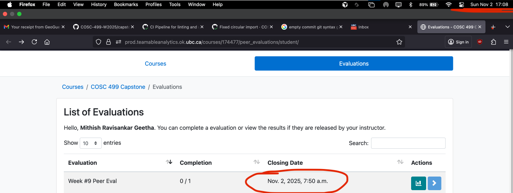
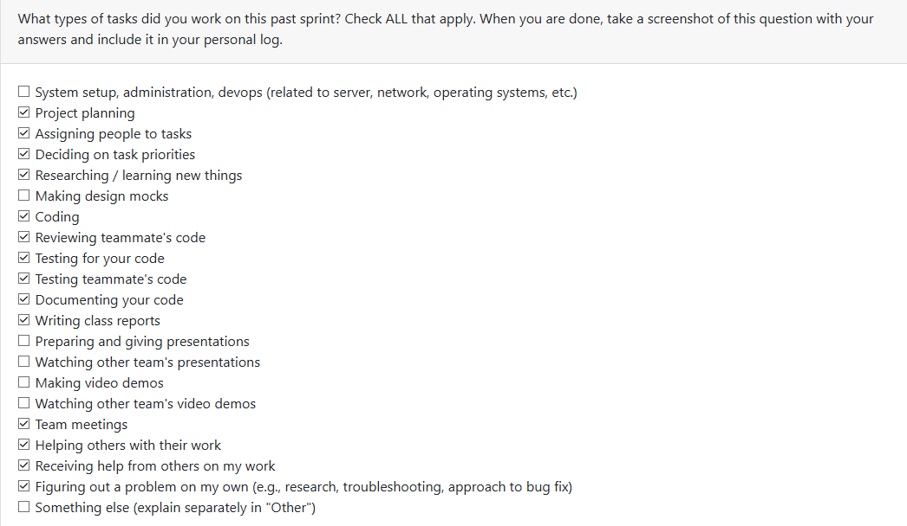
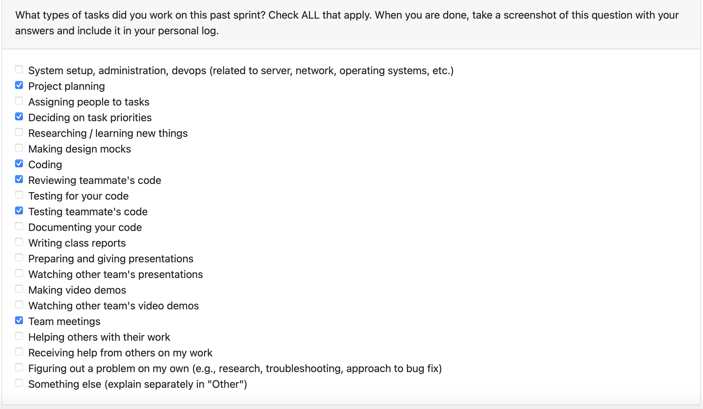

# Mandira Samarasekara  

## Date Range  

## Tasks Worked On  

### Tests  

## Weekly Goals Recap  

# Mithish Ravisankar Geetha  

## Date Range  

October 27 - November 2

## Tasks Worked On 
- Integrated the consent form to the CLI.
- Cleaned up the repository by moving files to folders for better organizations. 
- Added sessional management to the backend (currently for CLI and login, to be expanded further).
- Added more unit testing.
- Modified test structures such that a session is automatically logged in during testing. 
- Created a CI pipeline for the following:
1. Auto-merge a PR into `Development` after 2 approvals.
2. Linting verification and auto-formatting when linting errors are detected (for Python 3.14 only)
3. Unit testing of all backend tests (frontend will be added when frontend is being worked upon from the next term). 
## Weekly Goals Recap 
- **Features I was responsible for (this milestone):** 
1. Creation of a CI pipeline.
2. Creating and modifying any existing/missing unit tests.
3. Integrating the CLI to non-connected components. 

All of my goals this week have been met successfully. I have integrated the consent form to the CLI and added session management to the database. This way, existing users will not be required to keep providing consent, and only new users will be shown the consent form. Furthermore, a user can revoke consent at any time. The goal is to update the consent form in further iterations when more components are added (such as an LLM or any package). 

I have also successfully created the CI pipeline. This ensures that there will be no issues if a pull request is not merged into the `Development` branch due to someone forgetting to merge. Furthermore, the pipeline also checks for any linting issues, auto-formats the branch and runs unit tests everytime a PR is created. 

Through the creation of the pipeline and integration, the project will be much smoother to develop and run. It was a busy week so I was not able to work more on the analysis. 

# Aakash  

## Date Range  
October 27 - November 2

## Tasks Worked On  
- Worked on debugging and ensuring that the inegration of traversal.py is completely functional. 
- Removed excess code from traversal.py and ensured that the zip file functions work as expected. 
- Created the project traversal
    - file identification
    - file sorting
- wrote tests for the file identification and file sorting
- documented my work
- participated in team discussions

- Tested the folder restructuring for no errors and windows accomadation
- updated few requirements so that it works on python 3.13 and 3.14

- Started on llama stack initializationa and phase 2 of analysis with LLM (these are not merged so will not count towards this week)

## Weekly Goals Recap  
- To complete a backbone version of the analysis with LMM with Mohamed Sakr. 
- complete integration of everything uptil file traversal

### what was accomplished
- completed on phase 1/5 of analysis
- started phase 2
- phase 3,4 was given to other members of the team
- phase 5 was planned to be completed next week

# Ansh Rastogi

## Date Range

October 27 - November 2

## Tasks Worked On

- Created comprehensive **integration test infrastructure** for the Authentication & Session Management system.
- Implemented **8 integration tests** (Tests 1-8) covering complete signup and login workflows across multiple components.
- Developed **reusable test fixtures** in `conftest.py` for test isolation:
  - `temp_db`: Isolated temporary SQLite database per test
  - `temp_session_file`: Temporary session file location with monkeypatching
  - `isolated_test_env`: Combined fixture for complete test isolation
  - `mock_users`: Pre-created test users for reusable test data
  - `test_directory`: Test directory with project indicators for future tests
- Created **TestSignupIntegration** test class (Tests 1-4):
  - Successful signup with database user creation and session management
  - Duplicate signup prevention with proper error handling
  - Empty username/password validation
  - Special characters in username handling
- Created **TestLoginIntegration** test class (Tests 5-8):
  - Successful login with session file creation
  - Wrong password authentication failure
  - Non-existent user authentication failure
  - Session overwrite behavior when logging in multiple times
- Added **TestHelpers** infrastructure validation tests to verify fixture correctness.
- Verified all tests pass successfully: **10 passed** (8 main integration tests + 2 helper tests).
- Documented test workflows with comprehensive docstrings explaining each test's purpose, workflow steps, and expected behavior.
- Set up proper test isolation ensuring no cross-contamination between tests using temporary databases and session files.
- Created new branch `ansh/intgrationTest` from Development, committed changes, and pushed to remote.
- Prepared pull request documentation with detailed description of all changes and test coverage.

## Weekly Goals Recap

- **Features I was responsible for (this milestone):** Integration test infrastructure for Authentication & Session Management; comprehensive test coverage for signup/login workflows; reusable test fixtures for future integration tests.
- **Progress in the last 2 weeks:** Implemented ZIP file traversal with file system abstraction layer; created integration test infrastructure for authentication workflows.

The goal for this week was to establish a robust integration testing framework for the authentication system. Integration tests are critical because they verify that multiple components (database, session files, authentication logic) work correctly together, unlike unit tests which test components in isolation. I created a complete test suite that covers all authentication scenarios including user signup, login, duplicate prevention, password validation, and session management.

The test infrastructure uses pytest fixtures to ensure complete test isolation—each test runs with a clean temporary database and session file, preventing any cross-contamination. This foundation will make it easy to add more integration tests in the future (Tests 10-20 are already planned for session persistence, authorization checks, and end-to-end workflows).

I also ensured backward compatibility by verifying that all existing tests still pass, and documented the test workflows thoroughly so teammates can understand and extend the test suite. The integration tests run successfully on the CI pipeline and provide confidence that our authentication system works correctly across all component boundaries.

# Harjot Sahota  

## Date Range  
October 27 - November 2

## Tasks Worked On  
- Set up and configured a Supabase cloud pgvector database (mining-artifacts-db) for the project
- Created two new backend modules: `database_vector.py` connects to Supabase, defines schemas for documents and document_chunks. `vector_service.py` handles text chunking, generates placeholder embeddings, and stores them in pgvector.
- Manually tested the setup using Python scripts (python -m backend.database_vector and python -m backend.vector_service)
- Participated in team discussions about future LLM integration and how this database will connect to our upload flow.
- researched about embedding models, vector databases and how to set them up
- updated file upload flow to handle files entirely in memory using FastAPI.

## Weekly Goals Recap  

- **Features I was responsible for (this milestone):** I was responsible for researching and selecting the most suitable vector database for our project. After evaluating multiple options, I implemented Supabase pgvector and integrated it with our backend to store document embeddings and text chunks.
- **Progress in the last 2 weeks:** Successfully set up and connected the Supabase pgvector database to our backend. Implemented the schema, created services for document chunking and embedding storage, and verified through manual testing that data is correctly stored in the cloud database. 
  
# Mohamed Sakr  

## Date Range  

## Tasks Worked On  

## Weekly Goals Recap  
