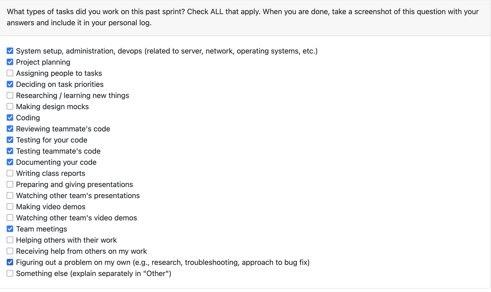
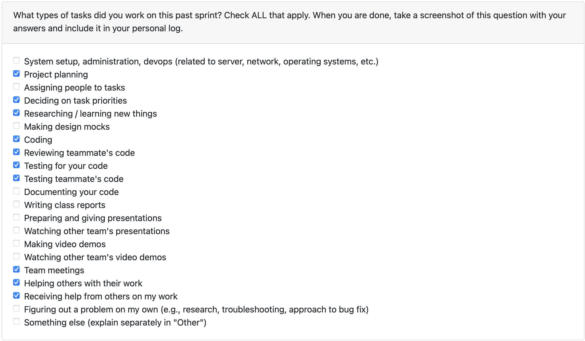

# Mandira Samarasekara  

## Date Range  

## Tasks Worked On  

## Weekly Goals Recap  

# Mithish Ravisankar Geetha  

## Date Range  

November 3 - November 9

## Tasks Worked On 
- Assisted Mandira for the non-LLM analysis by analyzing OOP principles in Python code files.
- Created an unified analysis script to run both Mandira's and my scripts together for the analysis.
- Reviewed pull requests and provided insights for the same.
- Created unit tests for my code.
- Attended team meetings and assigned teammates to tasks. 
## Weekly Goals Recap 
- **Features I was responsible for (this milestone):** 
1. OOP Code analysis for python

All of my goals this week have been met successfully. I have created detailed analysis for python OOP principles and the program gives a comprehensive report ranking the user's ability to design and apply object oriented programming principles. This week was busy due to midterms, hence I created only one PR which is slightly fewer than the usual. 

## PR's initiated
- Python OOP code analysis

## PR's reviewed
- Analysis without LLM

# Aakash  

## Date Range  

## Tasks Worked On  

## Weekly Goals Recap  

### what was accomplished

## PR's initiated/gave input to

## PR's reviewed

# Ansh Rastogi

## Date Range

## Tasks Worked On

## Weekly Goals Recap

# Harjot Sahota  

## Date Range  

## Tasks Worked On  

## Weekly Goals Recap  

  
# Mohamed Sakr  

## Date Range  
November 3 - November 9

## PRs
115 & 120

## Tasks Worked On 
- Implemented the new SQLite-backed `analysis.db`, covering schema design for analyses, projects, languages, frameworks, dependencies, contributors, and largest-file metadata. Added helper APIs (`record_analysis`, `get_analysis`, `get_projects_for_analysis`) plus fixtures so tests spin up isolated databases.
- Built a standalone `documents.db` helper that persists uploaded artefacts with per-category counts (code/docs/tests/config/other) and added alias handling so downstream code can pass either friendly keys or column names. Wrote a focused pytest module verifying schema creation, inserts, and alias mapping.

## Weekly Goals Recap  
**Features I was responsible for (this milestone):**
- Delivered the persistence layer for both analysis outputs and document uploads, complete with initialization helpers, migration-safe defaults, and repeatable tests. This sets the foundation for exposing the data to the UI/dashboard next cycle.
- **What went well:** The schema work landed smoothly, and the modular DB helpers made it easy to plug tests into temporary paths. The SQLite fallback for vector embeddings significantly improved local reliability.
- **What didn’t go as planned:** Initial test runs failed because of environment gaps . I patched these during the week via fixtures and fallbacks, but they ate time intended for wiring the DBs into the analysis pipeline.
- **Looking ahead:** Priority for the next cycle is to integrate these databases directly into the app flow (triggering `record_analysis`/`save_document` from the analyzer).

**Progress in the last 2 weeks:** 
- Built a database for uploaded file with catgories
- Constructed a database to capture the outputs post-analysis
- Defined the tasks that will be done by the LLM and prompt engineered templates based on them.
- Researched models for the LLM-based Analysis both local & cloud based.
