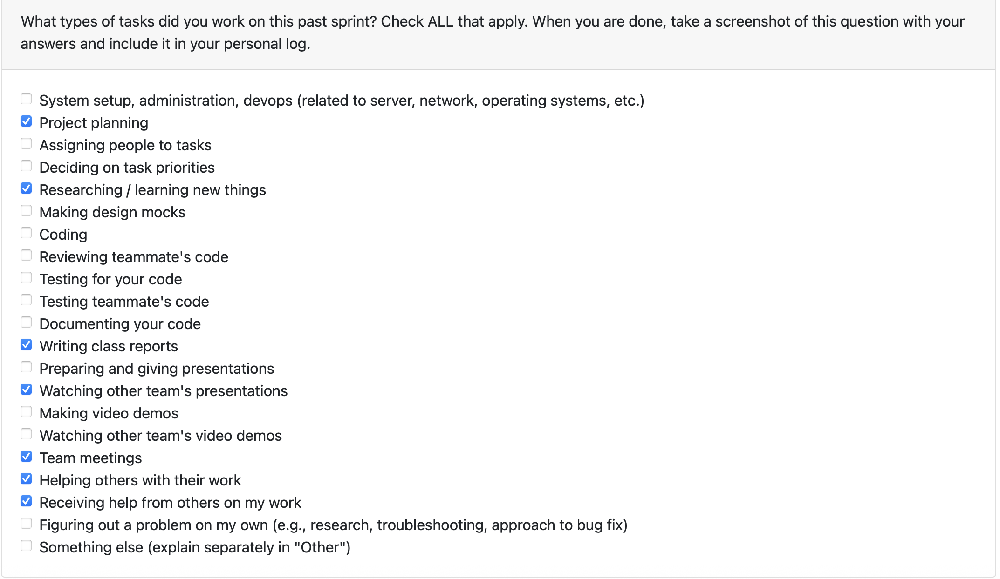

# Mandia Samarasekara

## Date Range

Week of Sep 15-21st

## Tasks Worked On

- Participated in team discussion on functional and non-functional requirements.
- Joined group discussion with Teams 2, 3, 4, and 5 about project requirements.
- Updated our project’s requirements after reflecting on peer input.
- Completed the quiz reflecting on the class discussion.
- Conducted research on:
  - How similar software crawlers function.
  - Ensuring user data privacy in such systems.
  - Differences in software performance across operating systems.

## Weekly Goals Recap

- **Features I was responsible for (this milestone):** Research into system feasibility and privacy considerations.
- **Progress in the last 2 weeks:** Researched privacy and OS differences, contributed insights to requirement updates.

# Aakash Tirathdas

# Ansh Rastogi

## Date Range

Week of Sep 15-21st

## Tasks Worked On

- Contributed to team discussions on functional and non-functional requirements.
- Collaborated with Teams 2, 3, 4, and 5 to review and compare project requirements.
- Revised our project requirements based on peer feedback.
- Finished the quiz summarizing insights from the class discussion.

# Weekly Goals Recap

- **Features I was responsible for (this milestone):** Researched cross-OS read-only scanning with consent prompts, metadata/visualization outputs, and performance/privacy targets.

- **Progress in the last 2 weeks:** Drafted end-to-end functional and non-functional requirements for the artifact-mining dashboard.

# Harjot Sahota

# Mithish Ravisankar Geetha

# Mohamed Sakr
