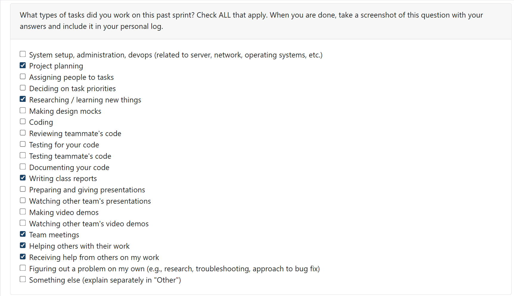
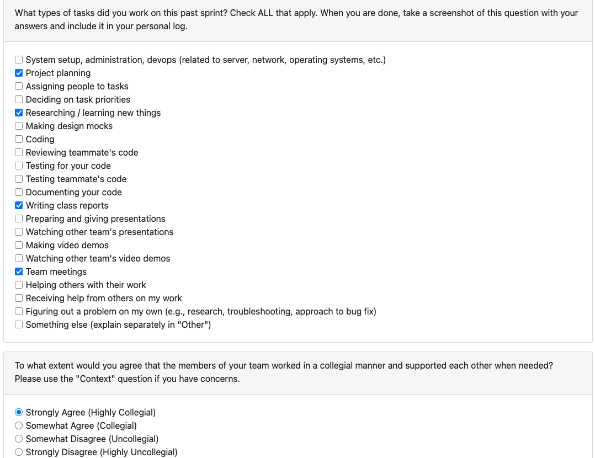

# Mandia Samarasekara

## Date Range
Week of Sep 15-21st

## Tasks Worked On
- Participated in team discussion on functional and non-functional requirements.
- Joined group discussion with Teams 2, 3, 4, and 5 about project requirements.
- Updated our project’s requirements after reflecting on peer input.
- Completed the quiz reflecting on the class discussion.
- Conducted research on:  
  - How similar software crawlers function.
  - Ensuring user data privacy in such systems.
  - Differences in software performance across operating systems.

## Weekly Goals Recap
- **Features I was responsible for (this milestone):** Research into system feasibility and privacy considerations.  
- **Progress in the last 2 weeks:** Researched privacy and OS differences, contributed insights to requirement updates.  

# Mithish Ravisankar Geetha
## Date Range
Week of Sep 15-21st

## Tasks Worked On
- Collaborated with the team regarding our project requirements.
- Had an insightful discussion with Teams 2, 3, 4 and 5 regarding their project requirements.
- Modified our team's project requirements after discussing with other teams.
- Reflected about the in-class discussion in the quiz and discussed with my team accordingly.
- Learnt about the basics of data mining in a system, Windows file structure and scalability.

## Weekly Goals Recap
- **Features I was responsible for (this milestone):** Expanding project requirements and researching about data mining. 
- **Progress in the last 2 weeks:** Researched about scalability and OS differences. 

# Aakash Tirathdas

# Ansh Rastogi

# Harjot Sahota

# Mohamed Sakr

