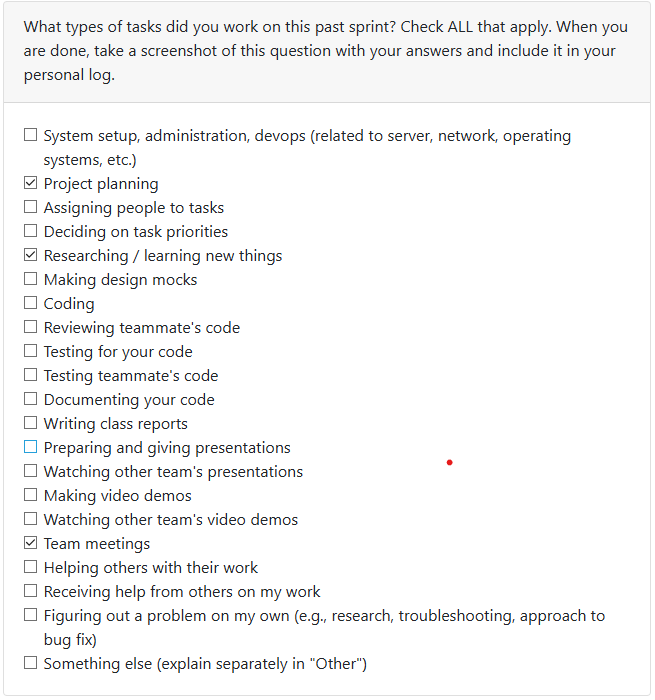
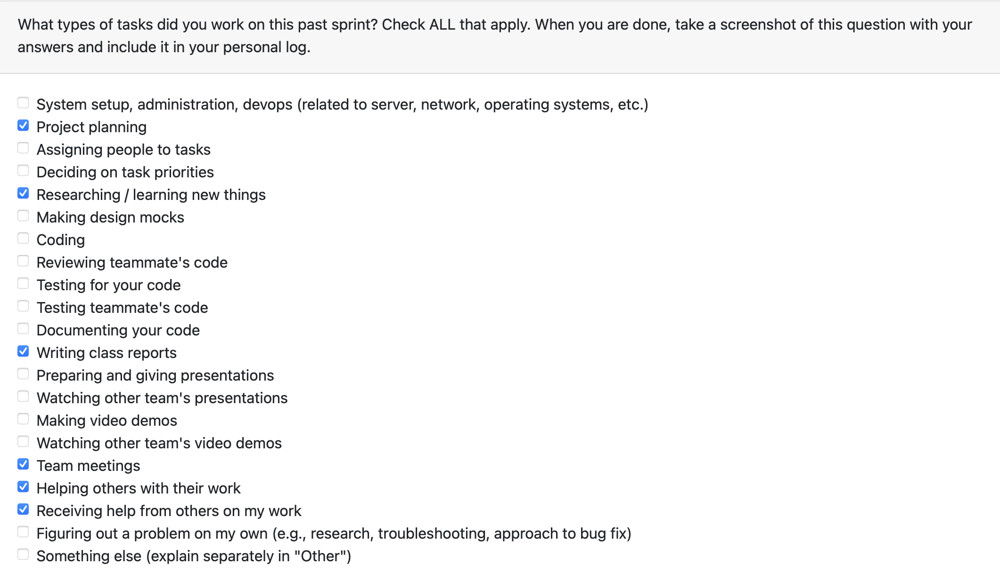

# Mandia Samarasekara

## Date Range

Week of Sep 15-21st

## Tasks Worked On

- Participated in team discussion on functional and non-functional requirements.
- Joined group discussion with Teams 2, 3, 4, and 5 about project requirements.
- Updated our project’s requirements after reflecting on peer input.
- Completed the quiz reflecting on the class discussion.
- Conducted research on:
  - How similar software crawlers function.
  - Ensuring user data privacy in such systems.
  - Differences in software performance across operating systems.

## Weekly Goals Recap

- **Features I was responsible for (this milestone):** Research into system feasibility and privacy considerations.
- **Progress in the last 2 weeks:** Researched privacy and OS differences, contributed insights to requirement updates.

# Mithish Ravisankar Geetha

## Date Range

Week of Sep 15-21st

## Tasks Worked On

- Collaborated with the team regarding our project requirements.
- Had an insightful discussion with Teams 2, 3, 4 and 5 regarding their project requirements.
- Modified our team's project requirements after discussing with other teams.
- Reflected about the in-class discussion in the quiz and discussed with my team accordingly.
- Learnt about the basics of data mining in a system, Windows file structure and scalability.

## Weekly Goals Recap

- **Features I was responsible for (this milestone):** Expanding project requirements and researching about data mining.
- **Progress in the last 2 weeks:** Researched about scalability and OS differences.

# Aakash Tirathdas
## Date Range

Week of Sep 15-21st

## Tasks Worked On
- Collaborated and discussed with team about potential approches to the project and how it would be different from other groups.
- Came up with a list of functional and non-function requirements for our take on the project
- Had discussions with teams 2, 3, 4, 5 on said requirements in the previous point.
- Completed the quiz after reflection of the requirments with the team afte the disscussion session with other teams.
- Started looking at the possibilty of using agents and the basic structure of the project in my own time. 

# Weekly Goals Recap

- **Features I was responsible for (this milestone):** Research on potential use of AI agents comparitively to a system file crawler 

- **Progress in the last 2 weeks:** Started research on system file crawlers similar to Windirstat and the Windows file structure.

# Ansh Rastogi

## Date Range

Week of Sep 15-21st

## Tasks Worked On

- Contributed to team discussions on functional and non-functional requirements.
- Collaborated with Teams 2, 3, 4, and 5 to review and compare project requirements.
- Revised our project requirements based on peer feedback.
- Finished the quiz summarizing insights from the class discussion.

# Weekly Goals Recap

- **Features I was responsible for (this milestone):** Researched cross-OS read-only scanning with consent prompts, metadata/visualization outputs, and performance/privacy targets.

- **Progress in the last 2 weeks:** Drafted end-to-end functional and non-functional requirements for the artifact-mining dashboard.

# Harjot Sahota

## Date Range

Week of Sep 15-21st

## Tasks Worked On

- Participated in team discussions on functional and non-functional requirements.
- Completed the quiz for this week
- helped make a comprehensive set of functional and non-functional requirements for our project
- Refined and updated our project requirements in response to peer feedback.
- Learned the fundamentals of data mining in a system, Windows file structure, and scalability concerns.

# Weekly Goals Recap

- **Features I was responsible for (this milestone):** creating project requirements and learning more about the project.

- **Progress in the last 2 weeks:** made a set of functional and non-functional requirements for our project.
# Mohamed Sakr

## Date Range

Week of Sep 15-21st

## Tasks Worked On

- Contributed to drafting the project’s functional and non-functional requirements document.
- Participated in internal team sessions to scope and refine those requirements.
- Collaborated with Teams 2, 3, 4, and 5 to align on shared project requirements.
- Researched approaches for implementing AI agents in the solution.
- Completed the reflection quiz summarizing insights from the class discussion.

## Weekly Goals Recap

- **Features I was responsible for (this milestone):** Research into agentic AI for crawling through files.
- **Progress in the last 2 weeks:** Researched functional and non-functional requirements as well as agentic AI solutions.
