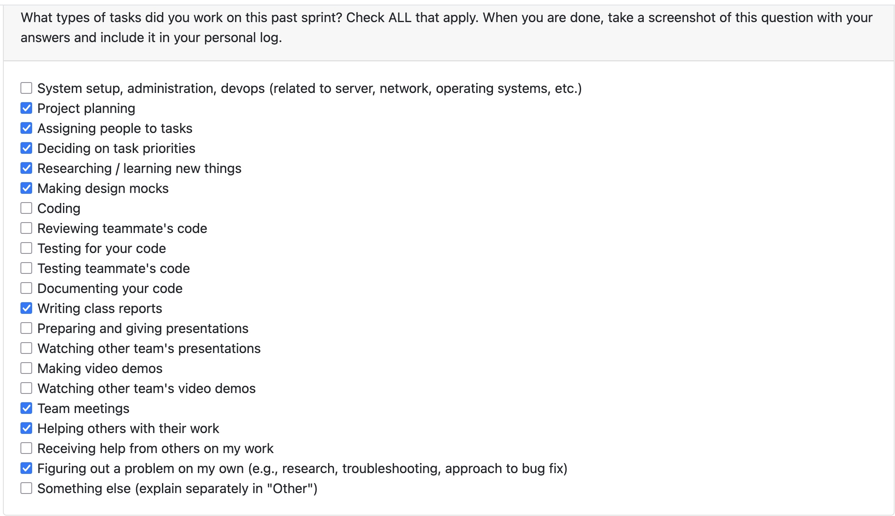
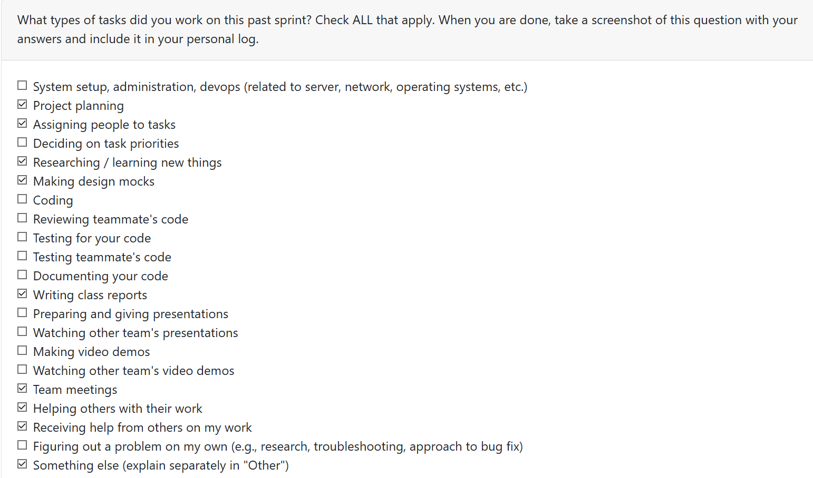
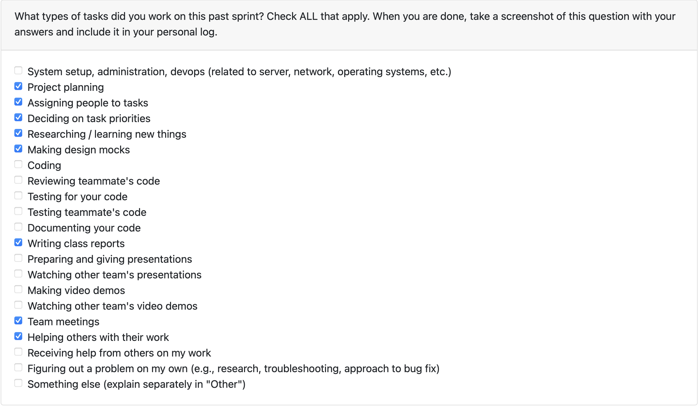
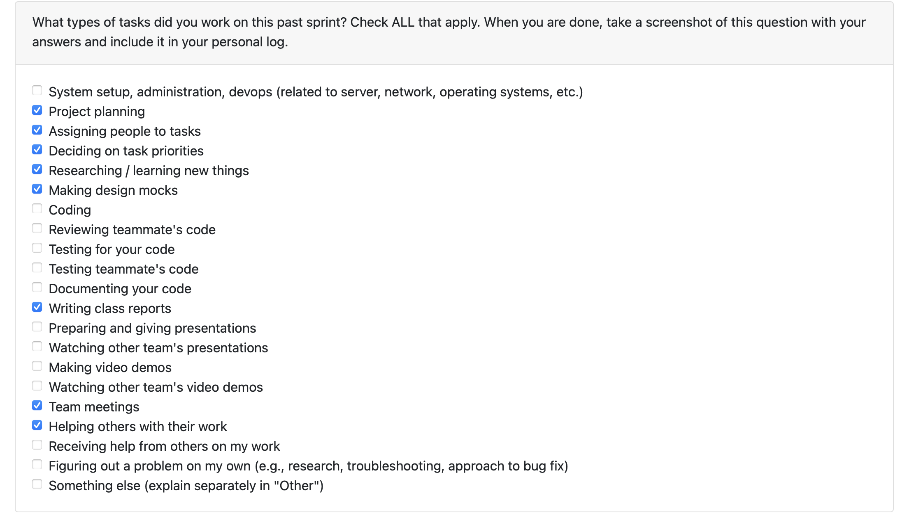

# Mandia Samarasekara

# Mithish Ravisankar Geetha
## Date Range

Week of Sep 22-28st

## Tasks Worked On

- Helped on working the project’s system architecture document.
- Participated in class discussions  to understand other team's architecture, discussed with the team about potential differences and challenges.
- Resarched the differences between web and desktop app for the project.
- Drafted the UML diagrams and use cases, researched about different tech stacks av available for this project. 
- Worked on the project proposal document.
- Attended group meetings, assigned tasks and discussed future requirements.

## Weekly Goals Recap

- **Features I was responsible for (this milestone):** Drew the UML diagram and wrote a few use cases. 
- **Progress in the last weeks** Research on desktop vs web app, tech stack and system architecture goals.

# Aakash Tirathdas
## Date Range

Week of Sep 22-28st

## Tasks Worked On

- Helped on working the project’s system architecture document.
- Participated in class discussions  to understand other team's architecture, discussed with the team about potential differences and challenges.
- Resarched on the potential of an AI agentic system vs a laptop crawler system an dwhy each can be implemneted (decided on a laptop crawler with an agentic analyser if excess time is present)
- Drafted majority of the use cases and filled out parts in the team proposal. 
- Attended group meetings, assigned tasks and discussed future requirements.

## Weekly Goals Recap

- **Features I was responsible for (this milestone):** Wrote a majority of the Use cases and research on agentic systems
- **Progress in the last weeks** Research on the agentic system and laptop crawler. Breif Architecture diagram finallised

# Ansh Rastogi

## Date Range

Week of Sep 22-28st

## Tasks Worked On

- Helped compile the initial system architecture write-up.
- Contributed to drafting UML diagrams and outlining primary use cases.
- Built and iterated on UML diagrams (use cases, relationships) to support the proposal.
- Organized meeting times and supported task distribution.

## Weekly Goals Recap

- **Features I was responsible for (this milestone):** Drafted UML and defined core use cases.
- **Progress in the last 2 weeks:** Conducted research on how to extract files for the system

# Harjot Sahota

# Mohamed Sakr

## Date Range

Week of Sep 22-28st

## Tasks Worked On

- Contributed to drafting the project’s system architecture document.
- Participated in internal team sessions to scope and refine our architecture.
- Researched the pros and cons of building a desktop app vs web application for the project.
- Worked on the UML diagrams and use cases for the project proposal.
- Set group meetings and helped assign tasks

## Weekly Goals Recap

- **Features I was responsible for (this milestone):** Worked on UML diagrams and use cases
- **Progress in the last 2 weeks:** Research on desktop application vs web application for the project.
