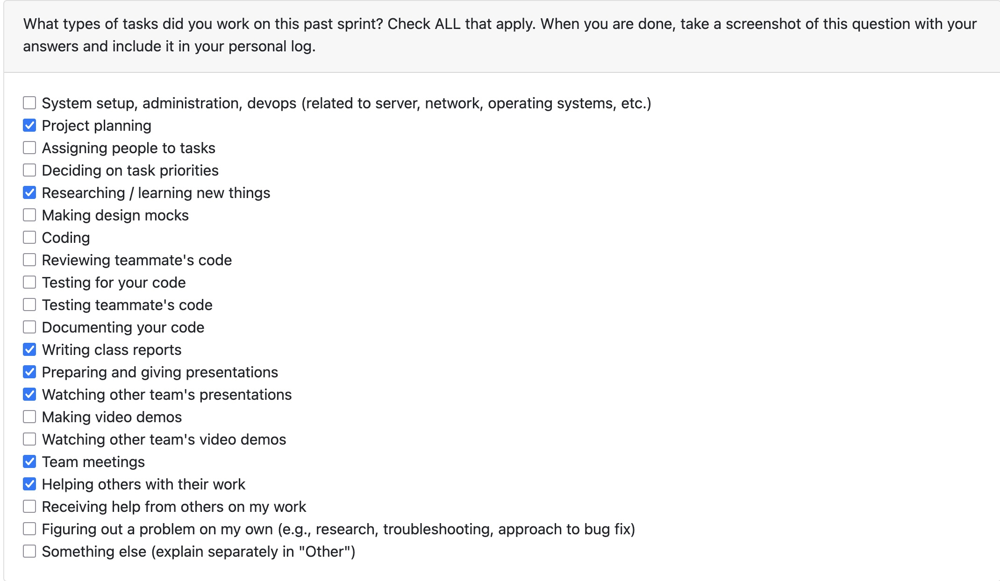
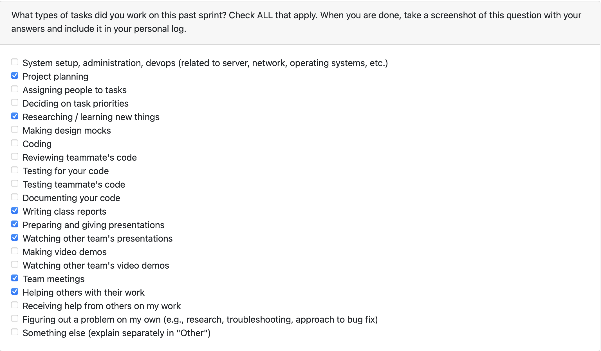
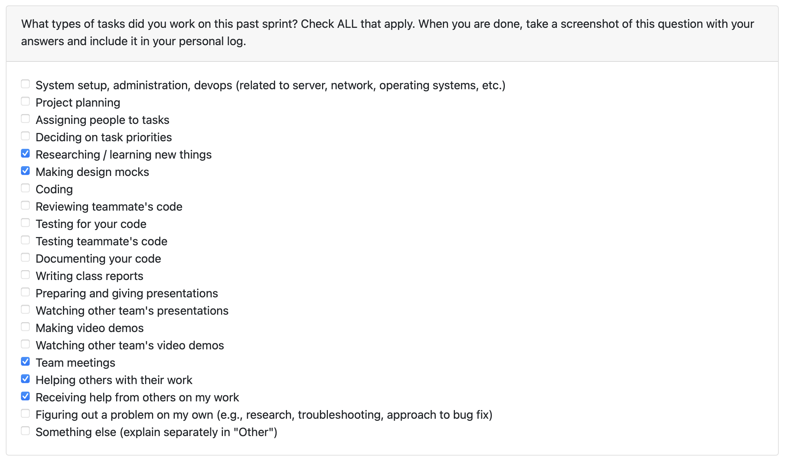

# Mandira Samarasekara

## Date Range

## Tasks Worked On

## Weekly Goals Recap

- **Features I was responsible for (this milestone):**
- **Progress in the last 2 weeks:**

# Mithish Ravisankar Geetha

## Date Range

Week of Sep 29th-Oct 5th

## Tasks Worked On

- Helped on working the project’s system architecture document.
- Helped in desigining DFD Level 0 and Level 1
- Participated in class discussions to understand other team's data flow diagrams, discussed with the team about potential differences and challenges.
- Resarched the different ways code and image extraction can be done for the project.
- Attended group meetings, assigned tasks and discussed future requirements.

## Weekly Goals Recap

- **Features I was responsible for (this milestone):** Designing Level 0 DFD, Helping on Level 1 DFD.
- **Progress in the last 2 weeks:** Drafted project proposal, finalized system requirements and data flow diagrams.

# Aakash Tirathdas

# Ansh Rastogi

## Date Range

Week of Sep 29th-Oct 5th

## Tasks Worked On

Tasks Worked On

- Produced the Level 0 and Level 1 data-flow diagrams.
- Took part in the in-class sessions reviewing other teams’ DFDs.
- Collaborated with the team to evaluate differences and identify upcoming challenges.
- Attended group meetings, assigned tasks and discussed future requirements.

## Weekly Goals Recap

- **Features I was responsible for (this milestone):** Completion of DFD Level 0 and Level 1.
- **Progress in the last 2 weeks:** Finalized system requirements and data flow diagrams.

# Harjot Sahota

## Tasks Worked On

## Weekly Goals Recap

- **Features I was responsible for (this milestone):**
- **Progress in the last 2 weeks:**

# Mohamed Sakr

## Date Range

Week of Sep 29th-Oct 5th

## Tasks Worked On

- Contributed the Level 0 and Level 1 data-flow diagrams (DFDs).
- Participated in class reviews to examine other teams’ DFDs.
- Collaborated with my team to analyze differences and anticipate potential challenges.
- Researched databases and platforms for the project

## Weekly Goals Recap

- **Features I was responsible for (this milestone):** Worked on DFD Level 0 and 1
- **Progress in the last 2 weeks:** Researching databases and platforms for the project
