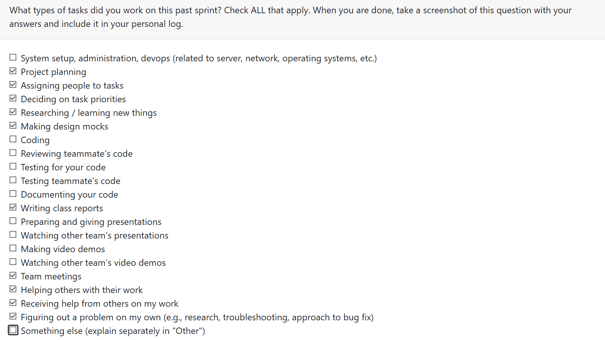

# Mandira Samarasekara  

## Date Range  

## Tasks Worked On  

## Weekly Goals Recap  

- **Features I was responsible for (this milestone):** 
- **Progress in the last 2 weeks:** 

# Mithish Ravisankar Geetha
## Date Range

Week of Sep 29th-Oct 5th

## Tasks Worked On

- Helped on working the project’s system architecture document.
- Helped in desigining DFD Level 0 and Level 1
- Participated in class discussions  to understand other team's data flow diagrams, discussed with the team about potential differences and challenges.
- Resarched the different ways code and image extraction can be done for the project.
- Attended group meetings, assigned tasks and discussed future requirements.

## Weekly Goals Recap

- **Features I was responsible for (this milestone):**  Designing Level 0 DFD, Helping on Level 1 DFD.
- **Progress in the last 2 weeks:** Drafted project proposal, finalized system requirements and data flow diagrams.

# Aakash 

## Tasks worked on
- Helped with going over Data flow diagram level 1(DFD1).
- Made the changes to DFD1 after the disussion session on Wednesday. 
- Participated in online and class disscussions
- Researched the Analysis portion of the project to make the changes to DFD1.
- 
## Weekly Goals Recap

- **Features I was responsible for (this milestone):**  Making the changes/improvements to DFD1 after the discussion
- **Progress in the last week:** Created and finilized the data flow diagrams

# Ansh Rastogi

## Date Range

## Tasks Worked On

## Weekly Goals Recap

- **Features I was responsible for (this milestone):** 
- **Progress in the last 2 weeks:** 

# Harjot Sahota

## Date Range
Week of Sep 29th-Oct 5th

## Tasks Worked On
- worked the project’s system architecture document.
- Helped in desigining DFD Level 1
- Participated in group meetiong discussions 
- Kept track of class discussions with other groups and took note of differences and similarities between our design and other groups designs

## Weekly Goals Recap

- **Features I was responsible for (this milestone):** Working on DFD level 1
- **Progress in the last 2 weeks:** Learnt more about how our data will flow through the project and Drafted project proposal
  
# Mohamed Sakr

## Date Range
Week of Sep 29th-Oct 5th

## Tasks Worked On
- Contributed the Level 0 and Level 1 data-flow diagrams (DFDs).
- Participated in class reviews to examine other teams’ DFDs.
- Collaborated with my team to analyze differences and anticipate potential challenges.
- Researched databases and platforms for the project

## Weekly Goals Recap

- **Features I was responsible for (this milestone):**  Worked on DFD Level 0 and 1
- **Progress in the last 2 weeks:** Researching databases and platforms for the project
