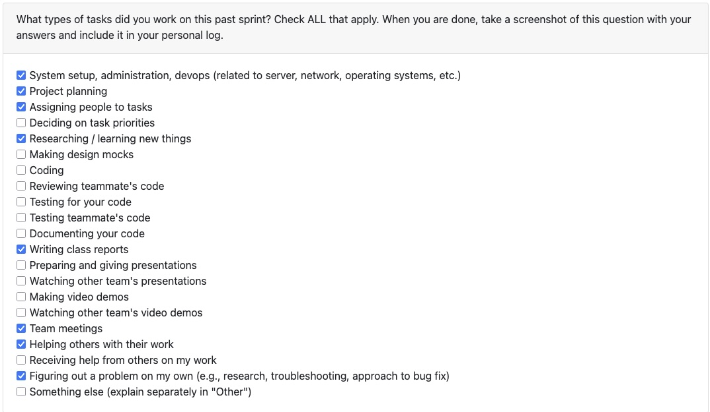
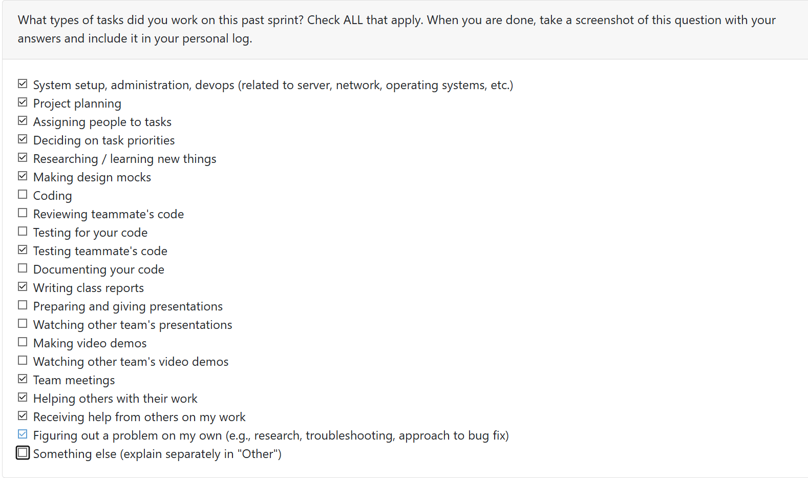
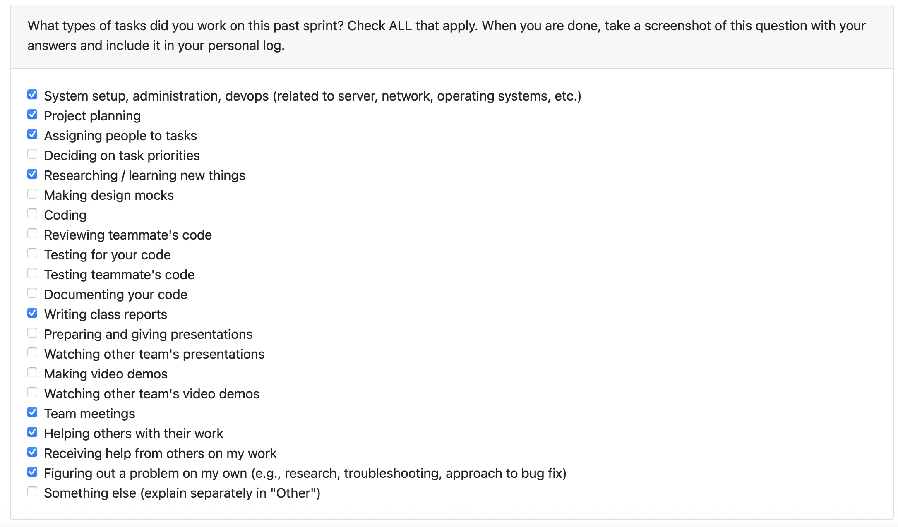

# Mandira Samarasekara

## Date Range

Oct 06th–12th

## Tasks Worked On

- Created the Work Breakdown Structure (WBS) for the project.
- Updated the Data Flow Diagram (DFD) Level 1 with assistance from **Aakash**.
- Ensured both the WBS and DFD reflected recent changes made to the project plan.
- Assigned weekly tasks to team members and hosted meetings to coordinate progress.

## Weekly Goals Recap

The goal for this week was to refine the project documentation to align with our updated project direction.  
This included improving the accuracy and clarity of the WBS and DFD Level 1 to better represent the current system structure and workflow.  
Team coordination and meeting facilitation ensured that all updates were completed efficiently and aligned with team expectations.

# Mithish Ravisankar Geetha

## Date Range

October 06-12

## Tasks Worked On

- Created the docker file for the project and set up the initial project structure.
- Revised and understood how Docker containerization works and set up the local environment.
- Added issues into the Kanban board and assigned weekly tasks to team members.
- Attended team meetings to coordinate progress and assign tasks.

## Weekly Goals Recap

The goal for this week was to set up our local environments and create the foundation of our project. This included creating our docker file, and I tested it by running the project in two devices to check if the containerization works. Furthermore, after our discussion in the team meeting, I added the initial issues to be worked on in the Kanban board and this will be updated frequently going forward from the next sprint.

# Aakash

## Date Range

Oct 06th–12th

## Tasks Worked On

- Helped Maddy on the DFD level 1
- Updated the System Architecture

## Weekly Goals Recap

The goal for this week was to refine the project documentation to align with our updated project direction.  
This included improving the accuracy and clarity of the System architecture and DFD Level 1 to better represent the current system structure and workflow.  
Team coordination and meeting facilitation ensured that all updates were completed efficiently and aligned with team expectations.

# Ansh Rastogi

## Date Range

Oct 06th–12th

## Tasks Worked On

- Created backend environment
- Created README for backend
- Added issues into the Kanban board and assigned weekly tasks to team members.
- Attended team meetings to coordinate progress and assign tasks.

## Weekly Goals Recap

- **Features I was responsible for (this milestone):** Backend environment set up.
- **Progress in the last 2 weeks:** Researched and created backend environment.

# Harjot Sahota

## Date Range

Oct 06th–12th

## Tasks Worked On

- Helped edit system arhitecture
- Helped update our Sytstem requirements
- Setup our frontend environment with electron and react (vite)

## Weekly Goals Recap

The goal for this week was to update and upload our system architecture and our requirements. I also researched and
created our front end environment using electron and react.

# Mohamed Sakr

## Date Range

Oct 06th–12th

## Tasks Worked On

- Edited the project proposal based on the newly released project requirements
- Created the Kanban board for the project
- Researched the possible implementation of RAG and LLMs

## Weekly Goals Recap

- **Features I was responsible for (this milestone):** Project proposal and kanban board
- **Progress in the last 2 weeks:** Researching the implementation of RAG and LLMs for this project
