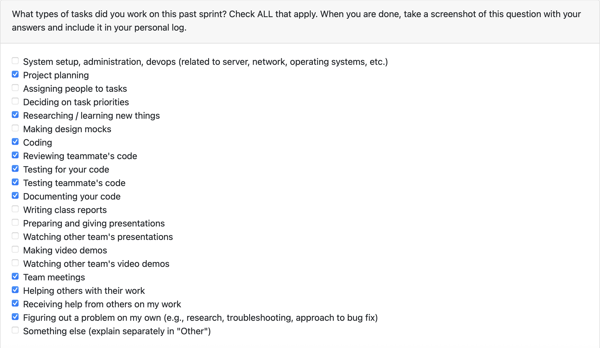

# Mandira Samarasekara

# Aakash Tirithdas

# Mithish Ravisankar Geetha

## Date Ranges

November 10 - Novemeber 23

Over the past two weeks, I made solid progress strengthening the non-LLM analysis pipeline. Building the Java OOP analysis helped me translate high-level design principles into practical code checks, and integrating it into the main pipeline showed me how each component contributes to the overall workflow.

Fixing bugs and adding project-size adaptations improved the accuracy and reliability of the analysis. Implementing database storage and résumé item generation also gave me a better sense of how our results will be used and how to present them meaningfully to users.

Overall, these weeks helped me improve both the technical quality of the analysis pipeline and my ability to think about how the system works end-to-end.## PR's initiated

## PR's initiated

- Complete Java OOP Analysis #128: https://github.com/COSC-499-W2025/capstone-project-team-6/pull/128
- Integrated Java nalysis to the main analysis pipeline #130: https://github.com/COSC-499-W2025/capstone-project-team-6/pull/130
- Add fixes to Java analysis pipeline #140: https://github.com/COSC-499-W2025/capstone-project-team-6/pull/140
- Modify java analysis to account for project size #144: https://github.com/COSC-499-W2025/capstone-project-team-6/pull/144
- Store project information in the database #145: https://github.com/COSC-499-W2025/capstone-project-team-6/pull/145
- Non LLM Analysis generate resume items #146: https://github.com/COSC-499-W2025/capstone-project-team-6/pull/146
- Unit testing for generation of resume items #147: https://github.com/COSC-499-W2025/capstone-project-team-6/pull/147
  
  

## PR's reviewed

- Integrating analysis pipeline with CLI: https://github.com/COSC-499-W2025/capstone-project-team-6/pull/146

## Plan for next week

- Retrieve previously generated portfolio information
- Retrieve previously generated résumé item
- Study for the quiz
- Prepare milestone presentation
- Refactor code after integration

# Ansh Rastogi

## Date Ranges

November 10 - Novemeber 23

Over the past two weeks, I focused on expanding our analysis capabilities by integrating the analysis pipeline with the CLI, developing comprehensive integration tests, and implementing a document analysis feature for essay evaluation. This work strengthened the end-to-end workflow and added new functionality to help users analyze both code and written documents.

Building the CLI workflow integration tests gave me deeper insight into how different components interact within the system. Implementing the document analyzer module for essays, including .docx file support and the analyze-essay command, demonstrated how we can extend our platform beyond code analysis. The complexity analysis feature added practical value by helping users identify performance bottlenecks in their Python code.

Overall, these weeks helped me improve my understanding of test-driven development, CLI design patterns, and how to build modular features that integrate seamlessly with existing infrastructure.

## Tasks Worked On

- [x] Integrated the analysis pipeline with the CLI interface
- [x] Developed CLI workflow integration tests for end-to-end validation
- [x] Implemented document analyzer module for essay/writing analysis
- [x] Added .docx file support to text extractor
- [x] Created analyze-essay command for both CLI and interactive shell
- [x] Contributed to Python complexity analysis feature development
- [x] Added demo project files and documentation for complexity analysis
- [x] Fixed terminal compatibility issues by removing emojis from CLI output

## Weekly Goals Recap

- [x] Complete CLI integration with analysis pipeline
- [x] Build comprehensive integration tests for CLI workflows
- [x] Implement document analysis feature for essays and written content
- [x] Ensure cross-platform compatibility (Windows/macOS/Linux)

### What Was Accomplished

- [x] Successfully integrated the non-LLM analysis pipeline with CLI commands
- [x] Created integration test suite covering authentication, session management, and CLI workflows
- [x] Implemented full document analysis pipeline supporting .docx files
- [x] Added analyze-essay command accessible from both standard CLI and interactive shell
- [x] Contributed to complexity analyzer with demo files and documentation
- [x] Improved CLI output formatting for better terminal compatibility

### What Didn't Go as Planned

- [x] Initial integration tests had Windows-specific path handling issues that required debugging
- [x] .docx parsing needed additional dependencies (python-docx) which expanded the requirements
- [x] Had to refactor some CLI command structures to support both direct and interactive modes

### Looking Ahead

- [x] Enhance document analysis with more sophisticated writing metrics
- [x] Add support for additional document formats (PDF, plain text)
- [x] Expand integration test coverage to include more edge cases
- [x] Optimize the analysis pipeline for larger projects

## PR's initiated

- CLI Workflow Integration Tests #132: https://github.com/COSC-499-W2025/capstone-project-team-6/pull/132
- Integrating Analysis Pipeline with CLI #134: https://github.com/COSC-499-W2025/capstone-project-team-6/pull/134
- Document Analysis Feature #150: https://github.com/COSC-499-W2025/capstone-project-team-6/pull/150

## PR's reviewed

- Non LLM Analysis generate resume items #146: https://github.com/COSC-499-W2025/capstone-project-team-6/pull/146
- Add fixes to Java analysis pipeline #140: https://github.com/COSC-499-W2025/capstone-project-team-6/pull/140
- C++ OOP Analyzer #157: https://github.com/COSC-499-W2025/capstone-project-team-6/pull/157
- C OOP Analysis #154: https://github.com/COSC-499-W2025/capstone-project-team-6/pull/154
- Integrated Java analysis to the main analysis pipeline #130: https://github.com/COSC-499-W2025/capstone-project-team-6/pull/130
- Refactor vector DB local #107: https://github.com/COSC-499-W2025/capstone-project-team-6/pull/107

## Plan for next week

- Enhance document analysis with additional metrics and formats
- Expand integration test coverage
- Study for the quiz
- Prepare milestone presentation
- Refactor and optimize CLI commands based on user feedback

# Harjot Sahota

## Date Ranges

November 16 - Novemeber 23

## Tasks Worked On

- [x] Implemented the C++ OOP Analyzer for Phase 3
- [x] Wrote a full test suite for the analyzer
- [x] Added documentation for C++ analysis in Phase 3
- [x] Added libclang dependency and created a samplecpp.cpp test file
- [x] Debugged import issues, AST issues, and test failures
- [x] Prepared and opened PR #157 (C++ OOP Analyzer)

## Weekly Goals Recap

- [x] Finished the working version of the C++ OOP analysis module
- [x] Create a complete test suite
- [x] Add the analyzer to the documentation & requirements

### What Was Accomplished

- [x] Implemented the entire C++ OOP analyzer using Clang’s AST
- [x] Created a comprehensive PyTest test suite
- [x] Added samplecpp.cpp so teammates can run real tests
- [x] Updated documentation:
      Added “Phase 3: C++ OOP Detection” to MetadataExtractor README
      Added installation & usage instructions
      Added example output
      Added known limitations section
- [x] Updated requirements.txt with libclang
- [x] Verified the analyzer works both when libclang is installed or missing (fallback mode)

### What Didn’t Go as Planned

- [x] libclang caused unexpected issues:
      AST parsing fails silently if libclang is missing or incorrectly installed

- [x] Tests repeatedly failed until adjustments were made
- [x] Had to adjust imports to match the project structure.

### Looking Ahead

- [x] I plan to expand the detection system to include more patterns like Adapter, Decorator, and Bridge, while reducing false positives.

## PR's initiated

- https://github.com/COSC-499-W2025/capstone-project-team-6/issues/156
  

## PR's reviewed

- https://github.com/COSC-499-W2025/capstone-project-team-6/issues/141
  
- https://github.com/COSC-499-W2025/capstone-project-team-6/issues/139
  
- https://github.com/COSC-499-W2025/capstone-project-team-6/issues/148
  

# Mohamed Sakr

## Date Ranges

November 10 - Novemeber 23

## Tasks Worked On

- Attended team meetings.
- Implemented the core infrastructure for LLM-based Code Analysis using Google Gemini's File Search API.
- Developed `GeminiFileSearchClient` for robust interaction with Google's Vertex AI/Generative Language APIs, handling authentication and corpus management.
- Created `llm_pipeline.py` to orchestrate the full analysis workflow, including file classification, filtering, ingestion, and summarization.
- Implemented session caching mechanisms to optimize performance for re-runs.
- Updated the database schema (`analysis_database.py`) to persist generated LLM summaries.

## Weekly Goals Recap

- **Features I was responsible for (this milestone):**
  - **Gemini File Search Integration:** Built a client wrapper handling authentication (ADC + env var) and parallel file ingestion with exponential backoff.
  - **Analysis Pipeline:** Established the end-to-end flow for ingesting codebases, creating ephemeral corpora, and querying the model for architectural insights.
  - **Session Caching:** Implemented in-memory caching to avoid re-ingesting files for the same user session.
  - **Database Storage:** Extended the database to store and retrieve AI-generated project summaries.

### What Went Well

- **Performance:** Parallel file uploads and `tenacity` integration for retries ensured that even medium-sized repositories are indexed quickly.
- **Infrastructure:** Successfully set up a robust wrapper around Google's APIs that handles rate limits gracefully.
- **Functionality:** The pipeline effectively filters irrelevant files and generates comprehensive architectural reports.

### What Didn’t Go as Planned

- **Large File Handling:** Files >1MB are currently truncated rather than being intelligently split, potentially losing some context.
- **Persistence:** The session cache is currently in-memory only, meaning it clears if the backend restarts.
- **Integration:** The feature is currently backend-only (`run_gemini_analysis`), lacking a direct UI/CLI entry point for end-users.

### Looking Ahead

- **UI/CLI Integration:** Connect the backend pipeline to the CLI or Electron UI to make the feature accessible to users.
- **Advanced Features:** Implement persistent caching and support for user-provided prompts/templates.
- **Optimization:** Improve the chunking strategy for large files to preserve full context during analysis.

## PRs initiated

- [#143 – Deep Semantic Analysis](https://github.com/COSC-499-W2025/capstone-project-team-6/pull/143)
- Completed issue #122
  
  

## PRs reviewed

- Documents analysis – #150
- Unit Testing for generation of resume items – #147
- Modified java analysis to account for project size – #144
- C oop – #154
