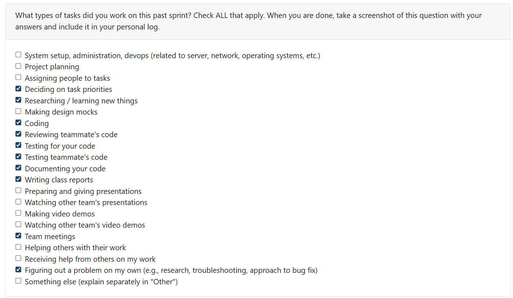
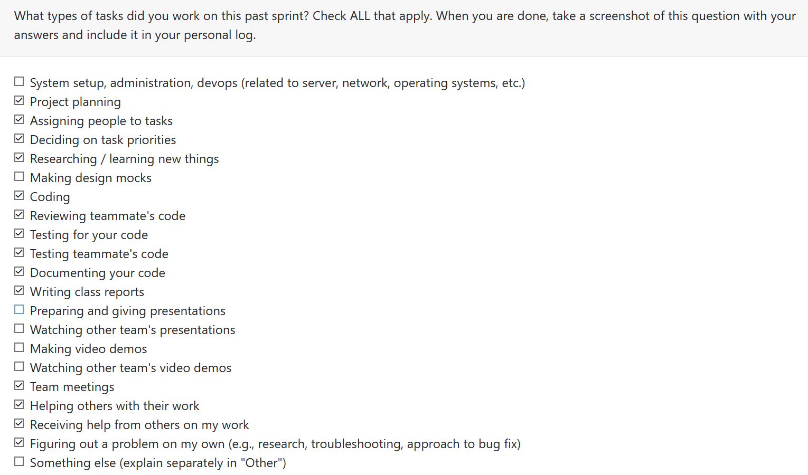
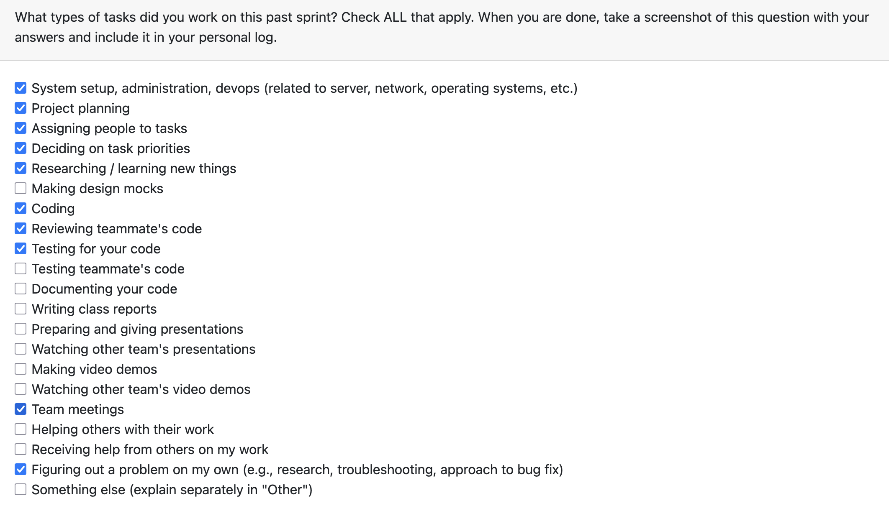
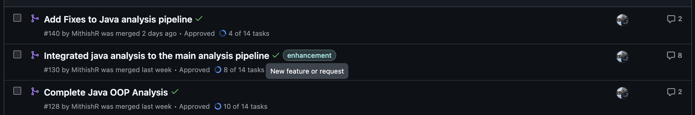
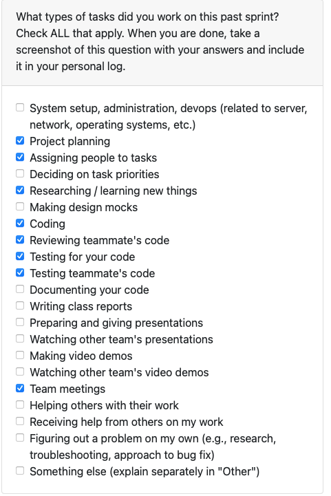
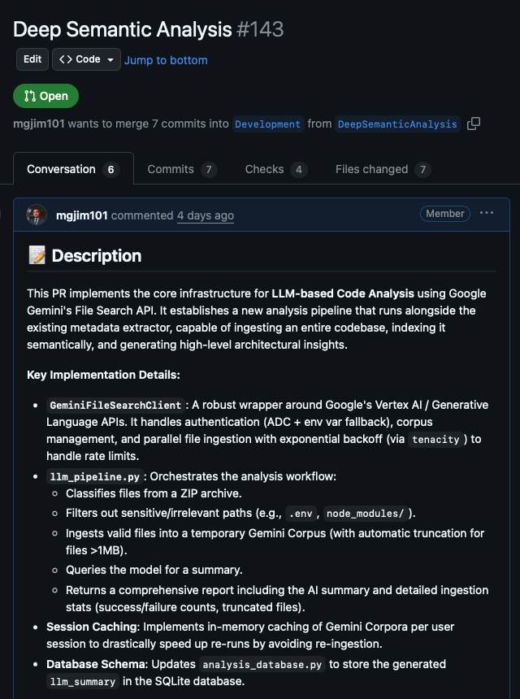
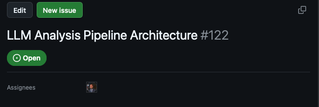

# Mandira Samarasekara
## Date Ranges
November 10 - November 23

## Tasks Worked On 
- Developed a Python complexity analyzer that evaluates whether code demonstrates awareness of algorithmic complexity and optimization practices, such as reducing runtime from O(n²) to O(n log n) through efficient algorithms and optimization techniques.
- Implemented detection for efficient data structures that improve performance, including the use of hash maps over lists for enhanced lookup efficiency.
- Created comprehensive test coverage for the Python complexity analyzer with 29 passing tests.
- Authored detailed documentation for the Python complexity analyzer feature.
- https://github.com/COSC-499-W2025/capstone-project-team-6/issues/151

### What Went Well

- All tests passed successfully, and I completed the implementation while addressing any bugs efficiently.
- The changes I made did not break any existing tests, ensuring backward compatibility.

### What Didn't Go as Planned

- Encountered a few minor merge conflicts due to working from an outdated branch that had undergone several merges. These conflicts were straightforward and resolved quickly.

### Looking Ahead

- I plan to extend the complexity analyzer to support additional programming languages beyond Python, beginning with Java.
- Will continue expanding language support based on project requirements.

## PR's initiated

- Python complexity analysis   https://github.com/COSC-499-W2025/capstone-project-team-6/pull/152

Implemented a Python time-complexity analysis feature that inspects Python files within projects to detect algorithmic complexity patterns and optimization awareness. The analyzer identifies inefficient patterns such as nested loops and suboptimal membership tests, while recognizing positive optimizations including memoization, set/dictionary usage, binary search implementations, and list comprehensions. Outputs include a per-project Optimization Awareness Score (0–100) with optional detailed findings. Includes comprehensive test suite and complete documentation.

## PR's reviewed

- Add Fixes to Java analysis pipeline   https://github.com/COSC-499-W2025/capstone-project-team-6/pull/140
- Added CLI workflow integration tests  https://github.com/COSC-499-W2025/capstone-project-team-6/pull/132
- Non LLM analysis: Generate Resume items   https://github.com/COSC-499-W2025/capstone-project-team-6/pull/146
- Unit testing for generation of resume items   https://github.com/COSC-499-W2025/capstone-project-team-6/pull/147
- Mithish logs W11+W12    https://github.com/COSC-499-W2025/capstone-project-team-6/pull/149

Conducted thorough testing and code review for all PRs listed above, providing constructive feedback with actionable suggestions for improvement while highlighting strengths and effective implementations. 

# Aakash Tirithdas
## Date Ranges
November 10 - Novemeber 23

## Weekly goals recap
- Write code for manual C analysis
- Write tests for manual C analysis
- Complete llama stack initialization
  
## What was completed
- Write code for manual C analysis
- Write tests for manual C analysis

## What didnt go as planned
During reading week while trying to complete the llama stack initialization, I ran into a bug in the llama stack source code which had an issue with docker. The docker image for llama stack didnt allow for embedding models to be tagged with the embedding parameter. Llama stack defaulted the parameter to llm eventhough it was clearly passed as an embedding model. This cause the llama stack route to completely be closed of. There for no working code could be provided and the branch was left locally due to the several errors that were displayed.

## Plan for next week
Get everything that we already have integrated into the CLI and work on having an output and demo that can be shown after next week. I have informed my teammates that i will not be available next week form Friday to Sunday and that i will do the work prior to then.

Study for test on Wednesday

## PR initiated
C-OOP
https://github.com/COSC-499-W2025/capstone-project-team-6/pull/154

## PR's reviewed
https://github.com/COSC-499-W2025/capstone-project-team-6/pull/143

https://github.com/COSC-499-W2025/capstone-project-team-6/pull/145

https://github.com/COSC-499-W2025/capstone-project-team-6/pull/152

# Mithish Ravisankar Geetha  

## Date Ranges
November 10 - Novemeber 23

## Weekly recap goals
- Complete java analysis 
- Store project info in the database
- Generate resume items
- Complete unit tests for the above
- Review other teammates codes
## What went well
Over the past two weeks, I made solid progress strengthening the non-LLM analysis pipeline. Building the Java OOP analysis helped me translate high-level design principles into practical code checks, and integrating it into the main pipeline showed me how each component contributes to the overall workflow.

Fixing bugs and adding project-size adaptations improved the accuracy and reliability of the analysis. Implementing database storage and résumé item generation also gave me a better sense of how our results will be used and how to present them meaningfully to users.

Overall, these weeks helped me improve both the technical quality of the analysis pipeline and my ability to think about how the system works end-to-end.## PR's initiated

## What didn't go well
Some of the testing hasn't been added properly due to a busy week, hence it will be added in the next sprint. This includes more detailed testing for modifying java analysis based on project size. Furthermore, due to time constraints I couldn't finish the python SOLID design principles addition.

## PR's initiated 
-  Complete Java OOP Analysis #128:  https://github.com/COSC-499-W2025/capstone-project-team-6/pull/128
- Integrated Java nalysis to the main analysis pipeline #130: https://github.com/COSC-499-W2025/capstone-project-team-6/pull/130
- Add fixes to Java analysis pipeline #140: https://github.com/COSC-499-W2025/capstone-project-team-6/pull/140
- Modify java analysis to account for project size #144: https://github.com/COSC-499-W2025/capstone-project-team-6/pull/144
- Store project information in the database #145: https://github.com/COSC-499-W2025/capstone-project-team-6/pull/145
- Non LLM Analysis generate resume items #146: https://github.com/COSC-499-W2025/capstone-project-team-6/pull/146
- Unit testing for generation of resume items #147: https://github.com/COSC-499-W2025/capstone-project-team-6/pull/147

## PR's reviewed
- Integrating analysis pipeline with CLI: https://github.com/COSC-499-W2025/capstone-project-team-6/pull/146
- Python complexity analysis: https://github.com/COSC-499-W2025/capstone-project-team-6/pull/152

## Plan for next week
-  Retrieve previously generated portfolio information 
-  Retrieve previously generated résumé item 
-  Study for the quiz
- Prepare milestone presentation
- Refactor code after integration

# Ansh Rastogi

# Harjot Sahota

## Date Ranges
November 16 - Novemeber 23

## Tasks Worked On
- [x] Implemented the C++ OOP Analyzer for Phase 3
- [x] Wrote a full test suite for the analyzer
- [x] Added documentation for C++ analysis in Phase 3
- [x] Added libclang dependency and created a samplecpp.cpp test file
- [x] Debugged import issues, AST issues, and test failures
- [x] Prepared and opened PR #157 (C++ OOP Analyzer)

## Weekly Goals Recap
- [x] Finished the working version of the C++ OOP analysis module
- [x] Create a complete test suite 
- [x] Add the analyzer to the documentation & requirements

### What Was Accomplished
- [x] Implemented the entire C++ OOP analyzer using Clang’s AST
- [x] Created a comprehensive PyTest test suite
- [x] Added samplecpp.cpp so teammates can run real tests
- [x] Updated documentation:
Added “Phase 3: C++ OOP Detection” to MetadataExtractor README
Added installation & usage instructions
Added example output
Added known limitations section
- [x] Updated requirements.txt with libclang
- [x] Verified the analyzer works both when libclang is installed or missing (fallback mode)

### What Didn’t Go as Planned
- [x] libclang caused unexpected issues:
AST parsing fails silently if libclang is missing or incorrectly installed

- [x] Tests repeatedly failed until adjustments were made
- [x] Had to adjust imports to match the project structure.

### Looking Ahead
- [x] I plan to expand the detection system to include more patterns like Adapter, Decorator, and Bridge, while reducing false positives.

## PR's initiated
- https://github.com/COSC-499-W2025/capstone-project-team-6/issues/156 

## PR's reviewed
- https://github.com/COSC-499-W2025/capstone-project-team-6/issues/141

- https://github.com/COSC-499-W2025/capstone-project-team-6/issues/139

- https://github.com/COSC-499-W2025/capstone-project-team-6/issues/148

# Mohamed Sakr
## Date Ranges
November 10 - Novemeber 23

## Tasks Worked On 
- Attended team meetings.  
- Implemented the core infrastructure for LLM-based Code Analysis using Google Gemini's File Search API.
- Developed `GeminiFileSearchClient` for robust interaction with Google's Vertex AI/Generative Language APIs, handling authentication and corpus management.
- Created `llm_pipeline.py` to orchestrate the full analysis workflow, including file classification, filtering, ingestion, and summarization.
- Implemented session caching mechanisms to optimize performance for re-runs.
- Updated the database schema (`analysis_database.py`) to persist generated LLM summaries.

## Weekly Goals Recap 
- **Features I was responsible for (this milestone):**  
  - **Gemini File Search Integration:** Built a client wrapper handling authentication (ADC + env var) and parallel file ingestion with exponential backoff.
  - **Analysis Pipeline:** Established the end-to-end flow for ingesting codebases, creating ephemeral corpora, and querying the model for architectural insights.
  - **Session Caching:** Implemented in-memory caching to avoid re-ingesting files for the same user session.
  - **Database Storage:** Extended the database to store and retrieve AI-generated project summaries.

### What Went Well
- **Performance:** Parallel file uploads and `tenacity` integration for retries ensured that even medium-sized repositories are indexed quickly.
- **Infrastructure:** Successfully set up a robust wrapper around Google's APIs that handles rate limits gracefully.
- **Functionality:** The pipeline effectively filters irrelevant files and generates comprehensive architectural reports.

### What Didn’t Go as Planned
- **Large File Handling:** Files >1MB are currently truncated rather than being intelligently split, potentially losing some context.
- **Persistence:** The session cache is currently in-memory only, meaning it clears if the backend restarts.
- **Integration:** The feature is currently backend-only (`run_gemini_analysis`), lacking a direct UI/CLI entry point for end-users.

### Looking Ahead
- **UI/CLI Integration:** Connect the backend pipeline to the CLI or Electron UI to make the feature accessible to users.
- **Advanced Features:** Implement persistent caching and support for user-provided prompts/templates.
- **Optimization:** Improve the chunking strategy for large files to preserve full context during analysis.

## PRs initiated  
- [#143 – Deep Semantic Analysis](https://github.com/COSC-499-W2025/capstone-project-team-6/pull/143)  
- Completed issue #122
  
  

## PRs reviewed  
- Documents analysis – #150  
- Unit Testing for generation of resume items – #147  
- Modified java analysis to account for project size – #144  
- C oop – #154  
