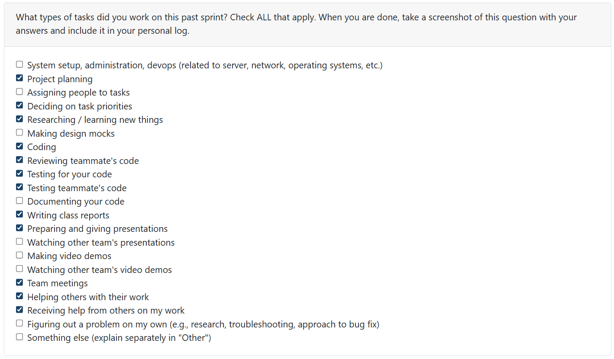
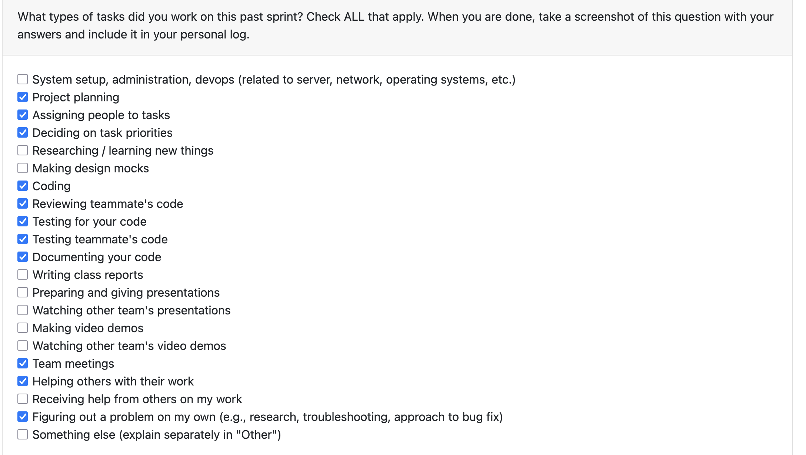
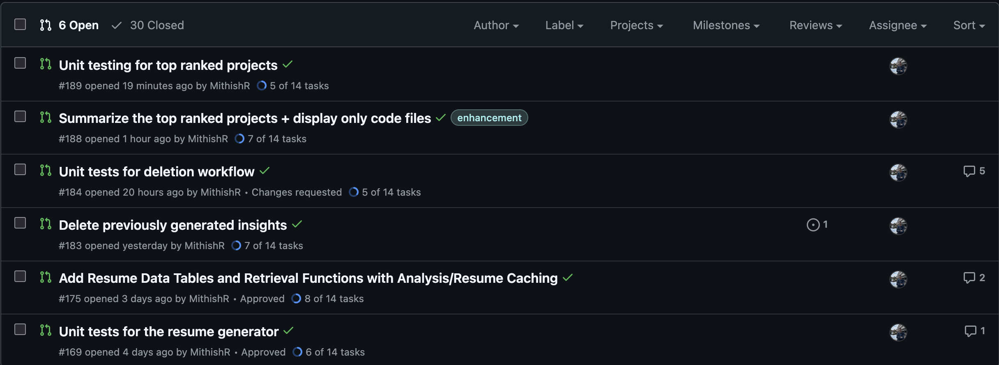
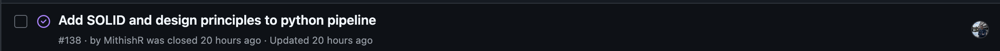
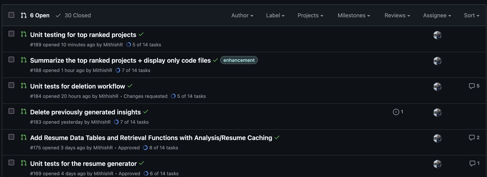
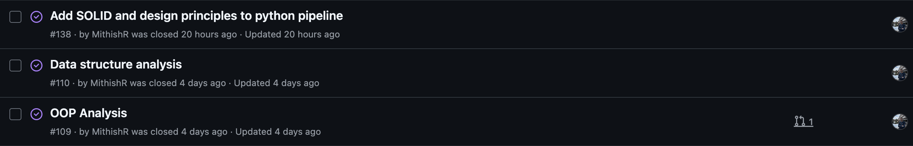
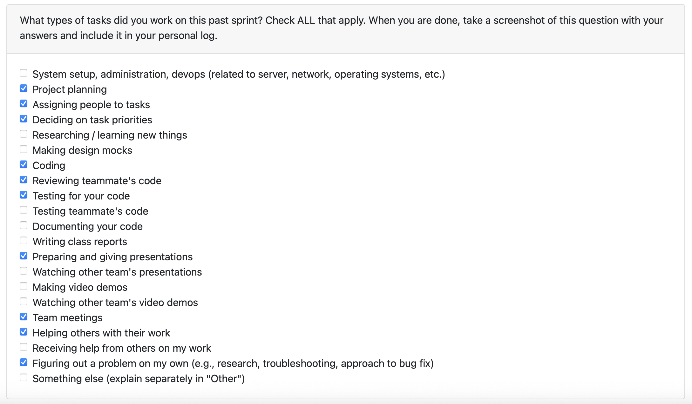
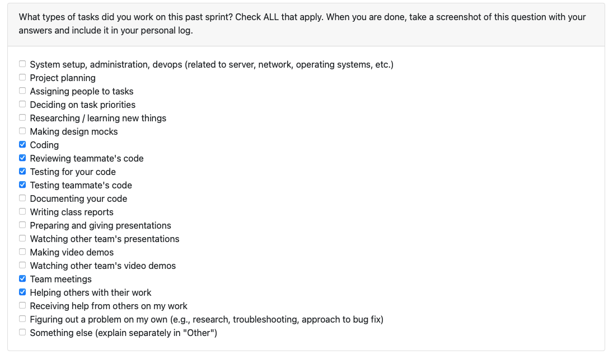

# Mandira Samarasekara

## Date Ranges

November 24–November 30  

## Weekly recap goals

- Studied and wrote for Quiz 2  
- Attended and organized multiple team meetings  
- Prepared for the project presentation  
- Reviewed multiple PRs from teammates  
- Implemented requirements 19 and 20 of the project requirement list  
- Implemented chronological project and skill timelines  
- Wrote tests for my code  
- Wrote personal logs  
- Wrote the team logs  

## What went well

All the tests for the features that I implemented passed without any issues. We completed a lot of features this week compared to previous weeks. I completed 2 issues: [**#191**](https://github.com/COSC-499-W2025/capstone-project-team-6/issues/191) and [**#192**](https://github.com/COSC-499-W2025/capstone-project-team-6/issues/192), and reviewed many PRs.  

I also held multiple team meetings, which helped us get a lot of work done and stay aligned on dependencies, such as identifying which PRs needed to be merged before starting work on others.

## What didn't go well

There was a small issue with the logic behind the chronological ordering of skills/projects. This ordering was supposed to be based on the date of the last commit for each project. However, this data was not stored in our current database, and the git commit history extraction function had not been merged at the time my feature was being implemented.  

As a result, the current implementation uses the timestamp of when the project was analyzed as its chronology. This will be refactored and changed to use the last commit date in the following week.

## PR's reviewed

- [Refactored resume generator #168  ](https://github.com/COSC-499-W2025/capstone-project-team-6/pull/168)
- [Git analysis #177](https://github.com/COSC-499-W2025/capstone-project-team-6/pull/177)  
- [CLI integration analysis test #182 ](https://github.com/COSC-499-W2025/capstone-project-team-6/pull/182) 
- [Delete previously generated insights #183](https://github.com/COSC-499-W2025/capstone-project-team-6/pull/183)  
- [Portfolio item generator #187  ](https://github.com/COSC-499-W2025/capstone-project-team-6/pull/187)
- [Unit testing for top ranked projects #189  ](https://github.com/COSC-499-W2025/capstone-project-team-6/pull/189)
- [Mohamed W13 Logs #196 ](https://github.com/COSC-499-W2025/capstone-project-team-6/pull/196) 

## PR's initiated

[- Project chronology #193](https://github.com/COSC-499-W2025/capstone-project-team-6/pull/193)  

**Description of my PR (#193):**

This PR adds a **chronology feature** that produces:

- **Projects timeline**: an ordered list of analyzed projects by `analysis_timestamp` with key metadata.  
- **Skills timeline**: aggregated unique languages and frameworks per analysis date.  
- **CLI integration**: integrates the feature into the CLI via a new `timeline` subcommand with `projects` and `skills` options.  
- Adjusts CLI imports to lazily load `text_extractor` so unrelated commands (e.g., `timeline`) don't fail when optional OCR dependencies are missing.  
- Adds unit tests to verify the new functionality.

## Plan for next week

- Refactor the chronology feature to use the last commit date instead of the analysis timestamp.  
- Finish the project report.  
- Finish the project demo.  
- Finish the group contract.  
- Refactor parts of the code that I have previously worked on.  

# Aakash Tirithdas

# Mithish Ravisankar Geetha

## Date Ranges

November 24-November 30

## Weekly recap goals

- Extend Python OOP analysis and design-principles detection
- Refactor and improve résumé generation workflow
- Add resume-related database tables and caching functions
- Implement deletion workflow for previously generated insights
- Generate and test “Top Ranked Projects” feature
- Review teammates’ PRs
- Study for Quiz 2 and complete the quiz

## What went well

Over the past two weeks, I made strong progress across multiple core areas of the non-LLM pipeline. I expanded the Python OOP and design-principles detection, which strengthened the depth of our code-quality analysis. I also refactored the résumé generator to make the output more structured, scalable, and aligned with the new database schema.

Another major step forward was implementing new database tables and caching logic for analysis and résumé retrieval, which improves performance and supports persistent storage. I added full workflows for deleting previously generated insights and implemented (and tested) the “Top Ranked Projects” feature, including code-file filtering and scoring logic.

Overall, this sprint helped solidify several important subsystems: OOP analysis, résumé generation, caching, project ranking, and deletion workflows—all of which strengthened the reliability, usability, and maintainability of the pipeline. I also studied for and completed Quiz 2.

## What didn't go well

Due to time constraints, I couldn’t finish implementing retrieval for previously generated résumé items. This will be completed in the next sprint along with additional refinements after integrating the new caching logic. A few deeper tests for the new resume-retrieval pathways also need to be added..

## PR's initiated

- Further OOP analysis and design principles detection in Python #164:https://github.com/COSC-499-W2025/capstone-project-team-6/pull/164
- Refactored résumé generator #168: https://github.com/COSC-499-W2025/capstone-project-team-6/pull/168
- Unit tests for the résumé generator #169: https://github.com/COSC-499-W2025/capstone-project-team-6/pull/169
- Add Resume Data Tables and Retrieval Functions with Analysis/Resume Caching #175: https://github.com/COSC-499-W2025/capstone-project-team-6/pull/175
- Delete previously generated insights #183: https://github.com/COSC-499-W2025/capstone-project-team-6/pull/183
- Unit tests for deletion workflow #184: https://github.com/COSC-499-W2025/capstone-project-team-6/pull/184
- Summarize the top ranked projects + display only code files #188: https://github.com/COSC-499-W2025/capstone-project-team-6/pull/188
- Unit testing for top ranked projects #189: https://github.com/COSC-499-W2025/capstone-project-team-6/pull/189

## PR's reviewed

- Git analysis #177: https://github.com/COSC-499-W2025/capstone-project-team-6/pull/177
- Portfolio item generator #187: https://github.com/COSC-499-W2025/capstone-project-team-6/pull/187
- CLI analysis integration #179: https://github.com/COSC-499-W2025/capstone-project-team-6/pull/179

## Plan for next week

- Implement retrieval for previously generated résumé items
- Refactor and clean up output and caching logic
- Prepare and finalize Milestone 1 submission
- Continue refining analysis modules after integration

# Ansh Rastogi

## Date Ranges

November 24 - November 30

## Weekly recap goals

- Complete comprehensive CLI analysis integration for all language analyzers
- Add integration tests for the analysis pipeline
- Integrate LLM-based analysis into the CLI workflow
- Fix bugs and improve error handling across the analysis pipeline
- Review teammates' PRs and provide constructive feedback
- Prepare for Milestone presentation

## What went well

This week I made substantial progress integrating all analysis modules into the CLI workflow. I successfully integrated the C++ OOP analyzer, C OOP analyzer, resume generator, database storage, and LLM pipeline into the CLI with proper command support. The integration work required careful attention to import structures, error handling, and ensuring all components work together seamlessly.

I also created comprehensive integration tests for the analysis pipeline to validate end-to-end workflows, including testing for edge cases like AttributeErrors in MetadataExtractor and suppressing third-party deprecation warnings in pytest. Additionally, I improved the display and field mappings for C/C++ analysis and moved them into the main pipeline alongside Java analysis.

The LLM pipeline integration was particularly challenging but rewarding—I changed the imports from absolute to relative paths and added better error handling to make the feature more robust. Overall, this sprint significantly strengthened the CLI's analysis capabilities and improved the overall system reliability.

## What didn't go well

The integration work revealed several edge cases and compatibility issues that needed immediate attention. Some of the import paths needed refactoring to work correctly across different modules, and I encountered AttributeErrors in the MetadataExtractor that required defensive programming fixes.

Additionally, coordinating the integration of multiple features simultaneously (C/C++ analyzers, resume generator, database storage, and LLM pipeline) required careful merge conflict resolution and testing to ensure nothing broke existing functionality.

## PR's initiated

- CLI Analysis Integration #179: https://github.com/COSC-499-W2025/capstone-project-team-6/pull/179
- CLI integration analysis test #182: https://github.com/COSC-499-W2025/capstone-project-team-6/pull/182

## PR's reviewed

- Further OOP analysis and design principles detection in Python #164: https://github.com/COSC-499-W2025/capstone-project-team-6/pull/164
- Deep Semantic Analysis Core Features #181 https://github.com/COSC-499-W2025/capstone-project-team-6/pull/181
- Delete previously generated insights #183: https://github.com/COSC-499-W2025/capstone-project-team-6/pull/183
- Deep RAG Analytical Features #185: https://github.com/COSC-499-W2025/capstone-project-team-6/pull/185
- Summarize the top ranked projects + display only code files #188: https://github.com/COSC-499-W2025/capstone-project-team-6/pull/188

## Plan for next week

- Finalize and polish the CLI integration features
- Add more comprehensive error handling and user feedback
- Prepare and finalize Milestone 1 submission
- Continue testing and refining the analysis pipeline based on user feedback
- Add documentation for the new analyze-llm command

# Harjot Sahota

## Date Ranges
November 24-November 30

## Weekly recap goals
- Implemented and integrated the new portfolio item generator into the backend analysis pipeline.
- Ensured portfolio items save to the database alongside resume items.
- Built a full automated test suite for the portfolio generator.

## What went well
- Successfully built the full portfolio_item_generator.py with architecture, contributions, skills, and overview generation.
- Fully integrated portfolio generation into analyze.py without duplicating OOP analysis or breaking existing resume logic.
- Created a comprehensive test suite (quality score, architecture, contributions, skills, and full item generation) — all tests pass.
- Cleanly resolved merge conflicts and ensured compatibility with Development.

## What didn't go well
- Integration required reorganizing parts of analyze.py to avoid duplicated or misplaced logic.
- My portfolio analysis does not yet evaluate C, C++, Git activity, or document files because those analyzers were not integrated or merged into Development in time. This will be completed next sprint alongisde with proper tests for those specific analyzers to ensure full coverage and consistency with the existing pipeline.
  
## PR's initiated
- portfolio item generator #187 https://github.com/COSC-499-W2025/capstone-project-team-6/pull/187
  

## PR's reviewed
- Further OOP analysis and design principles detection in Python #164 https://github.com/COSC-499-W2025/capstone-project-team-6/pull/164
- Mithish Week 13 logs #190 https://github.com/COSC-499-W2025/capstone-project-team-6/pull/190
- Unit tests for the resume generator #169 https://github.com/COSC-499-W2025/capstone-project-team-6/pull/169
- Deep Semantic Analysis Core Features #181 https://github.com/COSC-499-W2025/capstone-project-team-6/pull/181
- CLI integration analysis test #182 https://github.com/COSC-499-W2025/capstone-project-team-6/pull/182
- Unit tests for deletion workflow #184 https://github.com/COSC-499-W2025/capstone-project-team-6/pull/184
- Summarize the top ranked projects + display only code files #188 https://github.com/COSC-499-W2025/capstone-project-team-6/pull/188
  

## Plan for next week
- Extend the portfolio generator to incorporate insights from the new analyzers (C/C++ OOP metrics, Git contribution depth, documentation quality).
- refractor portfolio genereator to produce a cleaner output i.e not including a summary length output, clean up format (i.e 1 class instead of 1 classes)
- When running our CLI, at the end when it asks for the output to be stored as json, our code does not account for users to enter something other than y/n. I plan to fix this error in our code and have it handle different user inputs!

# Mohamed Sakr
## Date Ranges

November 24-November 30

## Weekly recap goals
- Refactor `llm_pipeline` and `gemini_file_search` to use `google-genai` SDK
- Implement deep semantic analysis lenses (Architecture, Complexity, Security, Skills, Domain)
- Integrate `rich` library for CLI output and add JSON export
- Ingest offline analysis report into RAG model
- Review teammates’ PRs
- Study for Quiz 2 and complete the quiz

## What went well
I successfully refactored the `llm_pipeline` and `gemini_file_search` modules to migrate to the modern `google-genai` SDK (v1.5+). This resolved a critical `TypeError` during file uploading and fixed data quality issues regarding macOS system files.

I implemented comprehensive Deep Semantic Analysis features, allowing users to trigger specific lenses via CLI flags:
- **Architecture**: Design pattern critiques, anti-pattern detection, and data flow tracing.
- **Complexity**: Efficiency gap analysis, data structure maturity, and concurrency audits.
- **Security**: Logical flaw detection, trust boundary analysis, and error handling maturity.
- **Skills & Domain**: Developer profiling (refactoring, testing psychology) and framework/API fluency checks.

Furthermore, I improved the User Interface by integrating the `rich` library for Markdown rendering, project statistics tables, and error panels in the terminal, alongside a JSON export feature. The full offline analysis report is now also ingested into the RAG model for deeper insights.

## What didn't go well
The migration to the `google-genai` SDK, while necessary, presented documentation gaps that made mapping legacy API calls to the new v1.5+ schema time-consuming, particularly for file state management. Additionally, prompt engineering for the specific analysis lenses required significantly more iterations than anticipated to ensure the LLM provided distinct, non-generic insights for categories like "Soft Skills" versus "Architecture." I also encountered intermittent rate-limiting issues during the RAG ingestion of larger codebases, which required implementing more robust backoff strategies.

## Plan for next week
- Refine prompt engineering for the "Soft Skills" and "Domain Competency" lenses to improve insight specificity.
- Optimize the RAG ingestion process to better handle large context windows and prevent timeouts.
- Update project documentation to verify the new deep analysis CLI flags and `rich` output features.
- Collaborate with the team to finalize the Milestone 1 submission and presentation.

## PR's initiated
- Deep Semantic Analysis Core Features #181 https://github.com/COSC-499-W2025/capstone-project-team-6/pull/181
- Deep RAG Analytical Features #185 https://github.com/COSC-499-W2025/capstone-project-team-6/pull/185

## PR's reviewed
- Unit tests for deletion workflow #184 https://github.com/COSC-499-W2025/capstone-project-team-6/pull/184
- cli analysis integration #179 https://github.com/COSC-499-W2025/capstone-project-team-6/pull/179
- Add Resume Data Tables and Retrieval Functions with Analysis/Resume Caching #175 https://github.com/COSC-499-W2025/capstone-project-team-6/pull/175
- Unit tests for the resume generator #169 https://github.com/COSC-499-W2025/capstone-project-team-6/pull/169
- C oop #154 https://github.com/COSC-499-W2025/capstone-project-team-6/pull/154

