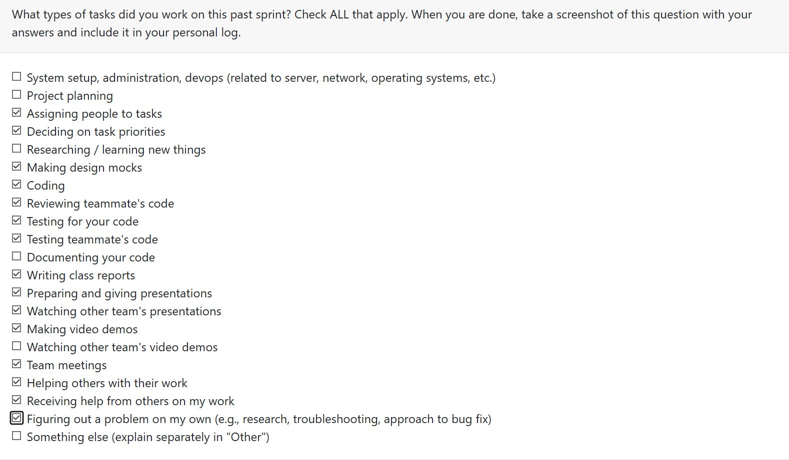

# Mandira Samarasekara

## Date Ranges
December 1st - December 6th

## Weekly recap goals

- Led and organized multiple team meetings
- Presented our first project milestone in class
- Reviewed and merged teammates’ PRs
- Refactored the project and skill timelines for chronology
- Added and validated unit tests for my changes
- Documented detailed personal logs
- Co-created the milestone 1 demo video with Aakash
- Revisited and reaffirmed the team contract
- Completed the milestone 1 self-reflection

## What went well

This was a heavy week, but I finished every commitment. I refactored the Project Chronology to use a three-tier date priority system and closed issue #212. Aakash and I completed the project milestone demo, and the team stayed ahead of tight deadlines.

## What didn't go well

The chronology output could still be formatted for better readability. In my PR, I initially missed adding the new `last_commit_date` and `last_modified_date` columns, but after Mithish flagged it, I patched it quickly. A previous merge also reintroduced a duplicate `resume_items` table definition; I corrected that regression as well.

## PR's reviewed

- Deep Semantic Analysis Documentation #208 (https://github.com/COSC-499-W2025/capstone-project-team-6/pull/208)
- Delete previously generated insights #183 (https://github.com/COSC-499-W2025/capstone-project-team-6/pull/183)
- Unit testing for top ranked projects #189 (https://github.com/COSC-499-W2025/capstone-project-team-6/pull/189)

## PR's initiated

Project chronology 2.0 #213 (https://github.com/COSC-499-W2025/capstone-project-team-6/pull/213)

**Description of my PR (#213):**

- Introduces a three-tier date priority to produce the most accurate work history: commit date (highest), file modified date (fallback), and analysis timestamp (last resort).
- Adds database and migration support for `last_commit_date` and `last_modified_date` with safe initialization in `init_db()`.
- Updates the CLI headers and appends date source indicators `(commit)`, `(modified)`, or `(analysis)` for clarity.
- Cleans up the schema by removing duplicate `resume_items` table definitions.

## Plan for next week

We wrapped milestone 1 and have a short break ahead. I will scan the codebase for vulnerabilities, refactor rough spots, and fix small issues that slipped into recent PRs, even if their impact is not yet visible.

# Aakash Tirithdas
December 1st - December 6th

## Weekly recap goals
- c analysis integration
- DFD diagram update
- system architecture update
- git analysis integration

## what went well
- teammate integrated c and git analysis
- Completed DFD and system archeitecture diagrams
- refactored part of CLI implementation
- recorded the video demo

## What didnt go well
- took a lot of time to get the CLI working ass expected which delayed the video demo

## PR initiated
- https://github.com/COSC-499-W2025/capstone-project-team-6/pull/228
- https://github.com/COSC-499-W2025/capstone-project-team-6/pull/229
- https://github.com/COSC-499-W2025/capstone-project-team-6/pull/227
- https://github.com/COSC-499-W2025/capstone-project-team-6/pull/204
- 

## PR reviewed
- https://github.com/COSC-499-W2025/capstone-project-team-6/pull/200
- https://github.com/COSC-499-W2025/capstone-project-team-6/pull/206

---

# Mithish Ravisankar Geetha

## Date Ranges

December 1-December 7

## Weekly recap goals

- Refactor and fix errors on the Delete previously generated insights PR
- Work on retrieving previously generated resume items
- Work on the milestone 1 presentation and present it
- Watch other teams presenting and review them
- Complete the Team contract
- Finalize all milestone 1 requirements
- Attend the team meetings
- Complete the milestone 1 self reflection

## What went well

This week was productive across both development tasks and milestone deliverables. I was able to successfully refactor the Delete Previously Generated Insights feature after addressing the errors identified during Mandira’s review. The refactor improved the clarity, safety, and overall consistency of the workflow. I also resolved merge conflicts from earlier PRs, which allowed the codebase to stabilize and ensured all components integrated cleanly.

I then implemented the retrieval of previously generated résumé items, and after a small bug surfaced during review, I quickly patched it. The feature now works end-to-end with the caching and storage logic introduced earlier.

Outside of development, our Milestone 1 presentation went smoothly, and we were able to clearly communicate each subsystem and our collective progress. All Milestone 1 requirements were completed on time, the team contract was finalized, and I attended all team meetings and review sessions. Overall, the week felt cohesive and productive, with steady progress across technical and deliverable-related responsibilities.

## What didn't go well

A few areas took longer than expected. The errors in the Delete Insights PR required more refactoring work than anticipated, especially since some issues only surfaced during deep review. Additionally, the merge conflicts from older PRs slowed down development, as resolving them required carefully aligning new logic with changes made by other teammates.

The retrieval feature also needed an unexpected bug fix during review, which added extra iteration time. While everything was ultimately completed, the amount of context switching such as between refactoring, conflict resolution, feature development, and presentation preparation made the workflow more fragmented than ideal.

## PR's initiated

(Created last week, merged this week:)

- Delete previously generated insights #183: https://github.com/COSC-499-W2025/capstone-project-team-6/pull/183
- Unit tests for deletion workflow #184: https://github.com/COSC-499-W2025/capstone-project-team-6/pull/184
- Summarize the top ranked projects + display only code files #188: https://github.com/COSC-499-W2025/capstone-project-team-6/pull/188
- Unit testing for top ranked projects #189: https://github.com/COSC-499-W2025/capstone-project-team-6/pull/189

(Created this week:)

- Retrieve previously generated résumé items #201: https://github.com/COSC-499-W2025/capstone-project-team-6/pull/201
- Merge branch Development to Main for Milestone 1 #200: https://github.com/COSC-499-W2025/capstone-project-team-6/pull/200
  
  

## PR's reviewed

- Extended Portfolio Item Generator with Full C++ & C OOP-Style Integration #211 : https://github.com/COSC-499-W2025/capstone-project-team-6/pull/211
- Update analyze.py #204 : https://github.com/COSC-499-W2025/capstone-project-team-6/pull/204
- Project chronology 2.0 #213 : https://github.com/COSC-499-W2025/capstone-project-team-6/pull/213

## Issue board

## Plan for next week

All milestone 1 requirements are met, and the term is complete.
Milestone 2 requirements will be discussed on the first week of classes in January.

---

# Ansh Rastogi

## Date Ranges

December 1-December 7

## Weekly recap goals

- Integrate git analysis into CLI workflow
- Integrate complexity analyzer, resume, and portfolio features into mda analyze
- Add feature selection and rich formatting to mda analyze-llm
- Complete Milestone 1 presentation and deliverables
- Review teammates' PRs and provide constructive feedback
- Fix bugs and improve existing analysis pipeline components
- Complete Milestone 1 self-reflection
- Attend team meetings and presentation sessions

## What went well

This week was highly productive in finalizing Milestone 1 deliverables and enhancing the analysis pipeline. I successfully integrated comprehensive git analysis capabilities into the CLI, enabling detailed repository metrics including commit history, contributor statistics, and collaboration patterns. The integration supports both directory-based and ZIP file repositories, with graceful handling when .git folders are absent.

Following the git integration, I completed a major CLI enhancement by integrating Python complexity analysis, resume generation, and portfolio generation into the `mda analyze` command. This integration automatically runs complexity analysis as Phase 4 of the pipeline, generates professional resume items, and creates detailed portfolio showcases - all with appropriate database storage and JSON export capabilities.

I also significantly improved the `mda analyze-llm` command by adding feature selection flags (--architecture, --complexity, --security, --skills, --domain, --resume, --all) that allow users to choose which deep analysis features to run. Additionally, I replaced the plain text output with rich library formatting, providing a professional terminal experience with styled panels, tables, and markdown-formatted insights.

The implementation underwent thorough manual testing and successfully resolved merge conflicts and unit test failures during the review cycle. I ensured existing language analyzers (Python, Java, C++, C) continued functioning without issues. Additionally, I fixed critical bugs including ZIP path handling, Java field naming issues, and import errors in the LLM pipeline, while removing duplicate analysis logic from analyze.py for cleaner code organization.

Our Milestone 1 presentation went smoothly, and the team successfully communicated each subsystem and our collective progress. All milestone requirements were completed on time, and I actively participated in reviewing other teams' presentations and providing constructive feedback.

## What didn't go well

The git analysis integration took longer than expected due to several merge conflicts that required careful resolution to align new logic with changes made by teammates. Handling both directory-based and ZIP file repository formats added complexity to the implementation, requiring additional testing iterations to ensure both workflows functioned correctly.

The CLI analysis integration also required careful attention to data structure details. Initially, I attempted to access non-existent fields in the portfolio generator output, which required reading the source code to understand the actual return structure. Import errors surfaced when testing the LLM analysis command, requiring conversion from absolute to relative imports in llm_pipeline.py.

Some bugs surfaced late during testing, particularly around ZIP path handling, which required quick patches during the review cycle. Coordinating the integration while other teammates were working on related features like portfolio generation and chronology required careful synchronization to avoid breaking existing functionality.

## PR's initiated

- Git analysis CLI integration #203: https://github.com/COSC-499-W2025/capstone-project-team-6/pull/203
- CLI Analysis Integration - Complexity, Resume & Portfolio Features #220: https://github.com/COSC-499-W2025/capstone-project-team-6/pull/220

## PR's reviewed

- Extended Portfolio Item Generator with Full C++ & C OOP-Style Integration #211: https://github.com/COSC-499-W2025/capstone-project-team-6/pull/211
- Deep Semantic Analysis Documentation #208: https://github.com/COSC-499-W2025/capstone-project-team-6/pull/208
- Update analyze.py #204: https://github.com/COSC-499-W2025/capstone-project-team-6/pull/204
- Retrieve previously generated résumé items #201: https://github.com/COSC-499-W2025/capstone-project-team-6/pull/201
- Project chronology #193: https://github.com/COSC-499-W2025/capstone-project-team-6/pull/193
- Mithish Week 14 logs #214: https://github.com/COSC-499-W2025/capstone-project-team-6/pull/214
- Integrated Optimization Scoring and Git Metadata into Portfolio Item Generator #218: https://github.com/COSC-499-W2025/capstone-project-team-6/pull/218
- Maddy logs week 14 #221: https://github.com/COSC-499-W2025/capstone-project-team-6/pull/221
- LLM Analysis Career Artifact Generation (Resume & Portfolio) #223: https://github.com/COSC-499-W2025/capstone-project-team-6/pull/223

## Plan for next week

All Milestone 1 requirements are met, and the term is complete. Milestone 2 requirements will be discussed during the first week of classes in January.

---

# Harjot Sahota

## Date Ranges
December 1 - December 7

## Weekly recap goals
- Fully integrated C++ OOP analysis into the portfolio generator, including metrics, design features, and narrative generation.
- Added complete C OOP analysis, detecting structs, function pointers, manual polymorphism, and memory management patterns.
- Updated portfolio architecture, contributions, skills, and summaries to support mixed language projects (C, C++, Python, Java (before it was just Python/Java)).
- Expanded the test suite with new C/C++ test cases and updated existing tests, ensured all tests pass.
- Restored and reintegrated portfolio item generation into the main analysis pipeline.
- Implemented optimization scoring (basic to advanced tiers) into the project quality scoring system.
- Added optimization awareness to architecture descriptions, contribution summaries, skills lists, and full portfolio summaries.
- Integrated Git metadata (commits, branches, contributors) into portfolio generation when project activity meets thresholds.

## What went well
The integration of the C and C++ analyzers blended smoothly into the existing portfolio generation pipeline, and importantly, nothing broke during the transition. The portfolio outputs became noticeably richer and more accurate, especially for projects that mix multiple languages. The new optimization scoring system worked exactly as intended, it provided meaningful differentiation between basic and advanced projects without artificially inflating weaker ones.

Adding Git metadata was also a strong improvement, as it made the portfolio descriptions feel more realistic and resume ready by capturing real workflow activity. The expanded test suite performed well and caught compatibility issues early, and with all tests passing, the system’s stability is clear. Manual testing further confirmed that the analyzers and optimization features behave correctly end-to-end.

my project reviewers specifically highlighted that the output text is now clearer, more detailed, and better structured. Overall, the collaboration went smoothly, and the changes strengthened both the accuracy and professionalism of the portfolio generator. 

## What didn't go well
A previous pull request unintentionally deleted a portion of my code, the part of the `analyze.py` flow responsible for triggering portfolio generation. As a result, the script continued to generate resumes but no longer produced portfolio items, which caused a lot of confusion when I tested the pipeline. After investigating, I traced the issue back to an earlier PR and restored the missing logic by re-adding my original code. I also brought this to the group’s attention so we could establish a clearer practice of thoroughly reviewing PRs before merging to prevent accidental removals in the future. Although this was not planned it was a great learning expirience because mistakes can happen, but we as a group can learn from them!

## PR's initiated

- Extended Portfolio Item Generator with Full C++ & C OOP-Style Integration https://github.com/COSC-499-W2025/capstone-project-team-6/pull/211
- Integrated Optimization Scoring and Git Metadata into Portfolio Item Generator https://github.com/COSC-499-W2025/capstone-project-team-6/pull/218

## PR's reviewed

- Retrieve previously generated résumé items https://github.com/COSC-499-W2025/capstone-project-team-6/pull/201
- Git analysis CLI integration https://github.com/COSC-499-W2025/capstone-project-team-6/pull/203
- Progress Bar for LLM Analysis https://github.com/COSC-499-W2025/capstone-project-team-6/pull/206
- Project chronology 2.0 https://github.com/COSC-499-W2025/capstone-project-team-6/pull/213
- CLI Analysis Integration - Complexity, Resume & Portfolio Features https://github.com/COSC-499-W2025/capstone-project-team-6/pull/220
- LLM Analysis Career Artifact Generation (Resume & Portfolio) https://github.com/COSC-499-W2025/capstone-project-team-6/pull/223
- updated logs for w14 https://github.com/COSC-499-W2025/capstone-project-team-6/pull/230

## Plan for next week
All milestone 1 requirements are met, and the term is complete. Milestone 2 requirements will be discussed on the first week of classes in January.

---

# Mohamed Sakr
