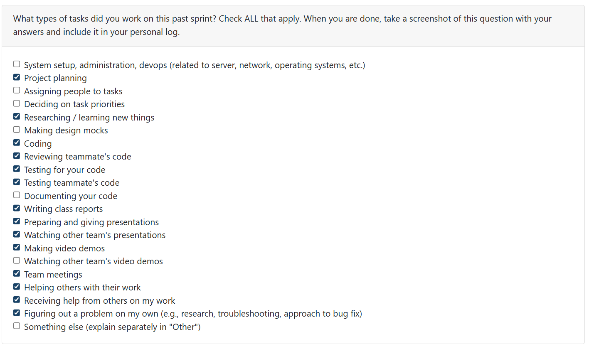

# Mandira Samarasekara

## Date Ranges
December 1st - December 6th

## Weekly recap goals

- Led and organized multiple team meetings
- Presented our first project milestone in class
- Reviewed and merged teammates’ PRs
- Refactored the project and skill timelines for chronology
- Added and validated unit tests for my changes
- Documented detailed personal logs
- Co-created the milestone 1 demo video with Aakash
- Revisited and reaffirmed the team contract
- Completed the milestone 1 self-reflection

## What went well

This was a heavy week, but I finished every commitment. I refactored the Project Chronology to use a three-tier date priority system and closed issue #212. Aakash and I completed the project milestone demo, and the team stayed ahead of tight deadlines.

## What didn't go well

The chronology output could still be formatted for better readability. In my PR, I initially missed adding the new `last_commit_date` and `last_modified_date` columns, but after Mithish flagged it, I patched it quickly. A previous merge also reintroduced a duplicate `resume_items` table definition; I corrected that regression as well.

## PR's reviewed

- Deep Semantic Analysis Documentation #208 (https://github.com/COSC-499-W2025/capstone-project-team-6/pull/208)
- Delete previously generated insights #183 (https://github.com/COSC-499-W2025/capstone-project-team-6/pull/183)
- Unit testing for top ranked projects #189 (https://github.com/COSC-499-W2025/capstone-project-team-6/pull/189)

## PR's initiated

Project chronology 2.0 #213 (https://github.com/COSC-499-W2025/capstone-project-team-6/pull/213)

**Description of my PR (#213):**

- Introduces a three-tier date priority to produce the most accurate work history: commit date (highest), file modified date (fallback), and analysis timestamp (last resort).
- Adds database and migration support for `last_commit_date` and `last_modified_date` with safe initialization in `init_db()`.
- Updates the CLI headers and appends date source indicators `(commit)`, `(modified)`, or `(analysis)` for clarity.
- Cleans up the schema by removing duplicate `resume_items` table definitions.

## Plan for next week

We wrapped milestone 1 and have a short break ahead. I will scan the codebase for vulnerabilities, refactor rough spots, and fix small issues that slipped into recent PRs, even if their impact is not yet visible.

# Aakash Tirithdas

---

# Mithish Ravisankar Geetha

## Date Ranges
December 1-December 7

## Weekly recap goals
- Refactor and fix errors on the Delete previously generated insights PR
- Work on retrieving previously generated resume items
- Work on the milestone 1 presentation and present it
- Watch other teams presenting and review them 
- Complete the Team contract
- Finalize all milestone 1 requirements
- Attend the team meetings
- Complete the milestone 1 self reflection

## What went well
This week was productive across both development tasks and milestone deliverables. I was able to successfully refactor the Delete Previously Generated Insights feature after addressing the errors identified during Mandira’s review. The refactor improved the clarity, safety, and overall consistency of the workflow. I also resolved merge conflicts from earlier PRs, which allowed the codebase to stabilize and ensured all components integrated cleanly.

I then implemented the retrieval of previously generated résumé items, and after a small bug surfaced during review, I quickly patched it. The feature now works end-to-end with the caching and storage logic introduced earlier.

Outside of development, our Milestone 1 presentation went smoothly, and we were able to clearly communicate each subsystem and our collective progress. All Milestone 1 requirements were completed on time, the team contract was finalized, and I attended all team meetings and review sessions. Overall, the week felt cohesive and productive, with steady progress across technical and deliverable-related responsibilities.

## What didn't go well
A few areas took longer than expected. The errors in the Delete Insights PR required more refactoring work than anticipated, especially since some issues only surfaced during deep review. Additionally, the merge conflicts from older PRs slowed down development, as resolving them required carefully aligning new logic with changes made by other teammates.

The retrieval feature also needed an unexpected bug fix during review, which added extra iteration time. While everything was ultimately completed, the amount of context switching such as between refactoring, conflict resolution, feature development, and presentation preparation made the workflow more fragmented than ideal.

## PR's initiated
(Created last week, merged this week:)
- Delete previously generated insights #183: https://github.com/COSC-499-W2025/capstone-project-team-6/pull/183
- Unit tests for deletion workflow #184: https://github.com/COSC-499-W2025/capstone-project-team-6/pull/184
- Summarize the top ranked projects + display only code files #188: https://github.com/COSC-499-W2025/capstone-project-team-6/pull/188
- Unit testing for top ranked projects #189: https://github.com/COSC-499-W2025/capstone-project-team-6/pull/189

(Created this week:)
-  Retrieve previously generated résumé items #201: https://github.com/COSC-499-W2025/capstone-project-team-6/pull/201
- Merge branch Development to Main for Milestone 1 #200: https://github.com/COSC-499-W2025/capstone-project-team-6/pull/200

## PR's reviewed
-  Extended Portfolio Item Generator with Full C++ & C OOP-Style Integration #211 : https://github.com/COSC-499-W2025/capstone-project-team-6/pull/211
-  Update analyze.py #204 : https://github.com/COSC-499-W2025/capstone-project-team-6/pull/204
-   Project chronology 2.0 #213  : https://github.com/COSC-499-W2025/capstone-project-team-6/pull/213

## Issue board

## Plan for next week
All milestone 1 requirements are met, and the term is complete. 
Milestone 2 requirements will be discussed on the first week of classes in January. 

---

# Ansh Rastogi

---

# Harjot Sahota

---

# Mohamed Sakr
