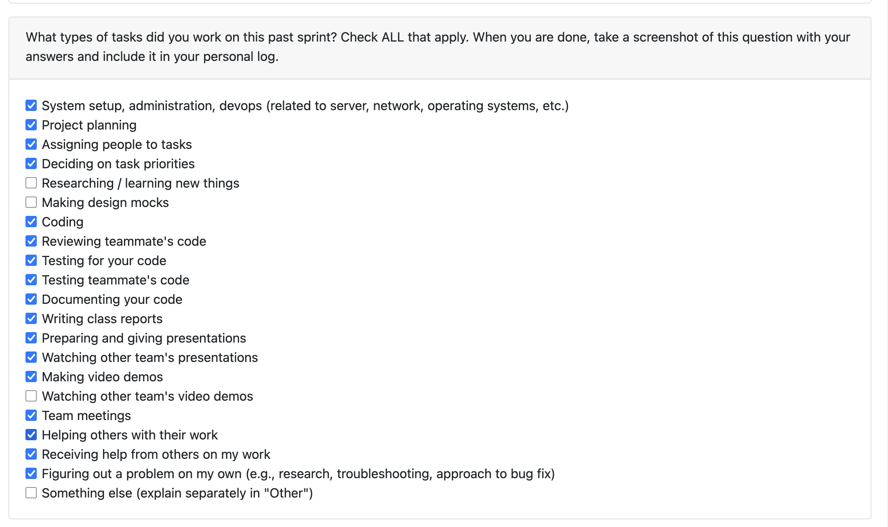
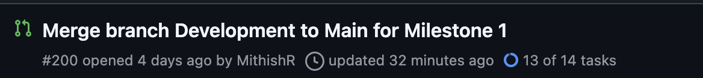
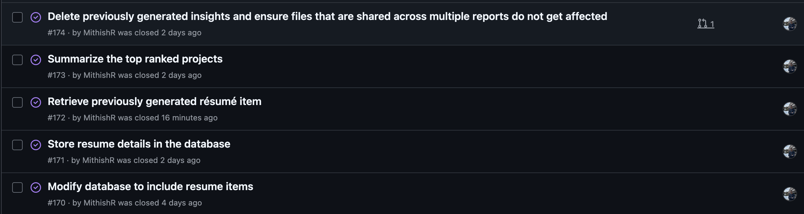
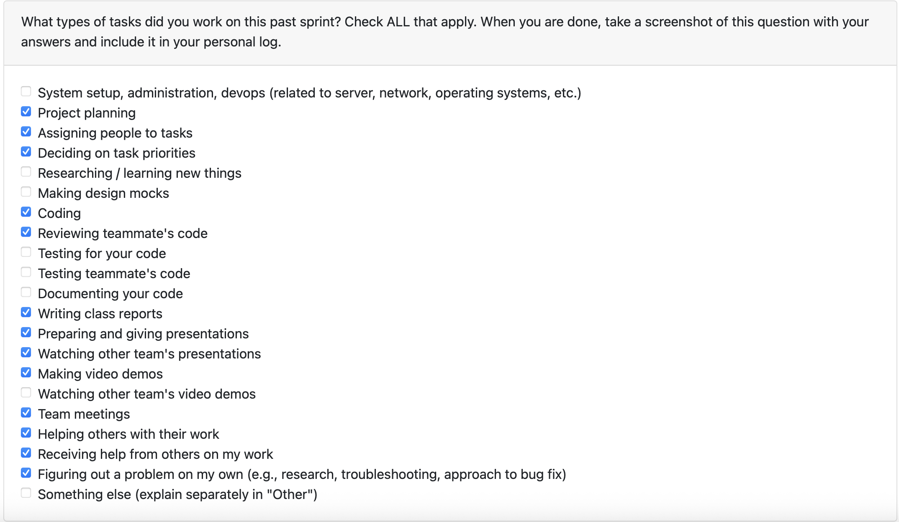

# Mandira Samarasekara

---

# Aakash Tirithdas

---

# Mithish Ravisankar Geetha

## Date Ranges

December 1-December 7

## Weekly recap goals

- Refactor and fix errors on the Delete previously generated insights PR
- Work on retrieving previously generated resume items
- Work on the milestone 1 presentation and present it
- Watch other teams presenting and review them
- Complete the Team contract
- Finalize all milestone 1 requirements
- Attend the team meetings
- Complete the milestone 1 self reflection

## What went well

This week was productive across both development tasks and milestone deliverables. I was able to successfully refactor the Delete Previously Generated Insights feature after addressing the errors identified during Mandira’s review. The refactor improved the clarity, safety, and overall consistency of the workflow. I also resolved merge conflicts from earlier PRs, which allowed the codebase to stabilize and ensured all components integrated cleanly.

I then implemented the retrieval of previously generated résumé items, and after a small bug surfaced during review, I quickly patched it. The feature now works end-to-end with the caching and storage logic introduced earlier.

Outside of development, our Milestone 1 presentation went smoothly, and we were able to clearly communicate each subsystem and our collective progress. All Milestone 1 requirements were completed on time, the team contract was finalized, and I attended all team meetings and review sessions. Overall, the week felt cohesive and productive, with steady progress across technical and deliverable-related responsibilities.

## What didn't go well

A few areas took longer than expected. The errors in the Delete Insights PR required more refactoring work than anticipated, especially since some issues only surfaced during deep review. Additionally, the merge conflicts from older PRs slowed down development, as resolving them required carefully aligning new logic with changes made by other teammates.

The retrieval feature also needed an unexpected bug fix during review, which added extra iteration time. While everything was ultimately completed, the amount of context switching such as between refactoring, conflict resolution, feature development, and presentation preparation made the workflow more fragmented than ideal.

## PR's initiated

(Created last week, merged this week:)

- Delete previously generated insights #183: https://github.com/COSC-499-W2025/capstone-project-team-6/pull/183
- Unit tests for deletion workflow #184: https://github.com/COSC-499-W2025/capstone-project-team-6/pull/184
- Summarize the top ranked projects + display only code files #188: https://github.com/COSC-499-W2025/capstone-project-team-6/pull/188
- Unit testing for top ranked projects #189: https://github.com/COSC-499-W2025/capstone-project-team-6/pull/189

(Created this week:)

- Retrieve previously generated résumé items #201: https://github.com/COSC-499-W2025/capstone-project-team-6/pull/201
- Merge branch Development to Main for Milestone 1 #200: https://github.com/COSC-499-W2025/capstone-project-team-6/pull/200
  
  

## PR's reviewed

- Extended Portfolio Item Generator with Full C++ & C OOP-Style Integration #211 : https://github.com/COSC-499-W2025/capstone-project-team-6/pull/211
- Update analyze.py #204 : https://github.com/COSC-499-W2025/capstone-project-team-6/pull/204
- Project chronology 2.0 #213 : https://github.com/COSC-499-W2025/capstone-project-team-6/pull/213

## Issue board

## Plan for next week

All milestone 1 requirements are met, and the term is complete.
Milestone 2 requirements will be discussed on the first week of classes in January.

---

# Ansh Rastogi

## Date Ranges

December 1-December 7

## Weekly recap goals

- Integrate git analysis into CLI workflow
- Complete Milestone 1 presentation and deliverables
- Review teammates' PRs and provide constructive feedback
- Fix bugs and improve existing analysis pipeline components
- Complete Milestone 1 self-reflection
- Attend team meetings and presentation sessions

## What went well

This week was highly productive in finalizing Milestone 1 deliverables and enhancing the analysis pipeline. I successfully integrated comprehensive git analysis capabilities into the CLI, enabling detailed repository metrics including commit history, contributor statistics, and collaboration patterns. The integration supports both directory-based and ZIP file repositories, with graceful handling when .git folders are absent.

The implementation underwent thorough manual testing and successfully resolved merge conflicts and unit test failures during the review cycle. I ensured existing language analyzers (Python, Java, C++, C) continued functioning without issues. Additionally, I fixed critical bugs including ZIP path handling and Java field naming issues in the analysis pipeline, while removing duplicate analysis logic from analyze.py for cleaner code organization.

Our Milestone 1 presentation went smoothly, and the team successfully communicated each subsystem and our collective progress. All milestone requirements were completed on time, and I actively participated in reviewing other teams' presentations and providing constructive feedback.

## What didn't go well

The git analysis integration took longer than expected due to several merge conflicts that required careful resolution to align new logic with changes made by teammates. Handling both directory-based and ZIP file repository formats added complexity to the implementation, requiring additional testing iterations to ensure both workflows functioned correctly.

Some bugs surfaced late during testing, particularly around ZIP path handling, which required quick patches during the review cycle. Coordinating the integration while other teammates were working on related features like portfolio generation and chronology required careful synchronization to avoid breaking existing functionality.

## PR's initiated

- Git analysis CLI integration #203: https://github.com/COSC-499-W2025/capstone-project-team-6/pull/203

## PR's reviewed

- Extended Portfolio Item Generator with Full C++ & C OOP-Style Integration #211: https://github.com/COSC-499-W2025/capstone-project-team-6/pull/211
- Deep Semantic Analysis Documentation #208: https://github.com/COSC-499-W2025/capstone-project-team-6/pull/208
- Update analyze.py #204: https://github.com/COSC-499-W2025/capstone-project-team-6/pull/204
- Retrieve previously generated résumé items #201: https://github.com/COSC-499-W2025/capstone-project-team-6/pull/201
- Project chronology #193: https://github.com/COSC-499-W2025/capstone-project-team-6/pull/193
- Mithish Week 14 logs #214: https://github.com/COSC-499-W2025/capstone-project-team-6/pull/214

## Plan for next week

All Milestone 1 requirements are met, and the term is complete. Milestone 2 requirements will be discussed during the first week of classes in January.

---

# Harjot Sahota

---

# Mohamed Sakr
