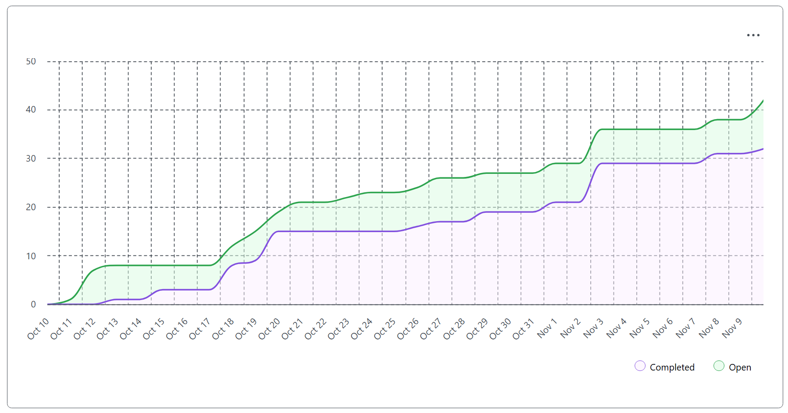

# Team Log – Team 6

**Work Performed:** Nov 3rd–Nov 9th  

---

## Milestone Goals Recap

### Features in Project Plan for This Milestone
- Complete non-LLM project analysis with deterministic metadata extraction and examples/tests.  
- Add Python OOP code analysis and a unified analysis runner.  
- Advance LLM stack enablement (Ollama/Llama Stack in Docker) and align services.  
- Refactor to local pgvector pipeline with offline embeddings; harden Docker Compose.  
- Land persistence layer for analysis outputs and uploaded documents (SQLite).  
- Team PR reviews, CI stability, and documentation updates.

### Associated Tasks from Project Board
- Phase-2 non-LLM analyzer  (metadata extraction) + 29 tests + docs/examples.  
- OOP analyzer for Python + unit tests + unified run script.  
- Llama Stack initialization in Docker; align with vector DB and CLI services.  
- Swap Supabase → local pgvector, integrate Ollama nomic-embed-text; fixtures + tests.  
- New SQLite databases: `analysis.db` & `documents.db` with helpers/fixtures.

---

## Team Members 

- **maddysam356** → Mandira Samarasekara  
- **MithishR** → Mithish Ravisankar  
- **HarjotSahota** → Harjot Sahota  
- **aakash-tir** → Aakash Tirathdas  
- **anshr18** → Ansh Rastogi  
- **mgjim101** → Mohamed Sakr  

---

## Completed Tasks

### Non-LLM Metadata Analysis (Phase-2) + Tests & Docs — Mandira
- Shipped comprehensive metadata extractor (tech stack/framework/deps/health metrics) building on FileClassifier.  
- Wrote **29 automated tests**, `METADATA_EXTRACTOR_README.md`, and `example_usage.py`.  
- Reviewed teammates’ PRs and supported integration.  
- **PR/Issue:** [Analysis without LLM](https://github.com/COSC-499-W2025/capstone-project-team-6/pull/105)

---

### Python OOP Analyzer + Unified Runner — Mithish
- Implemented OOP analysis (design & application of principles) and unit tests.  
- Created a unified script to run Mandira’s + OOP analyzers together.  
- Reviewed PRs and coordinated task assignments.  
- **PR/Issue:** ([Python OOP Analyzer](https://github.com/COSC-499-W2025/capstone-project-team-6/pull/108))

---

### Local Embeddings & Vector DB Refactor — Harjot
- Migrated from Supabase to **local pgvector** via Docker Compose; verified end-to-end embeddings → storage → retrieval.  
- Integrated **Ollama nomic-embed-text (768-dim)**; added fixtures & automated tests.  
- Resolved CI dependency incompatibilities; reviewed teammate PRs and unblocked merges.  
- **PR/Issues:**  
  - [local-embedding-model](https://github.com/COSC-499-W2025/capstone-project-team-6/issues/112)  
  - [refactor-vector-db-local](https://github.com/COSC-499-W2025/capstone-project-team-6/issues/106)

---

### Persistence Layer (SQLite) for Analyses & Documents — Mohamed
- Implemented `analysis.db` (analyses, projects, languages, frameworks, deps, contributors, largest-file) with helpers/fixtures.  
- Added `documents.db` for uploaded artefacts + per-category counts and alias handling; focused pytest coverage.  
- **PRs:** [Output DB](https://github.com/COSC-499-W2025/capstone-project-team-6/pull/115) , [Documents Database with Project Files Categorization 
](https://github.com/COSC-499-W2025/capstone-project-team-6/pull/120)

---

### LLM Stack Enablement (In Progress) — Aakash
- Worked on **Llama Stack initialization (Docker)** and service alignment with vector DB/CLI.  
- Achieved a Dockerized stack with a fallback model; not yet the target configuration.  
- Reviewed *Analysis-without-LLM*, local embedding model, and vector DB refactor.  

---

## What Went Well 

- Deterministic analyzer landed with strong test coverage (**29 tests**), clear docs, and example usage — robust baseline without LLMs.  
- Data foundations solid: dual SQLite stores (`analysis.db`, `documents.db`) plus local pgvector with Ollama embeddings enable a reliable offline pipeline.  
- Cohesion improved: unified runner executes both analyzers; CI stability increased after dependency fixes.  
- Collaboration: timely reviews unblocked merges; shared fixtures/helpers made tests repeatable across modules.

---

## What Didn’t Go as Planned 

- **LLM stack in Docker** not production-ready: model defaults, container sprawl, and service wiring slowed integration with vector DB.  
- **Git contribution history** in the deterministic analyzer requires an active Git connection; placeholders remain.  
- **CI friction** (driver & Python versioning) cost time, delaying app-flow wiring to the new databases.

---

## How These Reflections Shape Next Cycle’s Plan

- **Finish LLM stack reliably (priority):**  
  Rework Llama Stack Docker (clean Compose), lock desired default model, verify compatibility with local pgvector.  
  Add smoke tests that run a minimal RAG call path in CI.  

- **Wire the pipeline end-to-end:**  
  Invoke `record_analysis` / `save_document` from analyzers; surface results in CLI/UI.  

- **Enhance Deterministic Analyzer:**  
  Implement real Git contribution extraction (with repo connection) and expand health metrics.  

- **Performance & Testing:**  
  Profile for large repos; add benchmarks. Add integration tests covering documents → embeddings → analysis → persistence.  

- **CI & Developer Experience:**  
  Pin versions/images; include DB + Ollama containers in CI matrix.  
  Introduce `make dev` one-command setup with sample projects and troubleshooting guide.

---

## Test Report

| Component | Summary |
|------------|----------|
| **Deterministic Analyzer** | 29 unit tests passed across extractors/parsers/heuristics. |
| **OOP Analyzer** | Unit tests implemented; CI integration via unified runner next. |
| **Vector Services (local)** | Fixtures & tests validated embedding generation, storage, and retrieval via pgvector. |
| **Persistence** | Pytest modules verified isolated SQLite DBs; helpers validated for schema & CRUD. |
| **LLM Stack** | Manual Docker runs work with non-target default model; RAG tests pending post-refactor. |

## Project Burnup Chart

