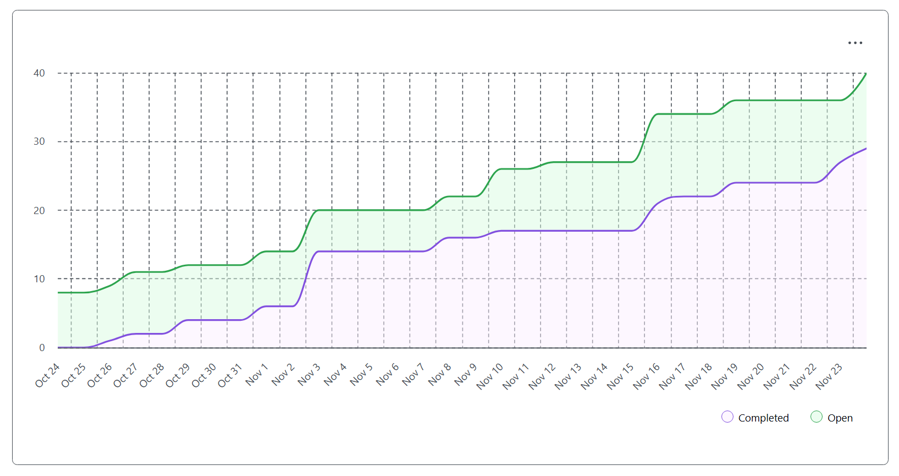

# Team Log – Team 6

**Work Performed:** Nov 9th - Nov 23rd  

---

## Milestone Goals Recap

### Features in Project Plan for This Milestone

- Extend **non-LLM analysis pipeline** across multiple languages:
  - Python time-complexity and optimization-awareness analysis.
  - Java OOP and design-quality analysis.
  - C and C++ OOP / structural analysis.
- Strengthen **end-to-end workflow**:
  - Integrate analysis pipeline with the CLI interface.
  - Add comprehensive integration and unit tests for analysis and CLI.
- Expand **user-facing analysis features**:
  - Generate résumé/portfolio items from analysis output.
  - Add document (essay) analysis capabilities.
- Build **LLM-based deep semantic analysis**:
  - Integrate with Google Gemini File Search for large-scale code understanding.
  - Persist LLM summaries in the project database.

### Associated Tasks from Project Board

- Python complexity analyzer and optimization awareness  
  - Issue: [#151](https://github.com/COSC-499-W2025/capstone-project-team-6/issues/151)  
  - PR: [#152 – Python complexity analysis](https://github.com/COSC-499-W2025/capstone-project-team-6/pull/152)

- Java non-LLM analysis pipeline and résumé item generation  
  - PRs:
    - [#128 – Complete Java OOP Analysis](https://github.com/COSC-499-W2025/capstone-project-team-6/pull/128)  
    - [#130 – Integrated Java analysis to the main analysis pipeline](https://github.com/COSC-499-W2025/capstone-project-team-6/pull/130)  
    - [#140 – Add fixes to Java analysis pipeline](https://github.com/COSC-499-W2025/capstone-project-team-6/pull/140)  
    - [#144 – Modify Java analysis to account for project size](https://github.com/COSC-499-W2025/capstone-project-team-6/pull/144)  
    - [#145 – Store project information in the database](https://github.com/COSC-499-W2025/capstone-project-team-6/pull/145)  
    - [#146 – Non-LLM Analysis: Generate résumé items](https://github.com/COSC-499-W2025/capstone-project-team-6/pull/146)  
    - [#147 – Unit testing for generation of résumé items](https://github.com/COSC-499-W2025/capstone-project-team-6/pull/147)

- C OOP manual analysis  
  - PR: [#154 – C-OOP](https://github.com/COSC-499-W2025/capstone-project-team-6/pull/154)

- C++ OOP analyzer for Phase 3  
  - Issue: [#156 – C++ OOP Analyzer](https://github.com/COSC-499-W2025/capstone-project-team-6/issues/156)  
  - PR: [#157 – C++ OOP Analyzer](https://github.com/COSC-499-W2025/capstone-project-team-6/pull/157)

- CLI workflow and document analysis  
  - PRs:
    - [#132 – CLI Workflow Integration Tests](https://github.com/COSC-499-W2025/capstone-project-team-6/pull/132)  
    - [#134 – Integrating Analysis Pipeline with CLI](https://github.com/COSC-499-W2025/capstone-project-team-6/pull/134)  
    - [#150 – Document Analysis Feature](https://github.com/COSC-499-W2025/capstone-project-team-6/pull/150)

- LLM-based deep semantic analysis (Gemini)  
  - Issue: #122 (completed)  
  - PR: [#143 – Deep Semantic Analysis](https://github.com/COSC-499-W2025/capstone-project-team-6/pull/143)

---

## Team Members

- **maddysam356** → Mandira Samarasekara  
- **MithishR** → Mithish Ravisankar  
- **HarjotSahota** → Harjot Sahota  
- **aakash-tir** → Aakash Tirathdas  
- **anshr18** → Ansh Rastogi  
- **mgjim101** → Mohamed Sakr  

---

## Completed Tasks

> *Format: name, task, description, then PR / issue link(s).*

### Mandira Samarasekara (**maddysam356**)

- **Task:** Python complexity analyzer implementation  
  **Description:** Implemented a Python time-complexity and optimization-awareness analyzer that scans Python projects for nested loops, suboptimal membership tests, and optimization patterns (memoization, set/dict usage, binary search, list comprehensions). Added an Optimization Awareness Score (0–100), detailed findings, and integrated behavior across files.  
  **Links:**  
  - Issue: [#151](https://github.com/COSC-499-W2025/capstone-project-team-6/issues/151)  
  - PR: [#152 – Python complexity analysis](https://github.com/COSC-499-W2025/capstone-project-team-6/pull/152)

- **Task:** Test coverage and documentation for Python analyzer  
  **Description:** Wrote 29 passing tests for the complexity analyzer, ensuring backward compatibility with existing tests, and authored detailed feature documentation (usage, configuration, and interpretation of scores).  
  **Links:**  
  - PR: [#152 – Python complexity analysis](https://github.com/COSC-499-W2025/capstone-project-team-6/pull/152)

- **Task:** Code review and validation  
  **Description:** Performed detailed reviews and testing for multiple core PRs, with actionable feedback and validation of integration behavior.  
  **Links:**  
  - [#140 – Add fixes to Java analysis pipeline](https://github.com/COSC-499-W2025/capstone-project-team-6/pull/140)  
  - [#132 – CLI Workflow Integration Tests](https://github.com/COSC-499-W2025/capstone-project-team-6/pull/132)  
  - [#146 – Non LLM analysis: Generate résumé items](https://github.com/COSC-499-W2025/capstone-project-team-6/pull/146)  
  - [#147 – Unit testing for generation of résumé items](https://github.com/COSC-499-W2025/capstone-project-team-6/pull/147)  
  - [#149 – Mithish logs W11+W12](https://github.com/COSC-499-W2025/capstone-project-team-6/pull/149)

---

### Aakash Tirathdas (**aakash-tir**)

- **Task:** Manual C OOP analysis  
  **Description:** Implemented manual C analysis focused on object-oriented patterns and project structure, and added tests to validate behavior across representative C samples.  
  **Links:**  
  - PR: [#154 – C-OOP](https://github.com/COSC-499-W2025/capstone-project-team-6/pull/154)

- **Task:** Investigation of Llama Stack initialization issues  
  **Description:** Attempted to complete Llama Stack initialization for embeddings-based analysis, discovered a bug in the Llama Stack Docker image where embedding parameters were incorrectly treated as LLM models, blocking route usage. Work remained local due to repeated errors and unresolved upstream behavior.  
  **Links:**  
  - (No merged PR; investigation work and bug discovery documented to team.)

- **Task:** Code reviews  
  **Description:** Reviewed key PRs related to semantic analysis, database storage, and Python complexity analysis, giving feedback on correctness, design, and integration.  
  **Links:**  
  - [#143 – Deep Semantic Analysis](https://github.com/COSC-499-W2025/capstone-project-team-6/pull/143)  
  - [#145 – Store project information in the database](https://github.com/COSC-499-W2025/capstone-project-team-6/pull/145)  
  - [#152 – Python complexity analysis](https://github.com/COSC-499-W2025/capstone-project-team-6/pull/152)

---

### Mithish Ravisankar (**MithishR**)

- **Task:** Java OOP and analysis pipeline enhancements  
  **Description:** Completed the Java OOP analysis module, including checks for design quality and OO principles, and integrated it into the main analysis pipeline. Implemented fixes and adaptations to make the analysis account for project size and real-world variability.  
  **Links:**  
  - [#128 – Complete Java OOP Analysis](https://github.com/COSC-499-W2025/capstone-project-team-6/pull/128)  
  - [#130 – Integrated Java analysis to the main analysis pipeline](https://github.com/COSC-499-W2025/capstone-project-team-6/pull/130)  
  - [#140 – Add fixes to Java analysis pipeline](https://github.com/COSC-499-W2025/capstone-project-team-6/pull/140)  
  - [#144 – Modify Java analysis to account for project size](https://github.com/COSC-499-W2025/capstone-project-team-6/pull/144)

- **Task:** Database storage and résumé item generation  
  **Description:** Extended the database layer to store project information and implemented non-LLM résumé item generation from analysis results, plus unit tests validating item creation and structure.  
  **Links:**  
  - [#145 – Store project information in the database](https://github.com/COSC-499-W2025/capstone-project-team-6/pull/145)  
  - [#146 – Non LLM Analysis generate résumé items](https://github.com/COSC-499-W2025/capstone-project-team-6/pull/146)  
  - [#147 – Unit testing for generation of résumé items](https://github.com/COSC-499-W2025/capstone-project-team-6/pull/147)

- **Task:** Code reviews  
  **Description:** Reviewed integration and analysis PRs, focusing on correctness and alignment with the non-LLM analysis pipeline design.  
  **Links:**  
  - [#146 – Non LLM Analysis generate résumé items](https://github.com/COSC-499-W2025/capstone-project-team-6/pull/146)  
  - [#152 – Python complexity analysis](https://github.com/COSC-499-W2025/capstone-project-team-6/pull/152)

---

### Ansh Rastogi (**anshr18**)

- **Task:** Integrate analysis pipeline with CLI  
  **Description:** Connected the non-LLM analysis pipeline to CLI commands, enabling end-to-end runs from the terminal and interactive shell, including authentication and session management.  
  **Links:**  
  - [#134 – Integrating Analysis Pipeline with CLI](https://github.com/COSC-499-W2025/capstone-project-team-6/pull/134)

- **Task:** CLI workflow integration tests  
  **Description:** Built a comprehensive integration test suite covering authentication, session handling, and core workflow paths. Resolved Windows-specific path issues and ensured cross-platform compatibility.  
  **Links:**  
  - [#132 – CLI Workflow Integration Tests](https://github.com/COSC-499-W2025/capstone-project-team-6/pull/132)

- **Task:** Document analysis feature and essay pipeline  
  **Description:** Implemented a document analyzer module for essays and writing, added `.docx` support to the text extractor, and created an `analyze-essay` command available in both standard CLI and interactive modes. Also contributed demo project files and documentation for complexity analysis and removed emojis for terminal compatibility.  
  **Links:**  
  - [#150 – Document Analysis Feature](https://github.com/COSC-499-W2025/capstone-project-team-6/pull/150)

- **Task:** Code reviews  
  **Description:** Reviewed multiple PRs across the analysis pipeline and language analyzers, focusing on integration, performance, and test coverage.  
  **Links:**  
  - [#146](https://github.com/COSC-499-W2025/capstone-project-team-6/pull/146), [#140](https://github.com/COSC-499-W2025/capstone-project-team-6/pull/140), [#157](https://github.com/COSC-499-W2025/capstone-project-team-6/pull/157), [#154](https://github.com/COSC-499-W2025/capstone-project-team-6/pull/154), [#130](https://github.com/COSC-499-W2025/capstone-project-team-6/pull/130), [#107](https://github.com/COSC-499-W2025/capstone-project-team-6/pull/107)

---

### Harjot Sahota (**HarjotSahota**)

- **Task:** C++ OOP Analyzer for Phase 3  
  **Description:** Implemented a full C++ OOP analyzer using libclang’s AST, detecting OOP structures and patterns. Added `samplecpp.cpp` for realistic tests, handled libclang dependency edge cases, and ensured a fallback mode when libclang is missing.  
  **Links:**  
  - Issue: [#156 – C++ OOP Analyzer](https://github.com/COSC-499-W2025/capstone-project-team-6/issues/156)  
  - PR: [#157 – C++ OOP Analyzer](https://github.com/COSC-499-W2025/capstone-project-team-6/pull/157)

- **Task:** Test suite and documentation for C++ analysis  
  **Description:** Created a comprehensive PyTest-based test suite, updated documentation (MetadataExtractor README, Phase 3: C++ OOP Detection), added installation/usage instructions, example output, and known limitations. Updated `requirements.txt` for libclang.  
  **Links:**  
  - PR: [#157 – C++ OOP Analyzer](https://github.com/COSC-499-W2025/capstone-project-team-6/pull/157)

- **Task:** Reviews of related work  
  **Description:** Reviewed issues/PRs related to the analysis stack and detection patterns, providing feedback and helping refine requirements.  
  **Links:**  
  - [#141](https://github.com/COSC-499-W2025/capstone-project-team-6/issues/141)  
  - [#139](https://github.com/COSC-499-W2025/capstone-project-team-6/issues/139)  
  - [#148](https://github.com/COSC-499-W2025/capstone-project-team-6/issues/148)

---

### Mohamed Sakr (**mgjim101**)

- **Task:** LLM-based deep semantic analysis infrastructure (Gemini)  
  **Description:** Implemented the core infrastructure for LLM-based code analysis using Google Gemini’s File Search API, including a `GeminiFileSearchClient` that manages authentication, corpus management, and robust file ingestion with retries/backoff.  
  **Links:**  
  - PR: [#143 – Deep Semantic Analysis](https://github.com/COSC-499-W2025/capstone-project-team-6/pull/143)  
  - Issue: #122 (completed)

- **Task:** LLM analysis pipeline and caching  
  **Description:** Created `llm_pipeline.py` to orchestrate file classification, filtering, ingestion, and summarization, with a session caching mechanism to avoid re-ingesting files within a session. Extended `analysis_database.py` to persist generated LLM summaries.  
  **Links:**  
  - PR: [#143 – Deep Semantic Analysis](https://github.com/COSC-499-W2025/capstone-project-team-6/pull/143)

- **Task:** Code reviews  
  **Description:** Reviewed key features including document analysis, résumé item unit tests, Java project-size analysis changes, and C OOP analysis.  
  **Links:**  
  - [#150](https://github.com/COSC-499-W2025/capstone-project-team-6/pull/150)  
  - [#147](https://github.com/COSC-499-W2025/capstone-project-team-6/pull/147)  
  - [#144](https://github.com/COSC-499-W2025/capstone-project-team-6/pull/144)  
  - [#154](https://github.com/COSC-499-W2025/capstone-project-team-6/pull/154)

---

## What Went Well

- The **non-LLM analysis pipeline** was significantly expanded:
  - Python complexity analyzer now detects both inefficient patterns and optimization-aware code, with a numeric Optimization Awareness Score.
  - Java analysis was completed, integrated, and adapted to different project sizes, with résumé/portfolio item generation wired into the database layer.
  - C and C++ OOP analysis were implemented with full test suites and documentation.
- The **CLI integration** work by Ansh successfully connected the analysis pipeline to a user-facing interface, with passing integration tests and platform-agnostic behavior.
- **Document analysis** for essays and `.docx` files now exists as a first-class module, making the tool useful beyond pure code analysis.
- The **LLM analysis infrastructure** for Gemini is in place with robust retries, parallel uploads, and database persistence of summaries, positioning the team well for richer semantic insights.
- Test coverage improved across the board (unit tests, integration tests, and language-specific test suites), and cross-team code reviews helped maintain quality and consistency.

---

## What Didn’t Go as Planned

- **Llama Stack initialization** could not be completed due to a bug in the Docker image that mis-handled embedding parameters, blocking that route for this milestone and leaving work local.
- Some **testing work was deferred**, such as more detailed tests for Java analysis behavior under different project sizes and Python SOLID design checks, due to time constraints.
- **Environment and dependency issues**:
  - CLI integration initially hit Windows-specific path handling problems and `.docx` parsing required additional dependencies.
  - C++ libclang integration caused silent AST failures until imports and installation instructions were refined.
- The **Gemini pipeline** currently truncates files >1MB instead of performing smarter chunking, and session caching is in-memory only. The feature also lacks a user-facing CLI/UI entry point for this milestone.
- Minor **merge conflicts and branching issues** arose when working from outdated branches but were resolved without major disruption.

---

## How These Reflections Shape Next Cycle’s Plan

- Prioritize **integration and UX**:
  - Expose the Gemini-based analysis through the CLI/GUI so users can run deep semantic analysis as easily as non-LLM checks.
  - Unify the entry points for code, document, and résumé analysis into a consistent CLI experience.
- Close **testing and reliability gaps**:
  - Add the deferred Java project-size tests and Python SOLID principle checks.
  - Expand integration tests to cover more edge cases (large projects, mixed-language repositories, and multi-format document inputs).
- Improve **infrastructure robustness**:
  - Introduce smarter chunking for large files in the LLM pipeline and explore persistent caching strategies.
  - Document and/or work around external stack issues (e.g., Llama Stack bug) and consider fallbacks.
- Continue **language and pattern expansion**:
  - Extend the Python complexity analyzer to more languages (starting with Java, as planned).
  - Enrich C++ OOP detection with additional patterns (Adapter, Decorator, Bridge) while reducing false positives.
- Prepare for the next milestone deliverables:
  - Use the new résumé and portfolio outputs in demos.
  - Refine the burnup/burndown metrics based on the now more complete test and feature set.

---

## Test Report

- **Python Complexity Analyzer (Mandira):**  
  - 29 automated tests written and all passing. No existing tests were broken, indicating good backward compatibility.
- **Java Analysis & Résumé Items (Mithish):**  
  - Unit tests added for résumé item generation. Additional tests for project-size-dependent analysis behavior are planned for the next cycle.
- **CLI Workflow Integration Tests (Ansh):**  
  - End-to-end tests cover authentication, session management, and typical CLI workflows. Platform-specific issues (especially on Windows) were identified and resolved.
- **C OOP Analysis (Aakash):**  
  - Tests created for manual C OOP analysis, validating detection logic on representative samples.
- **C++ OOP Analyzer (Harjot):**  
  - Comprehensive PyTest suite created around `samplecpp.cpp` and verifier logic, with documented behavior when libclang is missing or misconfigured.
- **LLM Pipeline (Mohamed):**  
  - Functional tests run at the pipeline level to verify corpus creation, ingestion, and summary persistence; further automated tests will be added once hooked into the CLI.

Overall, all merged features for this milestone have passing tests at their respective levels (unit/integration), with clearly identified areas where extra test depth will be added next cycle.

---

## Project Burnup Chart

