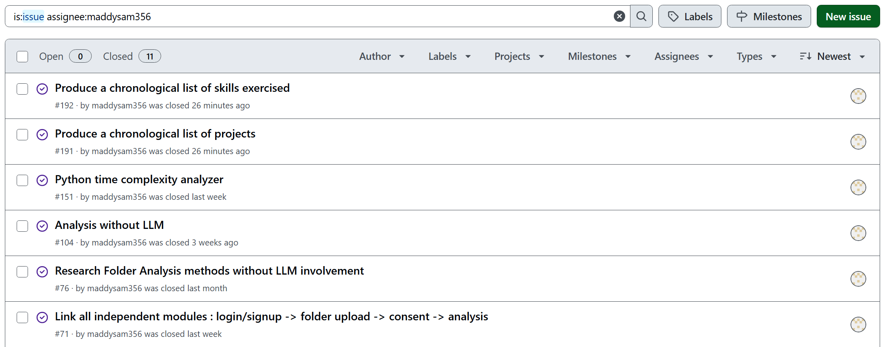
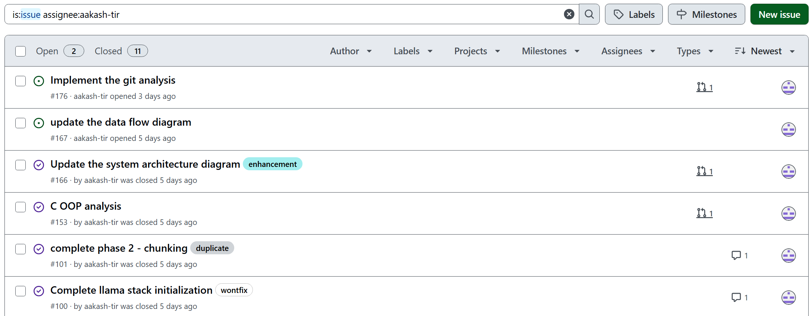
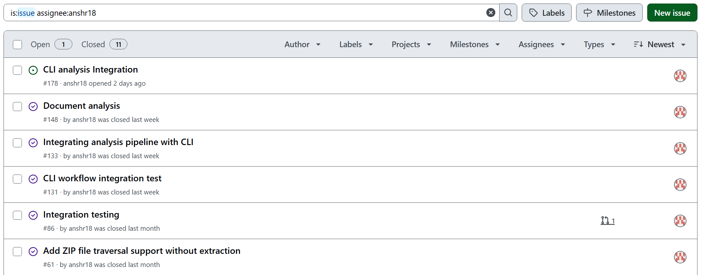
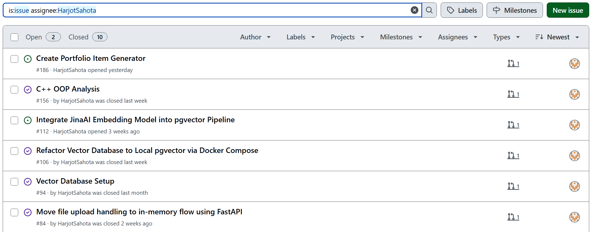
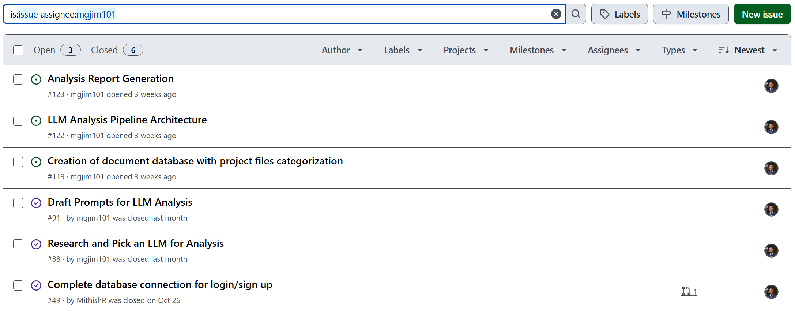
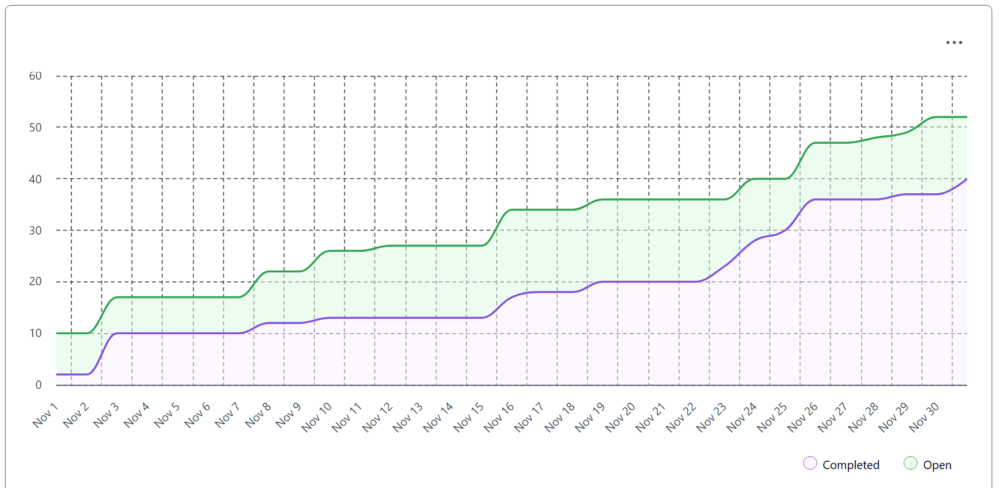

# Team Log – Team 6

**Work Performed:** Nov 24th – Nov 30th

---

## Milestone Goals Recap

### Features in Project Plan for This Milestone

- Extend and finalize the **non-LLM analysis pipeline**:
  - Chronological **project and skills timelines**.
  - Git history–based project analysis.
  - Resume and **portfolio item** generation from analysis output.
  - “Top Ranked Projects” summarization and testing.
- Strengthen the **end-to-end CLI workflow**:
  - Integrate all language analyzers (C, C++, Python, Java) plus resume/portfolio and LLM analysis into the CLI.
  - Add integration tests for the analysis pipeline and CLI.
- Expand **deep semantic analysis capabilities**:
  - Migrate `llm_pipeline` and `gemini_file_search` to the new `google-genai` SDK.
  - Add rich semantic “lenses” (Architecture, Complexity, Security, Skills, Domain).
  - Improve CLI output using the `rich` library and JSON exports.
- Support **reporting & presentation**:
  - Prepare for project demo and milestone presentation.
  - Update project architecture diagrams and documentation.

### Associated Tasks / PRs Touched This Week

- Project chronology and timelines  
  - Issues: [#191](https://github.com/COSC-499-W2025/capstone-project-team-6/issues/191), [#192](https://github.com/COSC-499-W2025/capstone-project-team-6/issues/192)  
  - PR: [#193 – Project chronology](https://github.com/COSC-499-W2025/capstone-project-team-6/pull/193)

- Git and system architecture work  
  - PRs:  
    - [#165](https://github.com/COSC-499-W2025/capstone-project-team-6/pull/165)  
    - [#177 – Git analysis](https://github.com/COSC-499-W2025/capstone-project-team-6/pull/177)

- Non-LLM pipeline (OOP, résumé, caching, deletion, top projects)  
  - PRs:  
    - [#164](https://github.com/COSC-499-W2025/capstone-project-team-6/pull/164) – Python OOP/design-principles  
    - [#168](https://github.com/COSC-499-W2025/capstone-project-team-6/pull/168) – Refactored résumé generator  
    - [#169](https://github.com/COSC-499-W2025/capstone-project-team-6/pull/169) – Unit tests for résumé generator  
    - [#175](https://github.com/COSC-499-W2025/capstone-project-team-6/pull/175) – Resume tables & caching  
    - [#183](https://github.com/COSC-499-W2025/capstone-project-team-6/pull/183) – Delete previously generated insights  
    - [#184](https://github.com/COSC-499-W2025/capstone-project-team-6/pull/184) – Unit tests for deletion workflow  
    - [#188](https://github.com/COSC-499-W2025/capstone-project-team-6/pull/188) – Summarize top ranked projects  
    - [#189](https://github.com/COSC-499-W2025/capstone-project-team-6/pull/189) – Unit testing for top ranked projects  

- CLI workflow and integration tests  
  - PRs:  
    - [#179 – CLI Analysis Integration](https://github.com/COSC-499-W2025/capstone-project-team-6/pull/179)  
    - [#182 – CLI integration analysis test](https://github.com/COSC-499-W2025/capstone-project-team-6/pull/182)

- Portfolio generator  
  - PR: [#187 – Portfolio item generator](https://github.com/COSC-499-W2025/capstone-project-team-6/pull/187)

- Deep Semantic & RAG features  
  - PRs:  
    - [#181 – Deep Semantic Analysis Core Features](https://github.com/COSC-499-W2025/capstone-project-team-6/pull/181)  
    - [#185 – Deep RAG Analytical Features](https://github.com/COSC-499-W2025/capstone-project-team-6/pull/185)

---

## Team Members

- **maddysam356** → Mandira Samarasekara  
- **aakash-tir** → Aakash Tirathdas  
- **MithishR** → Mithish Ravisankar Geetha  
- **anshr18** → Ansh Rastogi  
- **HarjotSahota** → Harjot Sahota  
- **mgjim101** → Mohamed Sakr  

---

## Completed Tasks

### Mandira Samarasekara (**maddysam356**)

- **Task:** Implement chronological project & skills timelines  
  **Description:** Implemented a chronology feature that generates:  
  - A **projects timeline**: ordered list of analyzed projects by `analysis_timestamp` with associated metadata.  
  - A **skills timeline**: aggregated unique languages and frameworks per analysis date.  
  Integrated this into the CLI via a new `timeline` subcommand supporting `projects` and `skills` modes, and adjusted imports to lazily load `text_extractor` so the timeline command does not break when OCR dependencies are missing.  
  **Links:**  
  - Issue: [#191](https://github.com/COSC-499-W2025/capstone-project-team-6/issues/191)  
  - Issue: [#192](https://github.com/COSC-499-W2025/capstone-project-team-6/issues/192)  
  - PR: [#193 – Project chronology](https://github.com/COSC-499-W2025/capstone-project-team-6/pull/193)

- **Task:** Tests and coordination for chronology feature  
  **Description:** Wrote unit tests to validate the chronology logic and CLI integration. Organized and ran multiple team meetings to coordinate dependencies (e.g., which PRs needed to be merged before starting other work) and prepared for the project presentation and report.

- **Task:** Code reviews  
  **Description:** Performed detailed reviews on multiple core features, including résumé generator, Git analysis, CLI tests, deletion workflow, portfolio generator, and top ranked projects logic.  
  **Links:**  
  - [#168](https://github.com/COSC-499-W2025/capstone-project-team-6/pull/168)  
  - [#177](https://github.com/COSC-499-W2025/capstone-project-team-6/pull/177)  
  - [#182](https://github.com/COSC-499-W2025/capstone-project-team-6/pull/182)  
  - [#183](https://github.com/COSC-499-W2025/capstone-project-team-6/pull/183)  
  - [#187](https://github.com/COSC-499-W2025/capstone-project-team-6/pull/187)  
  - [#189](https://github.com/COSC-499-W2025/capstone-project-team-6/pull/189)  
  - [#196](https://github.com/COSC-499-W2025/capstone-project-team-6/pull/196)  

---

### Aakash Tirathdas (**aakash-tir**)

- **Task:** Git folder analysis (without API)  
  **Description:** Completed `.git` folder analysis for repositories **without** relying on external API connections, laying the groundwork for Git-based project chronology and contribution insights.  
  **Links:**  
  - PR: [#165](https://github.com/COSC-499-W2025/capstone-project-team-6/pull/165)  
  - PR: [#177 – Git analysis](https://github.com/COSC-499-W2025/capstone-project-team-6/pull/177)

- **Task:** System architecture updates  
  **Description:** Redid the system architecture to better reflect the current end-to-end workflow, including new analyzers, CLI integration, and LLM pipeline components.

- **Task:** Code reviews  
  **Description:** Reviewed key PRs related to résumé generator refactor, resume caching, new RAG/LLM features, and top ranked projects testing.  
  **Links:**  
  - [#168](https://github.com/COSC-499-W2025/capstone-project-team-6/pull/168)  
  - [#175](https://github.com/COSC-499-W2025/capstone-project-team-6/pull/175)  
  - [#185](https://github.com/COSC-499-W2025/capstone-project-team-6/pull/185)  
  - [#189](https://github.com/COSC-499-W2025/capstone-project-team-6/pull/189)  

---

### Mithish Ravisankar Geetha (**MithishR**)

- **Task:** Strengthen non-LLM analysis & résumé pipeline  
  **Description:** Extended the Python OOP and design-principles detection logic, refactored the résumé generator for more structured and scalable output, and aligned it with the updated database schema.  
  **Links:**  
  - [#164](https://github.com/COSC-499-W2025/capstone-project-team-6/pull/164)  
  - [#168](https://github.com/COSC-499-W2025/capstone-project-team-6/pull/168)  

- **Task:** Database tables, caching, and deletion workflows  
  **Description:** Implemented new database tables and caching functions for analysis and résumé retrieval. Added workflows to delete previously generated insights, ensuring data consistency and performance.  
  **Links:**  
  - [#175](https://github.com/COSC-499-W2025/capstone-project-team-6/pull/175)  
  - [#183](https://github.com/COSC-499-W2025/capstone-project-team-6/pull/183)  
  - [#184](https://github.com/COSC-499-W2025/capstone-project-team-6/pull/184)

- **Task:** “Top Ranked Projects” feature  
  **Description:** Implemented and tested the **Top Ranked Projects** feature, including code-file filtering, scoring logic, and accompanying unit tests.  
  **Links:**  
  - [#188](https://github.com/COSC-499-W2025/capstone-project-team-6/pull/188)  
  - [#189](https://github.com/COSC-499-W2025/capstone-project-team-6/pull/189)

- **Task:** Code reviews  
  **Description:** Reviewed Git analysis and portfolio generator integrations, along with CLI analysis integration.  
  **Links:**  
  - [#177](https://github.com/COSC-499-W2025/capstone-project-team-6/pull/177)  
  - [#187](https://github.com/COSC-499-W2025/capstone-project-team-6/pull/187)  
  - [#179](https://github.com/COSC-499-W2025/capstone-project-team-6/pull/179)  

---

### Ansh Rastogi (**anshr18**)

- **Task:** Comprehensive CLI analysis integration  
  **Description:** Integrated all major analysis modules into the CLI, including C/C++ OOP analyzers, C analyzer, résumé generator, database storage, and LLM pipeline. Ensured the CLI commands correctly orchestrate the full pipeline with robust import structures and error handling.  
  **Links:**  
  - PR: [#179 – CLI Analysis Integration](https://github.com/COSC-499-W2025/capstone-project-team-6/pull/179)

- **Task:** Integration tests for analysis pipeline  
  **Description:** Built comprehensive integration tests for the analysis pipeline and CLI, validating end-to-end behavior and handling edge cases such as `AttributeError` in `MetadataExtractor` and deprecation warnings.  
  **Links:**  
  - PR: [#182 – CLI integration analysis test](https://github.com/COSC-499-W2025/capstone-project-team-6/pull/182)

- **Task:** Code reviews  
  **Description:** Reviewed multiple PRs for Python OOP analysis, deep semantic analysis features, deletion workflow, RAG analytical features, and top ranked projects.  
  **Links:**  
  - [#164](https://github.com/COSC-499-W2025/capstone-project-team-6/pull/164)  
  - [#181](https://github.com/COSC-499-W2025/capstone-project-team-6/pull/181)  
  - [#183](https://github.com/COSC-499-W2025/capstone-project-team-6/pull/183)  
  - [#185](https://github.com/COSC-499-W2025/capstone-project-team-6/pull/185)  
  - [#188](https://github.com/COSC-499-W2025/capstone-project-team-6/pull/188)  

---

### Harjot Sahota (**HarjotSahota**)

- **Task:** Portfolio item generator & integration  
  **Description:** Implemented and integrated the new `portfolio_item_generator.py` into the backend analysis pipeline, generating portfolio items that summarize architecture, contributions, skills, and overall project overview. Ensured portfolio items are saved to the database alongside résumé items, and integrated cleanly into `analyze.py` without duplicating OOP analysis.  
  **Links:**  
  - PR: [#187 – Portfolio item generator](https://github.com/COSC-499-W2025/capstone-project-team-6/pull/187)

- **Task:** Portfolio generator test suite  
  **Description:** Built a full automated test suite for the portfolio generator, including tests for quality score, architecture extraction, contributions, skills, and complete item generation. All tests are currently passing.

- **Task:** Code reviews & CLI UX improvements  
  **Description:** Reviewed several PRs across the pipeline (Python OOP analysis, logs, résumé tests, deep semantic analysis, CLI tests, deletion workflow, and top ranked projects). Identified UX issues in CLI prompts (e.g., strict `y/n` handling for JSON export) and planned to improve input validation and output formatting (“1 class” vs “1 classes”).  
  **Links:**  
  - [#164](https://github.com/COSC-499-W2025/capstone-project-team-6/pull/164)  
  - [#190](https://github.com/COSC-499-W2025/capstone-project-team-6/pull/190)  
  - [#169](https://github.com/COSC-499-W2025/capstone-project-team-6/pull/169)  
  - [#181](https://github.com/COSC-499-W2025/capstone-project-team-6/pull/181)  
  - [#182](https://github.com/COSC-499-W2025/capstone-project-team-6/pull/182)  
  - [#184](https://github.com/COSC-499-W2025/capstone-project-team-6/pull/184)  
  - [#188](https://github.com/COSC-499-W2025/capstone-project-team-6/pull/188)  

---

### Mohamed Sakr (**mgjim101**)

- **Task:** Refactor LLM pipeline to `google-genai` SDK  
  **Description:** Refactored `llm_pipeline` and `gemini_file_search` to use the latest `google-genai` SDK (v1.5+), resolving critical `TypeError`s during file upload and improving treatment of system files. Ensured compatibility between legacy calls and the new schemas.  
  **Links:**  
  - PR: [#181 – Deep Semantic Analysis Core Features](https://github.com/COSC-499-W2025/capstone-project-team-6/pull/181)

- **Task:** Deep Semantic Analysis lenses & RAG features  
  **Description:** Implemented deep semantic analysis lenses accessible via CLI flags, including:  
  - **Architecture**: design patterns, anti-patterns, data flow tracing.  
  - **Complexity**: efficiency gaps, structure maturity, concurrency analysis.  
  - **Security**: logical flaws, trust boundaries, error handling.  
  - **Skills & Domain**: developer profiling and framework/API fluency.  
  Also ingested offline analysis reports into the RAG model to enrich context for LLM queries.  
  **Links:**  
  - PR: [#185 – Deep RAG Analytical Features](https://github.com/COSC-499-W2025/capstone-project-team-6/pull/185)

- **Task:** Rich CLI output and JSON export  
  **Description:** Integrated the `rich` library to improve terminal output: Markdown rendering, statistics tables, and better error panels. Added JSON export capabilities for deep analysis output.

- **Task:** Code reviews  
  **Description:** Reviewed several PRs in the non-LLM pipeline (resume tables, résumé unit tests, C OOP analysis) and CLI integration.  
  **Links:**  
  - [#184](https://github.com/COSC-499-W2025/capstone-project-team-6/pull/184)  
  - [#179](https://github.com/COSC-499-W2025/capstone-project-team-6/pull/179)  
  - [#175](https://github.com/COSC-499-W2025/capstone-project-team-6/pull/175)  
  - [#169](https://github.com/COSC-499-W2025/capstone-project-team-6/pull/169)  
  - [#154](https://github.com/COSC-499-W2025/capstone-project-team-6/pull/154)  

---

## What Went Well

- The **non-LLM analysis pipeline** was substantially strengthened:  
  - Chronological **project and skills timelines** are now implemented and integrated into the CLI.  
  - Git analysis without API dependence is working and ready to be extended to commit-based chronology.  
  - Résumé generation, deletion workflows, caching, and **Top Ranked Projects** are implemented and covered by tests.  
  - A robust **portfolio item generator** is integrated and tested, producing high-level project summaries.

- The **CLI** now orchestrates a unified pipeline:  
  - Integrated multiple language analyzers (C, C++, Python, Java), résumé/portfolio generators, database storage, and LLM analysis under a single interface.  
  - Integration tests validate end-to-end workflows and help catch regressions early.

- **Deep Semantic Analysis** advanced significantly:  
  - The migration to `google-genai` is complete, unlocking more stable and modern deep analysis features.  
  - Semantic lenses and RAG-based features provide richer, targeted insights (architecture, complexity, security, skills, domain).

- **Testing culture** remained strong:  
  - New unit and integration tests were added for chronology, portfolio generation, deletion workflows, top ranked projects, résumé generator, and CLI integration.  
  - Most major features introduced this week are accompanied by automated tests.

- The team maintained good **coordination and communication**:  
  - Regular meetings (led by Mandira) helped manage dependencies between Git analysis, timelines, CLI integration, and LLM features.  
  - Several members balanced coursework (e.g., Quiz 2) while still delivering substantial progress.

---

## What Didn’t Go as Planned

- **Chronology data source**:  
  - The timelines currently use the **analysis timestamp** instead of the **last commit date** because last-commit information is not yet stored in the database and the Git history extraction function wasn’t merged in time. This will require a refactor once commit metadata is available.

- **Git & C integration**:  
  - Due to time constraints and limited availability over the weekend, Aakash could not complete the data flow diagram update or fully integrate C analysis or Git analysis with API-based data.

- **Resume retrieval & portfolio coverage**:  
  - Retrieval for previously generated résumé items remains incomplete and needs further work and tests.  
  - The portfolio generator currently does not leverage C, C++, Git, or document analyzers because those integrations were not fully merged; coverage will be extended next sprint.

- **LLM + RAG operational challenges**:  
  - Migrating to `google-genai` involved documentation gaps and required multiple iterations to stabilize.  
  - Prompt engineering for fine-grained lenses (especially soft skills and domain competency) took longer than expected.  
  - RAG ingestion for large codebases hit intermittent rate limits, requiring additional backoff logic.

- **CLI UX gaps**:  
  - Some user flows (like the final prompt for JSON export) don’t yet handle invalid input gracefully (`y/n` only), and output formatting still has minor polish issues (“1 classes” vs “1 class”).

---

## How These Reflections Shape Next Cycle’s Plan

- **Chronology Refactor**  
  - Wire Git commit metadata into the database and refactor the chronology feature to sort by last commit date instead of analysis timestamp.

- **Finish Incomplete Integrations**  
  - Complete integration of C analysis and `.git` analysis with the rest of the pipeline (including API-based Git analysis if feasible).  
  - Implement retrieval and display of previously generated résumé items using the new caching and DB layers.  
  - Extend portfolio generation to incorporate C/C++ insights, Git activity depth, and documentation quality.

- **Strengthen CLI UX & Reliability**  
  - Improve user input handling for interactive prompts (e.g., accept and sanitize more than just `y/n`).  
  - Polish output wording and formatting across résumé/portfolio/analysis summaries.  
  - Expand CLI documentation, especially for new commands like `timeline` and deep semantic lenses.

- **Optimize Deep Semantic & RAG**  
  - Refine prompts for “Soft Skills” and “Domain Competency” lenses for more specific, non-generic insights.  
  - Optimize RAG ingestion for large projects (smarter chunking, better handling of rate limits).  
  - Add more robust tests around LLM and RAG behavior once they’re fully accessible via CLI.

- **Milestone Deliverables**  
  - Finalize the project report, demo, and group contract using the new résumé, portfolio, and analysis outputs.  
  - Ensure the CLI and analysis features are ready for live presentation and demonstration.

---

## Test Report

- **Chronology Feature (Mandira):**  
  - Unit tests added to validate project and skills timeline generation and CLI integration; all tests passing.

- **Resume & Non-LLM Pipeline (Mithish):**  
  - Tests around résumé generator, deletion workflow, caching, and **Top Ranked Projects** are passing (PRs [#169](https://github.com/COSC-499-W2025/capstone-project-team-6/pull/169), [#184](https://github.com/COSC-499-W2025/capstone-project-team-6/pull/184), [#189](https://github.com/COSC-499-W2025/capstone-project-team-6/pull/189)). Further tests for resume item retrieval are planned.

- **CLI Integration (Ansh):**  
  - Integration tests (PR [#182](https://github.com/COSC-499-W2025/capstone-project-team-6/pull/182)) cover end-to-end analysis runs and key edge cases such as metadata extraction errors and suppressed third-party warnings.

- **Portfolio Generator (Harjot):**  
  - Comprehensive test suite covers quality scoring, architecture, contributions, skills, and full portfolio item generation — all tests passing for the currently integrated analyzers.

- **Deep Semantic & RAG (Mohamed):**  
  - Functional tests confirm successful migration to `google-genai`, lens-based semantic analysis, and offline report ingestion into RAG. Additional automated tests will follow as the CLI surface stabilizes.

Overall, all major features merged or worked on this week have passing unit and/or integration tests, with identified gaps clearly queued for the next sprint.

---

## Project Burnup Chart

