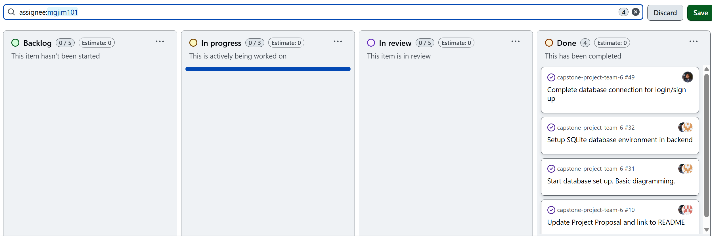

# Team Log  

## Team 6  

**Work Performed:** Oct 21st–26th  

---

## Milestone Goals Recap  

- **Features in project plan for this milestone:**  
  - Complete integration of backend modules (Login/Signup → File Upload → Consent → Analysis).  
  - Implement local consent handling using Llama Stack (local AI).  
  - Enhance file upload system with ZIP file traversal and folder sorting.  
  - Finalize database structure with tables for uploaded files and users.  
  - Extend OCR functionality for automated text extraction.  
  - Conduct comprehensive testing for new modules and verify system interoperability.  
  - Hold team meetings for sprint review and task reassignment for the next milestone.  

- **Associated tasks from project board:**  
  - Create consent form, consent handling module, and test suite.  
  - Implement ZIP file traversal and testing for compressed archive analysis.  
  - Add uploaded_files table and integrate OCR text extraction pipeline.  
  - Develop command line interface for project testing.  
  - Finalize SQLite authentication store and connect login/signup backend.  
  - Conduct research on LLMs for future adaptability.  
  - Peer review, test PRs, and ensure integration readiness.  

---

## Team Members  

- **maddysam356** → Mandira Samarasekara  
- **MithishR** → Mithish Ravisankar  
- **HarjotSahota** → Harjot Sahota  
- **aakash-tir** → Aakash Tirathdas  
- **anshr18** → Ansh Rastogi  
- **mgjim101** → Mohamed Sakr  

---

## Completed Tasks  

- **Developed consent module and LLM comparison documentation** — *Mandira*  
  - Created `consent-form.md` and `consent.py` for local AI consent handling.  
  - Implemented full test suite and validation for user responses.  
  - Conducted LLM research and documented viable model options.  

- **Implemented and tested CLI interface integration** — *Mithish*  
  - Connected login/signup authentication to the backend.  
  - Created CLI and interactive shell for system testing.  
  - Linked analysis features to the CLI and tested functionality.  
  - Assigned and tracked team tasks during sprint.  

- **Added OCR integration and database expansion** — *Harjot*  
  - Added new SQLite table `uploaded_files` for file tracking.  
  - Integrated Tesseract OCR for text extraction from PDFs and images.  
  - Created and ran tests for OCR and database functions.  

- **Implemented ZIP file traversal and abstraction layer** — *Ansh*  
  - Developed traversal functions to analyze ZIP archives without extraction.  
  - Added file system abstraction supporting both directories and archives.  
  - Created 11 comprehensive tests across multiple project structures.  
  - Added detailed documentation and maintained backward compatibility.  

- **Implemented folder sorting and heuristic project identification** — *Aakash*  
  - Created `DirectoryNode` and `ProjectHeuristics` classes.  
  - Enhanced folder traversal logic to calculate heuristic scores.  
  - Documented new traversal system and contributed to PR reviews.  

- **Migrated login flow to SQLite authentication store** — *Mohamed*  
  - Added persistent users table with bcrypt-hashed passwords.  
  - Updated FastAPI authentication endpoints to use the new DB layer.  
  - Expanded tests for database operations and assisted in file upload DB design.  

---

## Test Report  

- Conducted local tests for:  
  - **Consent system:** verified text display, user input handling, and response storage.  
  - **CLI integration:** validated login/signup → analysis flow.  
  - **OCR and file database:** confirmed text extraction and proper SQLite storage.  
  - **ZIP traversal and folder sorting:** tested multi-structure archive handling.  
  - **Auth database:** ensured correct user persistence and password hashing.  

All tests passed successfully across modules.  

---

## Optional Notes  

- Team focused heavily on **backend integration and testing** this week, ensuring each module functions independently and in the full system chain.  
- The **consent system**, **OCR integration**, and **ZIP traversal logic** mark significant progress toward a complete analysis pipeline.  
- Research on **LLMs** and **heuristics-based folder analysis** prepares the project for enhanced AI-driven analysis in future sprints.  
- Team coordination remained strong through PR reviews, testing sessions, and sprint meetings.  
- Next milestone will prioritize **linking consent and upload systems**, and **finalizing end-to-end CLI integration** for analysis.  

## Project Burnup Chart  
  

## Completed / In Progress Tasks per User  

# Mandira Samarasekara  
  

# Mohamed Sakr  
  

# Mithish Ravisankar Geetha  
  

# Aakash  
  

# Ansh Rastog
  

# Harjot Sahota

