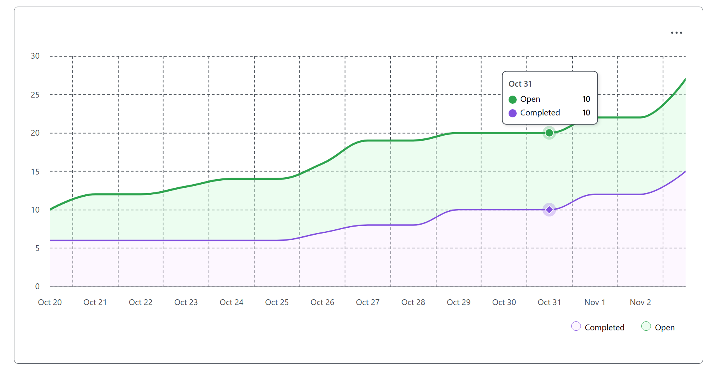
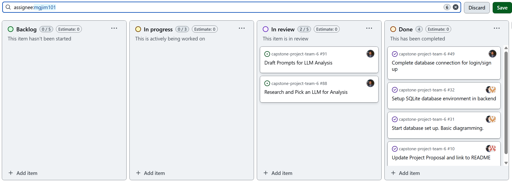
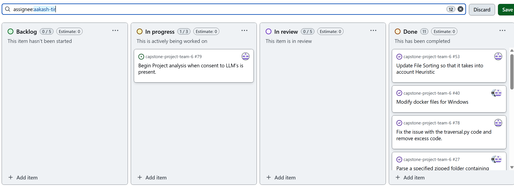
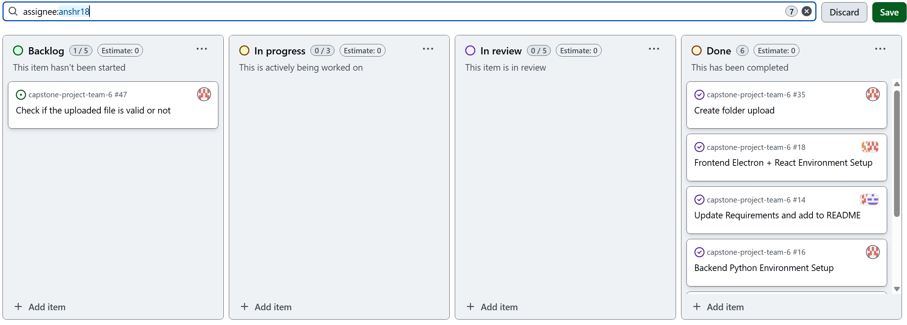
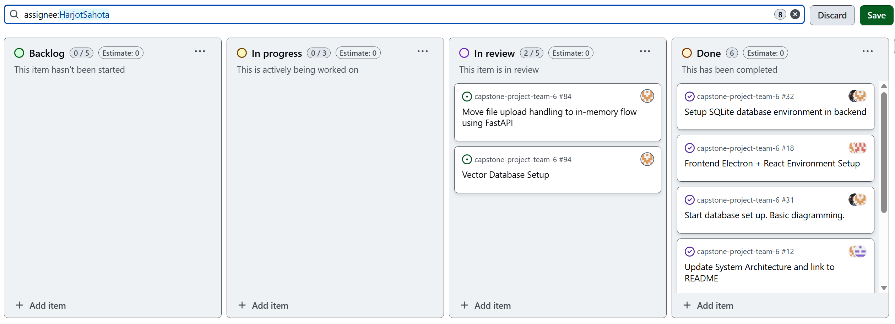

# Team Log  

## Team 6  

**Work Performed:** Oct 27th–Nov 2nd  

---

## Milestone Goals Recap  

- **Features in project plan for this milestone:**  
  - Advance **file analysis without LLMs** using deterministic classification and metadata heuristics.  
  - Integrate **consent flow** into the CLI and add **session management**.  
  - Harden **ZIP traversal / project sorting** and ensure Windows compatibility.  
  - Stand up **vector DB (pgvector on Supabase)** and backend services for chunking/embeddings.  
  - Establish **integration test infrastructure** for Authentication & Session flows.  
  - Create/expand **CI pipeline**: auto-merge after approvals, lint/format, and run tests.  
  - Team PR reviews, testing, sprint meetings, and documentation updates.  

- **Associated tasks from project board:**  
  - Non-LLM file analysis scaffolding and reuse of `FileClassifier`.  
  - CLI consent integration + session handling; test structure updates.  
  - ZIP traversal maintenance, folder restructuring, and requirement bumps.  
  - Supabase pgvector setup; chunking + (placeholder) embeddings service.  
  - Auth integration tests (signup/login, session behavior) with reusable fixtures.  
  - CI automation for merge, linting (Py 3.14), and backend test execution.  

---

## Team Members  

- **maddysam356** → Mandira Samarasekara  
- **MithishR** → Mithish Ravisankar  
- **HarjotSahota** → Harjot Sahota  
- **aakash-tir** → Aakash Tirathdas  
- **anshr18** → Ansh Rastogi  
- **mgjim101** → Mohamed Sakr  

---

## Completed Tasks  

- **Non-LLM file analysis groundwork & PR reviews** — *Mandira*  
  - Began non-LLM file analysis feature leveraging Aakash’s classifier; set up preliminary deterministic analysis framework (incomplete; not ready to merge).  
  - Reviewed and tested multiple teammates’ PRs; attended meetings and authored team logs.  

- **CLI consent integration, sessioning & CI** — *Mithish*  
  - Integrated consent flow into CLI; added backend session management for login/CLI.  
  - Repository cleanup and more unit tests; auto-login session setup for tests.  
  - Created CI pipeline: auto-merge after 2 approvals, lint/auto-format (Py 3.14), run backend tests.  

- **Traversal, sorting & compatibility updates** — *Aakash*  
  - Debugged and finalized `traversal.py` integration; removed excess code and verified ZIP functions.  
  - Implemented project traversal (file identification/sorting) with tests and docs; Windows compatibility checks.  
  - Updated requirements for Python 3.13–3.14; started LLaMA stack setup (not merged).  

- **Auth integration tests & fixtures** — *Ansh*  
  - Built comprehensive integration test suite (signup/login end-to-end); 8 core tests + 2 helper tests (10 passed).  
  - Added reusable fixtures for isolated temp DB and session files; documented workflows and coverage.  

- **Vector DB setup & upload flow updates** — *Harjot*  
  - Deployed Supabase **pgvector** (cloud) and added backend modules for document/chunk schemas and storage service.  
  - Manually tested end-to-end chunking + placeholder embeddings; updated FastAPI upload flow to process in-memory.  
  - Researched embedding models and vector DB best practices.  

- **Model research & prompt template suite** — *Mohamed*  
  - Authored models research doc covering local/cloud LLM + RAG stacks, integration patterns, and next-step prototypes.  
  - Produced an academic-style **prompt template suite** (consent → parsing → identification → skills/timeline → storage → résumé outputs) designed for RAG pipelines with privacy-aware, structured JSON outputs.  

---

## Test Report  

- **Authentication & Sessions (Integration):**  
  - 10 tests passed (8 main integration + 2 helper), validating signup/login, error cases, and session overwrite behavior.  
- **Traversal / Sorting:**  
  - Informal script and pytest suite exercised traversal, code/doc/config/test categorization, and Windows path handling.  
- **CI Pipeline:**  
  - Linting (Py 3.14) and backend unit tests triggered on PRs; auto-merge after approvals configured.  
- **Vector Services:**  
  - Manual scripts verified chunking/storage into pgvector; further automated tests planned once embeddings are finalized.  
- **Non-LLM Analysis:**  
  - Framework scaffolding in progress (Mandira); not yet in CI nor ready for merge—targeting completion in the coming days.  

---

## Optional Notes  

- Non-LLM analysis will reuse the existing classifier to support offline, deterministic insights while LLM/RAG paths mature.  
- The CI and integration testing work significantly improves reliability and velocity for upcoming milestones.  
- Research and prompt work by Mohamed positions the team to prototype one local + one cloud RAG stack next.  

## Project Burnup Chart  
  

## Completed / In Progress Tasks per User  

# Mandira Samarasekara  
  

# Mohamed Sakr  
  

# Mithish Ravisankar Geetha  
  

# Aakash  
  

# Ansh Rastogi  
  

# Harjot Sahota  
  

